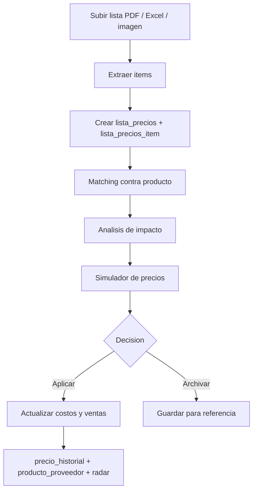
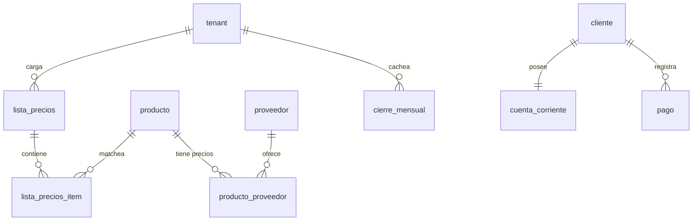

# SmartStock — Analizador de Rentabilidad

## Visión general

El módulo `analizador_rentabilidad` es la capa de inteligencia comercial de SmartStock. Extiende el importador y la IA de precios para que el usuario no solo cargue una lista, sino que pueda **entender su impacto antes de aplicarla**.

El flujo central es:

```text
Subir lista -> extraer -> matchear -> analizar -> simular -> decidir -> aplicar
```

Esto habilita cuatro capacidades principales:

- **Analizar listas de proveedores** antes de impactar el catálogo.
- **Simular márgenes y nuevos precios de venta** en tiempo real.
- **Comparar proveedores y detectar oportunidades** de compra/reposición.
- **Medir rentabilidad real** desde ventas, costos históricos y cuenta corriente.

El módulo está disponible solo en **Plan Completo** y se controla con el flag `analizador_rentabilidad` en `modulo_config`.

---

## Objetivos del módulo

- Convertir una lista de precios en una entidad persistente del sistema.
- Cruzar automáticamente items de proveedores con productos existentes del tenant.
- Medir variación de costos, caída de margen y precio sugerido por producto.
- Permitir aplicación total o parcial de cambios con trazabilidad completa.
- Construir analítica comercial sobre datos reales: ventas, costos, listas y pagos.

---

## Flujo principal



### Etapas

1. **Carga:** el usuario sube una lista en PDF, imagen o Excel/CSV.
2. **Extracción:** se usa SheetJS o Gemini según el tipo de archivo.
3. **Persistencia:** se guarda el archivo original y se crea `lista_precios`.
4. **Matching:** cada item se cruza con `producto` por código, nombre o fuzzy matching con IA.
5. **Análisis:** se calcula variación de costo, margen nuevo e impacto global.
6. **Simulación:** el usuario prueba distintas estrategias de precios.
7. **Aplicación:** se actualizan productos, historial, proveedor-producto y radar.

---

## Modelo de datos

### Nuevas entidades

- `lista_precios`
- `lista_precios_item`
- `producto_proveedor`
- `cuenta_corriente`
- `pago`
- `cierre_mensual`
- `radar_inflacion`

### Extensiones sobre entidades existentes

- `modulo_config.analizador_rentabilidad`
- `comprobante_item.precio_costo`
- `precio_historial.origen` incorpora `lista_precios`

### Relaciones clave



### Principios del schema

- La lista de precios es **persistente**, no un paso transitorio.
- El matching se guarda por item para poder auditar y corregir.
- La comparación entre proveedores usa una relación **N:N** entre `producto` y `proveedor`.
- La rentabilidad real se calcula desde ventas históricas, por eso `comprobante_item` conserva `precio_costo`.
- El radar cross-tenant agrega datos anonimizados y solo funciona con opt-in.

---

## Matching de productos

El motor de matching trabaja en tres niveles:

1. **Código exacto**: confianza `1.0`
2. **Nombre exacto normalizado**: confianza `0.95`
3. **Fuzzy matching con Gemini**: confianza variable

Los resultados se agrupan en:

- **Seguros**: `confidence >= 0.8`
- **Dudosos**: `0.5 <= confidence < 0.8`
- **Nuevos**: `confidence < 0.5` o sin match

### Reglas operativas

- Priorizar siempre match determinístico antes de usar IA.
- En IA, preferir falso negativo antes que falso positivo.
- Permitir corrección manual desde UI antes del análisis final.

---

## Análisis y simulación

### Métricas por item

- `precio_costo_anterior`
- `precio_costo_nuevo`
- `variacion_pct`
- `precio_venta_actual`
- `margen_anterior_pct`
- `margen_nuevo_pct`
- `precio_venta_sugerido`
- `precio_venta_decidido`

### Métricas globales de la lista

- Variación promedio de costos
- Cantidad de items con aumento, baja y sin cambio
- Margen global actual vs. margen global nuevo
- Impacto por categoría

### Modos del simulador

- Mantener margen
- Margen fijo
- Aumento fijo
- Piso de margen
- Manual

El simulador corre client-side con funciones puras para que el usuario vea feedback inmediato.

---

## Aplicación de la lista

Cuando una lista se aplica:

- Se actualiza `producto.precio_costo`
- Opcionalmente se actualiza `producto.precio_venta`
- Se registra un `precio_historial` con origen `lista_precios`
- Se hace upsert en `producto_proveedor`
- Se actualiza el estado de `lista_precios`
- Puede contribuir al `radar_inflacion`

La aplicación puede ser:

- **Total**
- **Parcial**
- **Solo costos**
- **Archivo sin aplicar**

---

## Rentabilidad real

La rentabilidad deja de depender solo del precio actual del catálogo y pasa a medirse con datos históricos reales de venta:

- `comprobante_item.precio_unitario`
- `comprobante_item.precio_costo`
- unidades vendidas
- contribución absoluta

Esto habilita:

- margen real por producto
- alertas de caída de margen
- ranking estrella vs. lastre
- cierre mensual con margen bruto

---

## Cuenta corriente

El analizador incorpora un subdominio financiero liviano:

- saldo por cliente
- pagos registrados
- deuda por facturación
- alertas de mora y límite de crédito

### Eventos que impactan saldo

- **Factura**: aumenta deuda
- **Nota de crédito**: reduce deuda
- **Pago**: reduce deuda

---

## Forecast y comparación de proveedores

Con `producto_proveedor`, `lista_precios`, `movimiento` y `precio_historial`, el sistema puede:

- sugerir el mejor proveedor por score
- proyectar fecha de reposición
- detectar estacionalidad
- comparar listas sucesivas del mismo proveedor
- comparar múltiples presupuestos simultáneamente

---

## UI del módulo

### Rutas principales

```text
/analizador
/analizador/listas
/analizador/listas/nueva
/analizador/listas/[id]
/analizador/listas/comparar
/analizador/proveedores
/analizador/reposicion
/analizador/ranking
/analizador/cuenta-corriente
```

### Componentes principales

- `upload-lista.tsx`
- `matching-review.tsx`
- `analisis-panel.tsx`
- `simulador-precios.tsx`
- `aplicar-lista-dialog.tsx`
- `dashboard-rentabilidad.tsx`
- `comparar-proveedores-table.tsx`
- `forecast-table.tsx`
- `ranking-table.tsx`
- `cuenta-corriente.tsx`

---

## Integraciones con módulos existentes

### `importador`

- reutiliza parseo Excel/CSV y normalización de headers

### `ia-precios`

- reutiliza `llamarGemini()` y límites mensuales
- agrega prompts específicos para extracción, matching y reportes

### `facturacion`

- agrega `precio_costo` a `comprobante_item`
- expone margen en tiempo real al emitir
- actualiza cuenta corriente según el tipo de comprobante

### `pedidos`

- forecast puede sugerir reposición y derivar en pedidos
- facturación desde pedido también debe grabar `precio_costo`

### `dashboard`

- suma alertas de listas pendientes, márgenes en caída, reposición y oportunidades

---

## Consideraciones de seguridad

- Todas las tablas nuevas con `tenant_id` usan RLS por `auth.tenant_id()`
- `radar_inflacion` usa RLS especial sin `tenant_id`, con datos anonimizados
- Las funciones `registrar_pago()` y `contribuir_radar()` operan como `SECURITY DEFINER`
- El radar cross-tenant debe ser **opt-in**

---

## Dependencias nuevas del bloque

- `recharts` para dashboards y gráficos
- bucket de Storage `listas-precios` para guardar archivos originales
- prompts Gemini específicos del analizador

---

## Roadmap del bloque

### Fase 1 — Fundación de datos

- tablas nuevas
- flag de módulo
- costo real en ventas
- cuenta corriente

### Fase 2 — Motor de listas e IA

- carga
- matching
- análisis
- reporte IA
- simulador
- aplicación

### Fase 3 — Análisis avanzado

- comparación de proveedores
- comparación temporal
- rentabilidad real
- ranking
- forecast
- cierre mensual

### Fase 4 — UX integrada

- alertas en dashboard
- margen en factura
- cuenta corriente en cliente

---

## Referencias relacionadas

- `docs/importador.md`
- `docs/ia-precios.md`
- `docs/facturacion.md`
- `docs/pedidos.md`
- `docs/base-de-datos.md`
- `docs/modulos.md`
- `docs/TICKETS.md`
