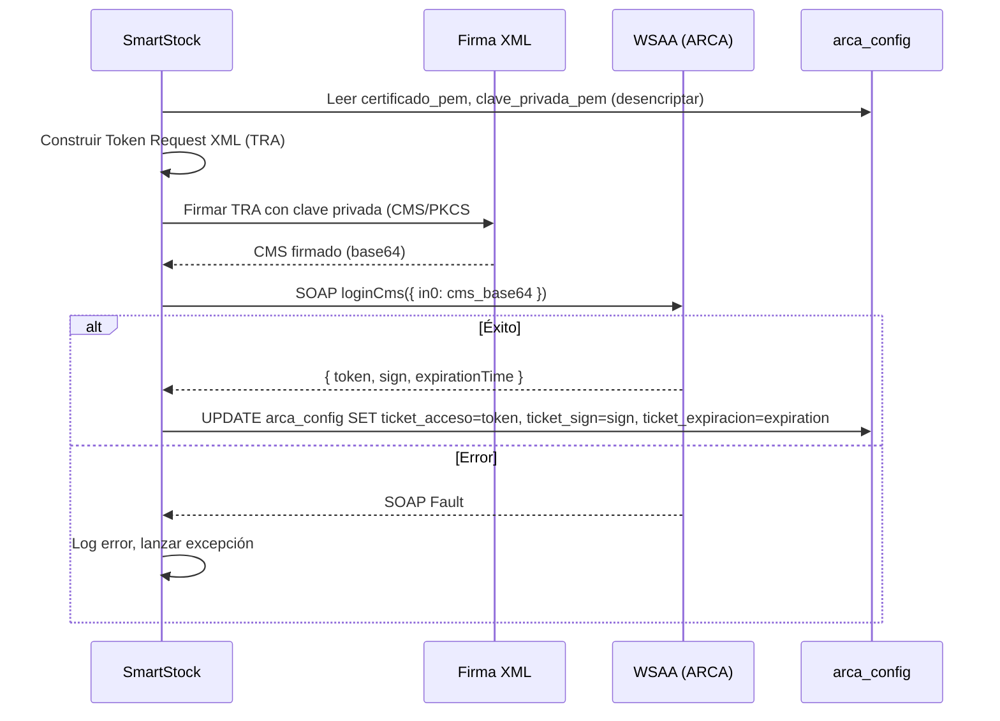
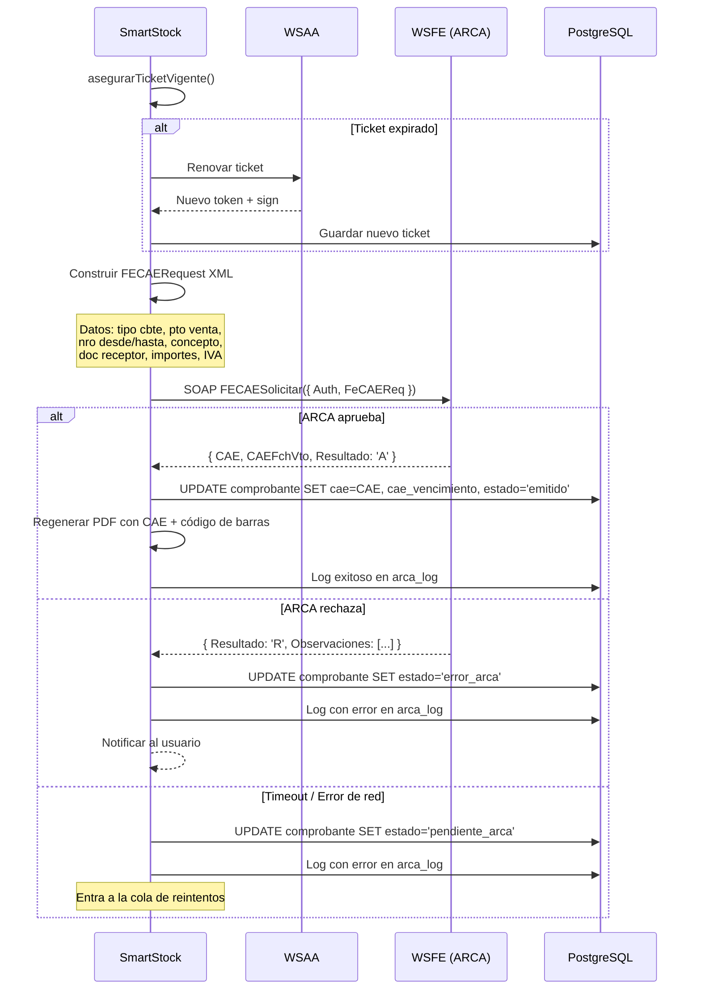
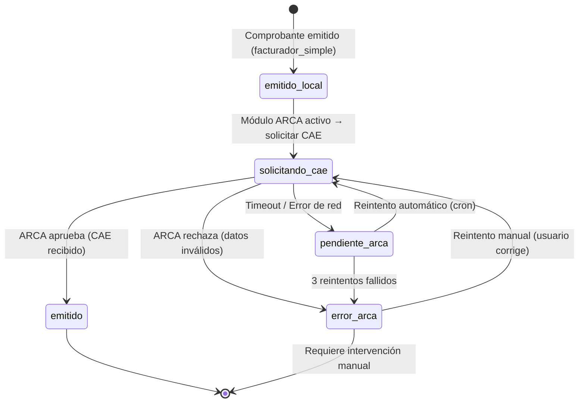
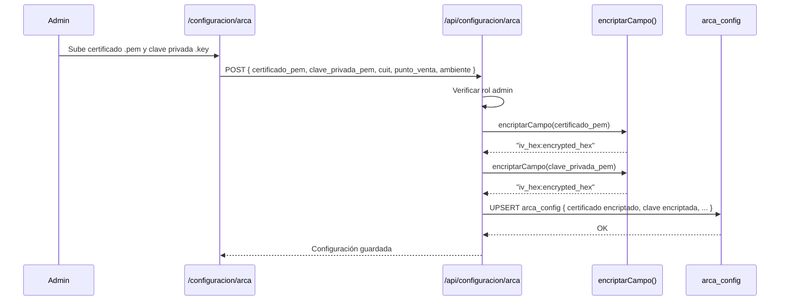

# SmartStock — Integración ARCA (ex-AFIP)

## Qué es ARCA y qué servicios usa SmartStock

ARCA (Agencia de Recaudación y Control Aduanero, ex-AFIP) es el organismo fiscal argentino. SmartStock integra dos de sus webservices SOAP para emitir facturas electrónicas con CAE (Código de Autorización Electrónico):

| Servicio | Propósito | Protocolo |
|---|---|---|
| **WSAA** (Web Service de Autenticación y Autorización) | Obtener un ticket de acceso (token + sign) firmando un Token Request XML con el certificado digital del contribuyente | SOAP/XML |
| **WSFE** (Web Service de Facturación Electrónica v1) | Emitir comprobantes (facturas, notas de crédito), obtener CAE, consultar último comprobante emitido | SOAP/XML |

El flujo siempre es: **WSAA primero** (autenticarse) → **WSFE después** (operar).

---

## Tabla de endpoints: homologación vs producción

| Servicio | Homologación (testing) | Producción |
|---|---|---|
| WSAA | `https://wsaahomo.afip.gob.ar/ws/services/LoginCms` | `https://wsaa.afip.gob.ar/ws/services/LoginCms` |
| WSFE | `https://wswhomo.afip.gob.ar/wsfev1/service.asmx` | `https://servicios1.afip.gob.ar/wsfev1/service.asmx` |

La selección del ambiente se lee de `arca_config.ambiente` (`'homologacion'` o `'produccion'`).

```typescript
// src/lib/facturacion/arca/endpoints.ts

export function getEndpoints(ambiente: 'homologacion' | 'produccion') {
  if (ambiente === 'produccion') {
    return {
      wsaa: 'https://wsaa.afip.gob.ar/ws/services/LoginCms',
      wsfe: 'https://servicios1.afip.gob.ar/wsfev1/service.asmx',
    };
  }
  return {
    wsaa: 'https://wsaahomo.afip.gob.ar/ws/services/LoginCms',
    wsfe: 'https://wswhomo.afip.gob.ar/wsfev1/service.asmx',
  };
}
```

---

## Flujo WSAA: autenticación con certificado



### Token Request XML (TRA)

```xml
<?xml version="1.0" encoding="UTF-8"?>
<loginTicketRequest version="1.0">
  <header>
    <uniqueId>1713000000</uniqueId>
    <generationTime>2026-04-13T10:00:00-03:00</generationTime>
    <expirationTime>2026-04-13T22:00:00-03:00</expirationTime>
  </header>
  <service>wsfe</service>
</loginTicketRequest>
```

| Campo | Descripción |
|---|---|
| `uniqueId` | Timestamp Unix. Identificador único del request |
| `generationTime` | Fecha/hora de generación. No puede ser futura (ARCA la rechaza) |
| `expirationTime` | Fecha/hora de expiración solicitada. Máximo 12 horas después de generationTime |
| `service` | Nombre del servicio al que se quiere acceder (`wsfe`) |

### Implementación WSAA

```typescript
// src/lib/facturacion/arca/wsaa.ts
import * as crypto from 'crypto';
import { getEndpoints } from './endpoints';
import { buildLoginCmsRequest } from './xml-builder';

interface TicketAcceso {
  token: string;
  sign: string;
  expiracion: Date;
}

export async function obtenerTicketAcceso(
  certificadoPem: string,
  clavePrivadaPem: string,
  ambiente: 'homologacion' | 'produccion'
): Promise<TicketAcceso> {
  const endpoints = getEndpoints(ambiente);

  // 1. Construir Token Request XML
  const ahora = new Date();
  const expiracion = new Date(ahora.getTime() + 12 * 60 * 60 * 1000); // +12 horas

  const tra = buildTRA(ahora, expiracion);

  // 2. Firmar con CMS (PKCS#7)
  const cmsFirmado = firmarCMS(tra, certificadoPem, clavePrivadaPem);
  const cmsBase64 = cmsFirmado.toString('base64');

  // 3. Enviar a WSAA
  const soapBody = buildLoginCmsRequest(cmsBase64);

  const response = await fetch(endpoints.wsaa, {
    method: 'POST',
    headers: {
      'Content-Type': 'text/xml; charset=utf-8',
      'SOAPAction': '',
    },
    body: soapBody,
  });

  if (!response.ok) {
    const text = await response.text();
    throw new Error(`WSAA HTTP ${response.status}: ${text.substring(0, 500)}`);
  }

  const responseXml = await response.text();

  // 4. Parsear respuesta
  const tokenMatch = responseXml.match(/<token>([\s\S]*?)<\/token>/);
  const signMatch = responseXml.match(/<sign>([\s\S]*?)<\/sign>/);
  const expMatch = responseXml.match(/<expirationTime>([\s\S]*?)<\/expirationTime>/);

  if (!tokenMatch || !signMatch) {
    // Buscar error
    const faultMatch = responseXml.match(/<faultstring>([\s\S]*?)<\/faultstring>/);
    throw new Error(`WSAA error: ${faultMatch?.[1] ?? 'Respuesta inválida'}`);
  }

  return {
    token: tokenMatch[1].trim(),
    sign: signMatch[1].trim(),
    expiracion: expMatch ? new Date(expMatch[1].trim()) : expiracion,
  };
}

function buildTRA(generacion: Date, expiracion: Date): string {
  const uniqueId = Math.floor(generacion.getTime() / 1000);
  const genStr = formatDateARCA(generacion);
  const expStr = formatDateARCA(expiracion);

  return `<?xml version="1.0" encoding="UTF-8"?>
<loginTicketRequest version="1.0">
  <header>
    <uniqueId>${uniqueId}</uniqueId>
    <generationTime>${genStr}</generationTime>
    <expirationTime>${expStr}</expirationTime>
  </header>
  <service>wsfe</service>
</loginTicketRequest>`;
}

function formatDateARCA(date: Date): string {
  // Formato ISO con offset Argentina (-03:00)
  const offset = '-03:00';
  const iso = date.toISOString().replace('Z', '');
  return iso.substring(0, 19) + offset;
}

function firmarCMS(
  contenido: string,
  certificadoPem: string,
  clavePrivadaPem: string
): Buffer {
  const sign = crypto.createSign('SHA256');
  sign.update(contenido);
  sign.end();

  const signature = sign.sign(clavePrivadaPem);

  // Construir estructura PKCS#7/CMS
  // En producción, usar una librería como `node-forge` o `pkcs7` para
  // construir el CMS correctamente con el certificado incluido
  // Esta es una simplificación del concepto
  const p7 = buildPKCS7(contenido, certificadoPem, clavePrivadaPem);
  return p7;
}

// Implementación real requiere node-forge para PKCS#7
function buildPKCS7(data: string, cert: string, key: string): Buffer {
  // Se usa node-forge para crear el signed data PKCS#7:
  //
  // import forge from 'node-forge';
  // const p7 = forge.pkcs7.createSignedData();
  // p7.content = forge.util.createBuffer(data, 'utf8');
  // p7.addCertificate(cert);
  // p7.addSigner({
  //   key: forge.pki.privateKeyFromPem(key),
  //   certificate: forge.pki.certificateFromPem(cert),
  //   digestAlgorithm: forge.pki.oids.sha256,
  // });
  // p7.sign({ detached: false });
  // return Buffer.from(forge.asn1.toDer(p7.toAsn1()).getBytes(), 'binary');
  //
  throw new Error('Requiere node-forge para PKCS#7. Ver implementación arriba.');
}

export async function asegurarTicketVigente(
  supabase: any,
  tenantId: string
): Promise<{ token: string; sign: string }> {
  const { data: config } = await supabase
    .from('arca_config')
    .select('*')
    .eq('tenant_id', tenantId)
    .single();

  if (!config) throw new Error('Configuración ARCA no encontrada');

  // Verificar si el ticket sigue vigente (con 5 minutos de margen)
  const ahora = new Date();
  const expiracion = config.ticket_expiracion ? new Date(config.ticket_expiracion) : null;
  const margen = 5 * 60 * 1000; // 5 minutos

  if (config.ticket_acceso && expiracion && expiracion.getTime() - ahora.getTime() > margen) {
    return { token: config.ticket_acceso, sign: config.ticket_sign };
  }

  // Renovar ticket
  const certPem = desencriptarCampo(config.certificado_pem);
  const keyPem = desencriptarCampo(config.clave_privada_pem);

  const ticket = await obtenerTicketAcceso(certPem, keyPem, config.ambiente);

  // Guardar nuevo ticket
  await supabase
    .from('arca_config')
    .update({
      ticket_acceso: ticket.token,
      ticket_sign: ticket.sign,
      ticket_expiracion: ticket.expiracion.toISOString(),
    })
    .eq('tenant_id', tenantId);

  return { token: ticket.token, sign: ticket.sign };
}

function desencriptarCampo(valorEncriptado: string): string {
  const key = process.env.ARCA_ENCRYPTION_KEY;
  if (!key) throw new Error('ARCA_ENCRYPTION_KEY no configurada');

  const [ivHex, encrypted] = valorEncriptado.split(':');
  const iv = Buffer.from(ivHex, 'hex');
  const decipher = crypto.createDecipheriv('aes-256-cbc', Buffer.from(key), iv);
  let decrypted = decipher.update(encrypted, 'hex', 'utf8');
  decrypted += decipher.final('utf8');
  return decrypted;
}
```

---

## Tabla `arca_config` — Campos y descripción

| Campo | Tipo | Descripción |
|---|---|---|
| `id` | UUID | PK |
| `tenant_id` | UUID (UNIQUE) | FK a tenant. Un registro por tenant |
| `certificado_pem` | TEXT | Certificado X.509 del contribuyente en formato PEM. Almacenado **encriptado** con AES-256-CBC |
| `clave_privada_pem` | TEXT | Clave privada RSA del contribuyente en formato PEM. Almacenado **encriptado** |
| `cuit_emisor` | VARCHAR(13) | CUIT del contribuyente (debe coincidir con el certificado) |
| `punto_de_venta` | INTEGER | Punto de venta habilitado en ARCA para facturación electrónica |
| `ambiente` | `arca_ambiente` | `'homologacion'` o `'produccion'`. Determina qué endpoints se usan |
| `ticket_acceso` | TEXT | Token devuelto por WSAA. Dura hasta 12 horas |
| `ticket_sign` | TEXT | Sign devuelto por WSAA. Acompaña al token en cada request a WSFE |
| `ticket_expiracion` | TIMESTAMPTZ | Fecha/hora de expiración del ticket. Se renueva automáticamente |
| `ultimo_comprobante` | INTEGER | Último número de comprobante emitido en ARCA (para sincronización con `FECompUltimoAutorizado`) |
| `created_at` | TIMESTAMPTZ | Fecha de creación |
| `updated_at` | TIMESTAMPTZ | Última actualización (trigger moddatetime) |

---

## Flujo WSFE: emisión de comprobante con CAE



### XML Builder

```typescript
// src/lib/facturacion/arca/xml-builder.ts

export function buildLoginCmsRequest(cmsBase64: string): string {
  return `<?xml version="1.0" encoding="UTF-8"?>
<soapenv:Envelope xmlns:soapenv="http://schemas.xmlsoap.org/soap/envelope/"
                  xmlns:wsaa="http://wsaa.view.sua.dvadac.desein.afip.gov">
  <soapenv:Body>
    <wsaa:loginCms>
      <wsaa:in0>${cmsBase64}</wsaa:in0>
    </wsaa:loginCms>
  </soapenv:Body>
</soapenv:Envelope>`;
}

interface FECAEParams {
  token: string;
  sign: string;
  cuit: string;
  puntoDeVenta: number;
  tipoComprobante: number;
  concepto: number;
  numeroDesde: number;
  numeroHasta: number;
  fechaComprobante: string;
  tipoDocReceptor: number;
  nroDocReceptor: string;
  importeTotal: number;
  importeNeto: number;
  importeIVA: number;
  importeExento: number;
  alicuotaIVA: number;
  fechaServicioDesde?: string;
  fechaServicioHasta?: string;
  fechaVtoPago?: string;
}

export function buildFECAESolicitar(params: FECAEParams): string {
  const tieneServicio = params.concepto !== 1;

  return `<?xml version="1.0" encoding="UTF-8"?>
<soapenv:Envelope xmlns:soapenv="http://schemas.xmlsoap.org/soap/envelope/"
                  xmlns:ar="http://ar.gov.afip.dif.FEV1/">
  <soapenv:Body>
    <ar:FECAESolicitar>
      <ar:Auth>
        <ar:Token>${params.token}</ar:Token>
        <ar:Sign>${params.sign}</ar:Sign>
        <ar:Cuit>${params.cuit}</ar:Cuit>
      </ar:Auth>
      <ar:FeCAEReq>
        <ar:FeCabReq>
          <ar:CantReg>1</ar:CantReg>
          <ar:PtoVta>${params.puntoDeVenta}</ar:PtoVta>
          <ar:CbteTipo>${params.tipoComprobante}</ar:CbteTipo>
        </ar:FeCabReq>
        <ar:FeDetReq>
          <ar:FECAEDetRequest>
            <ar:Concepto>${params.concepto}</ar:Concepto>
            <ar:DocTipo>${params.tipoDocReceptor}</ar:DocTipo>
            <ar:DocNro>${params.nroDocReceptor}</ar:DocNro>
            <ar:CbteDesde>${params.numeroDesde}</ar:CbteDesde>
            <ar:CbteHasta>${params.numeroHasta}</ar:CbteHasta>
            <ar:CbteFch>${params.fechaComprobante}</ar:CbteFch>
            <ar:ImpTotal>${params.importeTotal.toFixed(2)}</ar:ImpTotal>
            <ar:ImpTotConc>0.00</ar:ImpTotConc>
            <ar:ImpNeto>${params.importeNeto.toFixed(2)}</ar:ImpNeto>
            <ar:ImpOpEx>${params.importeExento.toFixed(2)}</ar:ImpOpEx>
            <ar:ImpIVA>${params.importeIVA.toFixed(2)}</ar:ImpIVA>
            <ar:ImpTrib>0.00</ar:ImpTrib>
            ${tieneServicio ? `
            <ar:FchServDesde>${params.fechaServicioDesde}</ar:FchServDesde>
            <ar:FchServHasta>${params.fechaServicioHasta}</ar:FchServHasta>
            <ar:FchVtoPago>${params.fechaVtoPago}</ar:FchVtoPago>
            ` : ''}
            <ar:MonId>PES</ar:MonId>
            <ar:MonCotiz>1</ar:MonCotiz>
            <ar:Iva>
              <ar:AlicIva>
                <ar:Id>${mapAlicuotaIVAId(params.alicuotaIVA)}</ar:Id>
                <ar:BaseImp>${params.importeNeto.toFixed(2)}</ar:BaseImp>
                <ar:Importe>${params.importeIVA.toFixed(2)}</ar:Importe>
              </ar:AlicIva>
            </ar:Iva>
          </ar:FECAEDetRequest>
        </ar:FeDetReq>
      </ar:FeCAEReq>
    </ar:FECAESolicitar>
  </soapenv:Body>
</soapenv:Envelope>`;
}

export function buildFECompUltimoAutorizado(
  token: string,
  sign: string,
  cuit: string,
  puntoDeVenta: number,
  tipoComprobante: number
): string {
  return `<?xml version="1.0" encoding="UTF-8"?>
<soapenv:Envelope xmlns:soapenv="http://schemas.xmlsoap.org/soap/envelope/"
                  xmlns:ar="http://ar.gov.afip.dif.FEV1/">
  <soapenv:Body>
    <ar:FECompUltimoAutorizado>
      <ar:Auth>
        <ar:Token>${token}</ar:Token>
        <ar:Sign>${sign}</ar:Sign>
        <ar:Cuit>${cuit}</ar:Cuit>
      </ar:Auth>
      <ar:PtoVta>${puntoDeVenta}</ar:PtoVta>
      <ar:CbteTipo>${tipoComprobante}</ar:CbteTipo>
    </ar:FECompUltimoAutorizado>
  </soapenv:Body>
</soapenv:Envelope>`;
}

function mapAlicuotaIVAId(porcentaje: number): number {
  const mapa: Record<number, number> = {
    0: 3,     // 0%
    10.5: 4,  // 10.5%
    21: 5,    // 21%
    27: 6,    // 27%
    5: 8,     // 5%
    2.5: 9,   // 2.5%
  };
  return mapa[porcentaje] ?? 5;
}
```

### Tipos de comprobante ARCA

```typescript
// src/lib/facturacion/arca/tipos.ts

export const TIPO_COMPROBANTE_ARCA: Record<string, number> = {
  factura_a: 1,
  factura_b: 6,
  factura_c: 11,
  nota_credito_a: 3,
  nota_credito_b: 8,
  nota_credito_c: 13,
};

export const TIPO_DOC_RECEPTOR: Record<string, number> = {
  CUIT: 80,
  CUIL: 86,
  CDI: 87,
  DNI: 96,
  SIN_IDENTIFICAR: 99,
};

export const CONCEPTO = {
  PRODUCTOS: 1,
  SERVICIOS: 2,
  PRODUCTOS_Y_SERVICIOS: 3,
} as const;

export function mapTipoComprobante(tipo: string): number {
  const codigo = TIPO_COMPROBANTE_ARCA[tipo];
  if (!codigo) throw new Error(`Tipo de comprobante no soportado por ARCA: ${tipo}`);
  return codigo;
}

export function mapTipoDocReceptor(cuitDni: string | null): { tipo: number; nro: string } {
  if (!cuitDni) return { tipo: 99, nro: '0' };

  const limpio = cuitDni.replace(/[-\s]/g, '');

  if (limpio.length === 11) return { tipo: 80, nro: limpio }; // CUIT
  if (limpio.length === 8) return { tipo: 96, nro: limpio };  // DNI
  if (limpio.length === 7) return { tipo: 96, nro: limpio };  // DNI corto

  return { tipo: 99, nro: '0' };
}
```

### Implementación WSFE

```typescript
// src/lib/facturacion/arca/wsfe.ts
import { getEndpoints } from './endpoints';
import { buildFECAESolicitar, buildFECompUltimoAutorizado } from './xml-builder';
import { mapTipoComprobante, mapTipoDocReceptor, CONCEPTO } from './tipos';
import { asegurarTicketVigente } from './wsaa';

interface SolicitudCAE {
  tenantId: string;
  tipo: string;
  numero: number;
  fecha: string;
  clienteCuitDni: string | null;
  importeTotal: number;
  importeNeto: number;
  importeIVA: number;
  alicuotaIVA: number;
}

interface ResultadoCAE {
  aprobado: boolean;
  cae: string | null;
  caeVencimiento: string | null;
  errores: { codigo: string; mensaje: string }[];
  observaciones: { codigo: string; mensaje: string }[];
}

export async function solicitarCAE(
  supabase: any,
  config: {
    tenant_id: string;
    cuit_emisor: string;
    punto_de_venta: number;
    ambiente: 'homologacion' | 'produccion';
  },
  solicitud: SolicitudCAE
): Promise<ResultadoCAE> {
  const endpoints = getEndpoints(config.ambiente);

  // 1. Asegurar ticket vigente
  const { token, sign } = await asegurarTicketVigente(supabase, config.tenant_id);

  // 2. Mapear tipos
  const tipoComprobante = mapTipoComprobante(solicitud.tipo);
  const docReceptor = mapTipoDocReceptor(solicitud.clienteCuitDni);
  const fechaFormateada = solicitud.fecha.replace(/-/g, '');

  // 3. Construir XML
  const soapBody = buildFECAESolicitar({
    token,
    sign,
    cuit: config.cuit_emisor,
    puntoDeVenta: config.punto_de_venta,
    tipoComprobante,
    concepto: CONCEPTO.PRODUCTOS,
    numeroDesde: solicitud.numero,
    numeroHasta: solicitud.numero,
    fechaComprobante: fechaFormateada,
    tipoDocReceptor: docReceptor.tipo,
    nroDocReceptor: docReceptor.nro,
    importeTotal: solicitud.importeTotal,
    importeNeto: solicitud.importeNeto,
    importeIVA: solicitud.importeIVA,
    importeExento: 0,
    alicuotaIVA: solicitud.alicuotaIVA,
  });

  // 4. Enviar a WSFE
  let responseXml: string;
  try {
    const response = await fetch(endpoints.wsfe, {
      method: 'POST',
      headers: {
        'Content-Type': 'text/xml; charset=utf-8',
        'SOAPAction': 'http://ar.gov.afip.dif.FEV1/FECAESolicitar',
      },
      body: soapBody,
      signal: AbortSignal.timeout(30000), // 30s timeout
    });

    if (!response.ok) {
      throw new Error(`WSFE HTTP ${response.status}`);
    }

    responseXml = await response.text();
  } catch (err) {
    // Timeout o error de red → pendiente_arca
    return {
      aprobado: false,
      cae: null,
      caeVencimiento: null,
      errores: [{ codigo: 'NETWORK', mensaje: (err as Error).message }],
      observaciones: [],
    };
  }

  // 5. Parsear respuesta
  return parsearRespuestaCAE(responseXml);
}

function parsearRespuestaCAE(xml: string): ResultadoCAE {
  const resultado = xml.match(/<Resultado>(.*?)<\/Resultado>/)?.[1];
  const cae = xml.match(/<CAE>(.*?)<\/CAE>/)?.[1] || null;
  const caeVto = xml.match(/<CAEFchVto>(.*?)<\/CAEFchVto>/)?.[1] || null;

  const errores: { codigo: string; mensaje: string }[] = [];
  const errorMatches = xml.matchAll(/<Err>[\s\S]*?<Code>(.*?)<\/Code>[\s\S]*?<Msg>(.*?)<\/Msg>[\s\S]*?<\/Err>/g);
  for (const match of errorMatches) {
    errores.push({ codigo: match[1], mensaje: match[2] });
  }

  const observaciones: { codigo: string; mensaje: string }[] = [];
  const obsMatches = xml.matchAll(/<Obs>[\s\S]*?<Code>(.*?)<\/Code>[\s\S]*?<Msg>(.*?)<\/Msg>[\s\S]*?<\/Obs>/g);
  for (const match of obsMatches) {
    observaciones.push({ codigo: match[1], mensaje: match[2] });
  }

  // Formatear fecha CAE: YYYYMMDD → YYYY-MM-DD
  const caeVencimiento = caeVto
    ? `${caeVto.substring(0, 4)}-${caeVto.substring(4, 6)}-${caeVto.substring(6, 8)}`
    : null;

  return {
    aprobado: resultado === 'A' && !!cae,
    cae,
    caeVencimiento: caeVencimiento,
    errores,
    observaciones,
  };
}

export async function consultarUltimoComprobante(
  supabase: any,
  config: {
    tenant_id: string;
    cuit_emisor: string;
    punto_de_venta: number;
    ambiente: 'homologacion' | 'produccion';
  },
  tipoComprobante: string
): Promise<number> {
  const endpoints = getEndpoints(config.ambiente);
  const { token, sign } = await asegurarTicketVigente(supabase, config.tenant_id);
  const tipoCodigo = mapTipoComprobante(tipoComprobante);

  const soapBody = buildFECompUltimoAutorizado(
    token, sign, config.cuit_emisor, config.punto_de_venta, tipoCodigo
  );

  const response = await fetch(endpoints.wsfe, {
    method: 'POST',
    headers: {
      'Content-Type': 'text/xml; charset=utf-8',
      'SOAPAction': 'http://ar.gov.afip.dif.FEV1/FECompUltimoAutorizado',
    },
    body: soapBody,
  });

  const xml = await response.text();
  const nroMatch = xml.match(/<CbteNro>(.*?)<\/CbteNro>/);

  return nroMatch ? parseInt(nroMatch[1]) : 0;
}
```

---

## Tipos de comprobantes soportados

| Tipo SmartStock | Código ARCA | Letra | Emisor | Receptor |
|---|---|---|---|---|
| `factura_a` | 1 | A | Responsable Inscripto | Responsable Inscripto |
| `factura_b` | 6 | B | Responsable Inscripto | Consumidor Final / Monotributista / Exento |
| `factura_c` | 11 | C | Monotributista | Cualquiera |
| `nota_credito_a` | 3 | A | RI | RI |
| `nota_credito_b` | 8 | B | RI | CF / Mono / Exento |
| `nota_credito_c` | 13 | C | Mono | Cualquiera |

---

## Manejo de errores: `pendiente_arca` y `error_arca`



| Estado | Causa | Acción |
|---|---|---|
| `pendiente_arca` | Timeout, error 500 de ARCA, error de red | Entra a la cola de reintentos. Se reintenta automáticamente |
| `error_arca` | ARCA rechazó el comprobante (datos inválidos, CUIT incorrecto, etc.) o se agotaron los 3 reintentos | Notificar al usuario. Requiere revisión manual |

---

## Cola de reintentos: Edge Function cron

```typescript
// supabase/functions/reintentar-arca/index.ts
// Edge Function que corre cada 15 minutos via cron

import { createClient } from 'https://esm.sh/@supabase/supabase-js@2';

const MAX_REINTENTOS = 3;

Deno.serve(async (req) => {
  const supabase = createClient(
    Deno.env.get('SUPABASE_URL')!,
    Deno.env.get('SUPABASE_SERVICE_ROLE_KEY')!
  );

  // Buscar comprobantes pendientes
  const { data: pendientes } = await supabase
    .from('comprobante')
    .select('*, tenant:tenant_id(*)')
    .eq('estado', 'pendiente_arca')
    .order('created_at', { ascending: true })
    .limit(10);

  if (!pendientes || pendientes.length === 0) {
    return new Response(JSON.stringify({ procesados: 0 }));
  }

  let procesados = 0;

  for (const comp of pendientes) {
    // Contar reintentos previos
    const { count } = await supabase
      .from('arca_log')
      .select('*', { count: 'exact', head: true })
      .eq('comprobante_id', comp.id)
      .eq('operacion', 'FECAESolicitar');

    const reintentos = count ?? 0;

    if (reintentos >= MAX_REINTENTOS) {
      // Máximo de reintentos alcanzado → marcar como error
      await supabase
        .from('comprobante')
        .update({ estado: 'error_arca' })
        .eq('id', comp.id);

      await supabase.from('arca_log').insert({
        tenant_id: comp.tenant_id,
        servicio: 'WSFE',
        operacion: 'reintentar_arca',
        comprobante_id: comp.id,
        exitoso: false,
        error_codigo: 'MAX_REINTENTOS',
        error_mensaje: `Se agotaron los ${MAX_REINTENTOS} reintentos`,
      });

      procesados++;
      continue;
    }

    // Intentar solicitar CAE de nuevo
    // (llamar a la lógica de solicitarCAE aquí)
    // Si éxito → actualizar comprobante con CAE, estado = 'emitido'
    // Si falla → dejar como pendiente_arca (se reintentará en el próximo ciclo)

    procesados++;
  }

  return new Response(JSON.stringify({ procesados }));
});
```

### Configuración del cron en Supabase

```sql
-- En supabase/config.toml o via Dashboard
-- Sección [functions.reintentar-arca]
-- schedule = "*/15 * * * *"   (cada 15 minutos)
```

---

## Tabla `arca_log` — Qué registra y para debugging

Cada interacción con WSAA o WSFE se registra en `arca_log`:

| Campo | Ejemplo WSAA | Ejemplo WSFE exitoso | Ejemplo WSFE fallido |
|---|---|---|---|
| `servicio` | `'WSAA'` | `'WSFE'` | `'WSFE'` |
| `operacion` | `'LoginCms'` | `'FECAESolicitar'` | `'FECAESolicitar'` |
| `request_xml` | TRA XML firmado | FECAERequest XML | FECAERequest XML |
| `response_xml` | LoginTicketResponse | FECAEResponse con CAE | FECAEResponse con error |
| `comprobante_id` | `null` | UUID del comprobante | UUID del comprobante |
| `exitoso` | `true` | `true` | `false` |
| `error_codigo` | `null` | `null` | `'10016'` |
| `error_mensaje` | `null` | `null` | `'El campo DocNro es requerido'` |

### Registrar log desde el código

```typescript
// src/lib/facturacion/arca/logger.ts
import { SupabaseClient } from '@supabase/supabase-js';

export async function logArcaOperacion(
  supabase: SupabaseClient,
  tenantId: string,
  datos: {
    servicio: 'WSAA' | 'WSFE';
    operacion: string;
    requestXml: string;
    responseXml: string;
    comprobanteId?: string;
    exitoso: boolean;
    errorCodigo?: string;
    errorMensaje?: string;
  }
) {
  await supabase.from('arca_log').insert({
    tenant_id: tenantId,
    servicio: datos.servicio,
    operacion: datos.operacion,
    request_xml: datos.requestXml,
    response_xml: datos.responseXml,
    comprobante_id: datos.comprobanteId || null,
    exitoso: datos.exitoso,
    error_codigo: datos.errorCodigo || null,
    error_mensaje: datos.errorMensaje || null,
  });
}
```

---

## Encriptación con `ARCA_ENCRYPTION_KEY`

Los certificados y claves privadas se almacenan **encriptados** en la base de datos usando AES-256-CBC con la clave definida en la variable de entorno `ARCA_ENCRYPTION_KEY`.

```typescript
// src/lib/facturacion/arca/crypto.ts
import * as crypto from 'crypto';

const ALGORITHM = 'aes-256-cbc';

export function encriptarCampo(texto: string): string {
  const key = process.env.ARCA_ENCRYPTION_KEY;
  if (!key) throw new Error('ARCA_ENCRYPTION_KEY no configurada');

  const keyBuffer = Buffer.from(key.padEnd(32, '0').substring(0, 32));
  const iv = crypto.randomBytes(16);
  const cipher = crypto.createCipheriv(ALGORITHM, keyBuffer, iv);
  let encrypted = cipher.update(texto, 'utf8', 'hex');
  encrypted += cipher.final('hex');

  return `${iv.toString('hex')}:${encrypted}`;
}

export function desencriptarCampo(valorEncriptado: string): string {
  const key = process.env.ARCA_ENCRYPTION_KEY;
  if (!key) throw new Error('ARCA_ENCRYPTION_KEY no configurada');

  const keyBuffer = Buffer.from(key.padEnd(32, '0').substring(0, 32));
  const [ivHex, encrypted] = valorEncriptado.split(':');
  const iv = Buffer.from(ivHex, 'hex');
  const decipher = crypto.createDecipheriv(ALGORITHM, keyBuffer, iv);
  let decrypted = decipher.update(encrypted, 'hex', 'utf8');
  decrypted += decipher.final('utf8');

  return decrypted;
}
```

### Flujo de guardado de certificados



---

## Archivos clave

| Archivo | Propósito |
|---|---|
| `src/lib/facturacion/arca/wsaa.ts` | Autenticación WSAA: construir TRA, firmar CMS, obtener ticket, renovación automática |
| `src/lib/facturacion/arca/wsfe.ts` | Operaciones WSFE: solicitar CAE, consultar último comprobante |
| `src/lib/facturacion/arca/xml-builder.ts` | Construcción de XMLs SOAP para WSAA y WSFE |
| `src/lib/facturacion/arca/tipos.ts` | Mapeo de tipos de comprobante, documento receptor, concepto, alícuotas IVA |
| `src/lib/facturacion/arca/crypto.ts` | Encriptación/desencriptación de certificados con AES-256-CBC |
| `src/lib/facturacion/arca/logger.ts` | Registro de operaciones en `arca_log` |
| `src/lib/facturacion/arca/endpoints.ts` | URLs de homologación y producción |
| `supabase/functions/reintentar-arca/index.ts` | Edge Function cron para reintentar comprobantes pendientes |
