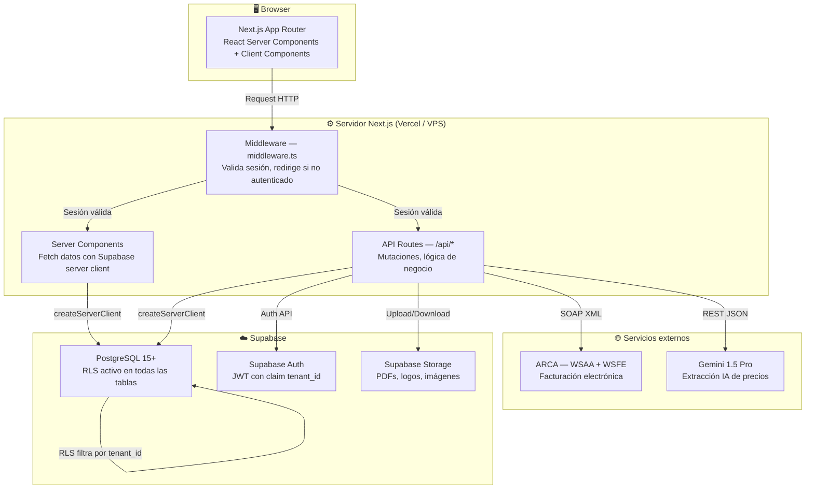
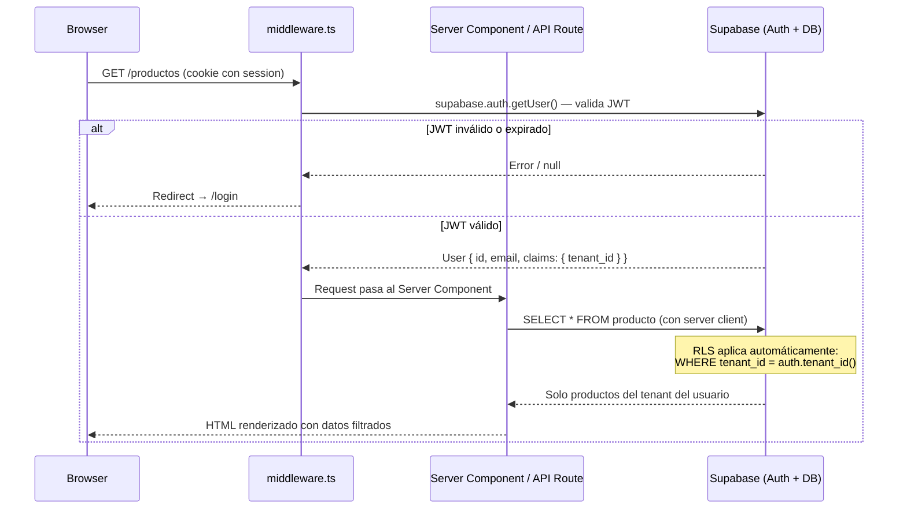

# SmartStock — Arquitectura

## Diagrama de capas



---

## Flujo de una request autenticada (punta a punta)



### Detalle paso a paso

1. **Browser** envía un request con la cookie de sesión de Supabase (`sb-access-token`, `sb-refresh-token`).
2. **`middleware.ts`** intercepta el request, crea un Supabase client con `createServerClient`, y llama a `supabase.auth.getUser()` para validar el JWT.
3. Si el JWT es inválido o la sesión expiró, redirige a `/login`.
4. Si el JWT es válido, el request llega al **Server Component** o **API Route**.
5. El Server Component crea su propio Supabase server client (que hereda la sesión del middleware).
6. Al hacer un query (`supabase.from('producto').select('*')`), PostgreSQL aplica las **RLS policies** automáticamente.
7. La policy verifica `tenant_id = auth.tenant_id()`, donde `auth.tenant_id()` extrae el claim `tenant_id` del JWT.
8. El resultado contiene **solo datos del tenant del usuario autenticado**. Nunca se mezclan datos entre tenants.

---

## Estructura de carpetas Next.js

```
smartstock/
├── src/
│   ├── app/                          # App Router de Next.js
│   │   ├── (auth)/                   # Grupo de rutas públicas (login, register)
│   │   │   ├── login/page.tsx        # Página de login
│   │   │   ├── register/page.tsx     # Registro de nuevo tenant + usuario admin
│   │   │   └── layout.tsx            # Layout sin sidebar para auth
│   │   ├── (dashboard)/              # Grupo de rutas protegidas
│   │   │   ├── layout.tsx            # Layout con sidebar, header, guard de módulos
│   │   │   ├── page.tsx              # Dashboard principal con métricas
│   │   │   ├── productos/            # CRUD de productos
│   │   │   ├── movimientos/          # Historial de movimientos de stock
│   │   │   ├── importar/             # Importador Excel: upload → mapeo → preview
│   │   │   ├── facturacion/          # Comprobantes: lista, emisión, detalle
│   │   │   ├── clientes/             # CRUD de clientes
│   │   │   ├── proveedores/          # CRUD de proveedores + perfil de mapeo Excel
│   │   │   ├── pedidos/              # Pedidos con estados (Plan Completo)
│   │   │   ├── presupuestos/         # Presupuestos (Plan Completo)
│   │   │   ├── ia-precios/           # Extracción IA + historial (Plan Completo)
│   │   │   └── configuracion/        # Config del negocio, plan, ARCA, usuarios
│   │   └── api/                      # API Routes (server-side)
│   │       ├── auth/callback/        # Callback de Supabase Auth (magic link)
│   │       ├── productos/            # CRUD API de productos
│   │       ├── movimientos/          # Registrar movimientos
│   │       ├── importar/             # Validar y ejecutar importación
│   │       ├── facturacion/          # Emitir comprobantes + ARCA
│   │       ├── pedidos/              # CRUD de pedidos
│   │       └── ia/                   # Extracción con Gemini
│   ├── lib/                          # Lógica de negocio y utilidades
│   │   ├── supabase/                 # Clientes Supabase (browser, server, middleware)
│   │   ├── normalizador/             # Aliases, mapeo, validación, normalización
│   │   ├── facturacion/              # PDF generator, numerador, ARCA (wsaa, wsfe)
│   │   ├── ia/                       # Cliente Gemini y prompts
│   │   └── utils/                    # Formatters y validators genéricos
│   ├── components/                   # Componentes React
│   │   ├── ui/                       # Componentes base (buttons, inputs, modals)
│   │   ├── layout/                   # Sidebar, header, breadcrumbs
│   │   ├── stock/                    # Tabla de productos, cards de alerta
│   │   ├── importar/                 # Wizard de importación
│   │   ├── facturacion/              # Formulario de comprobante, preview PDF
│   │   ├── pedidos/                  # Formulario de pedido, tabla de estados
│   │   └── dashboard/                # Widgets de métricas
│   ├── hooks/                        # Custom hooks
│   │   ├── useModulos.ts             # Lee modulo_config, expone flags de módulos
│   │   ├── useTenant.ts              # Datos del tenant actual
│   │   └── useProductos.ts           # Query de productos con filtros
│   └── types/                        # Tipos TypeScript
│       ├── database.ts               # Tipos generados de Supabase (tablas, enums)
│       ├── importacion.ts            # Tipos del pipeline de importación
│       └── facturacion.ts            # Tipos de comprobantes, ARCA
├── public/
│   └── plantillas/
│       └── plantilla_importacion.xlsx  # Plantilla descargable para importar productos
├── supabase/
│   ├── migrations/                   # Migraciones SQL ordenadas (001 → 012)
│   └── seed.sql                      # Datos de prueba
├── docs/                             # Documentación del proyecto (Memory Bank)
├── .env.local                        # Variables de entorno (no se commitea)
├── next.config.js                    # Configuración de Next.js
├── tailwind.config.ts                # Configuración de Tailwind CSS
├── tsconfig.json                     # Configuración de TypeScript
└── package.json                      # Dependencias y scripts
```

---

## Decisiones de diseño

### ¿Por qué App Router y no Pages Router?

App Router es el estándar actual de Next.js 14+. Permite:
- **React Server Components (RSC):** fetch de datos en el servidor sin estado en el cliente, menos JavaScript enviado al browser.
- **Layouts anidados:** el `(dashboard)/layout.tsx` maneja sidebar + guard de autenticación para todas las rutas protegidas, sin repetir lógica.
- **Route Groups:** `(auth)` y `(dashboard)` organizan rutas sin afectar la URL.
- **Streaming y Suspense:** carga progresiva de secciones pesadas (tabla de productos, historial).
- **Server Actions** disponibles si en el futuro se quiere reducir API routes para mutaciones simples.

### ¿Por qué Supabase y no un backend custom?

- Auth, Storage, Realtime y PostgreSQL con RLS en un solo servicio gestionado.
- El SDK de JS integra directamente con Next.js (cookies, server client, middleware).
- RLS nativo en PostgreSQL es la forma más robusta de garantizar aislamiento multi-tenant: la base de datos nunca entrega datos de otro tenant, sin importar bugs en la aplicación.
- Tier gratuito generoso para desarrollo. Escalado lineal de pricing.
- Evita construir y mantener un backend REST/GraphQL separado en esta etapa.

### ¿Por qué deploy único y no un deploy por tenant?

- Un solo codebase, un solo deploy, una sola base de datos. La separación de datos es por `tenant_id` + RLS.
- Simplifica enormemente el deploy, las migraciones y el mantenimiento.
- Escala horizontalmente en Vercel sin intervención manual.
- Si en el futuro se necesita aislamiento de DB por tenant (regulatorio, performance), se puede migrar a schema-per-tenant sin cambiar la app.

### ¿Por qué Vercel inicialmente y VPS después?

- **Vercel (v0.1 → v2.0):** zero-config para Next.js, deploy automático por push, SSL, CDN, Edge Functions. Ideal para validar el producto con los primeros clientes sin invertir en infraestructura.
- **VPS con Docker (v3.0+):** mayor control sobre costos a escala, posibilidad de cron jobs nativos (cola ARCA), persistencia de certificados, y evita límites de Vercel en funciones serverless de larga duración (WSAA/WSFE pueden tardar).

---

## Riesgos técnicos

| Riesgo | Impacto | Probabilidad | Mitigación |
|---|---|---|---|
| Caídas del servicio ARCA | Facturas electrónicas no se pueden emitir, bloquea operación fiscal | Alta | Cola de reintentos con Edge Function cron. Estado `pendiente_arca`. Máximo 3 intentos. Notificación al usuario. El negocio sigue operando con facturación simple |
| Certificados ARCA expiran | Bloquea toda la facturación electrónica del tenant | Media | Alerta automática 30 días antes del vencimiento. Documentación paso a paso para renovación. UI en configuración/arca para subir nuevo certificado |
| Archivos Excel con formatos irregulares | Importación falla o genera datos corruptos | Alta | Normalizador con diccionario de aliases. Perfil de proveedor guardado. Preview obligatorio antes de confirmar. Validación fila por fila con errores detallados. Edición inline |
| Costos de API Gemini | Gasto excesivo en llamadas IA si hay muchos tenants del Plan Completo | Media | Límite mensual de extracciones por plan. Cache de resultados. Fallback a importación manual si se agota el cupo |
| Fuga de datos multi-tenant | Un tenant ve o modifica datos de otro tenant | Baja pero crítica | RLS obligatorio en todas las tablas. `tenant_id` en cada fila. `auth.tenant_id()` extrae el claim del JWT. Tests de aislamiento automatizados. Code review obligatorio para queries sin RLS |
| Saturación de infraestructura | Lentitud o caídas bajo carga | Baja (inicial) | Vercel auto-escala. Supabase permite upgrade de tier. Índices optimizados en las queries más frecuentes. Monitoreo con Vercel Analytics |
| Cambios en la API de ARCA | Endpoints, schemas XML o reglas de validación cambian sin aviso | Media | Capa de abstracción (`wsaa.ts`, `wsfe.ts`, `xml-builder.ts`). Monitoreo de comunicados oficiales de ARCA. Tests contra homologación en CI |

---

## Roadmap de versiones

| Versión | Objetivo | Criterio de cierre |
|---|---|---|
| **v0.1 — Fundaciones** | Proyecto Next.js, Supabase, Auth, multi-tenancy con RLS, seed de datos | Un usuario se registra, loguea y ve un dashboard vacío. RLS aísla datos entre tenants |
| **v1.0 — Stock + Importador** | CRUD de productos, movimientos atómicos, alertas, importador Excel completo con normalizador | Se importa un Excel real de un proveedor y el stock queda actualizado correctamente |
| **v1.5 — Facturador simple** | Generador PDF (factura, remito, presupuesto), numeración atómica, CRUD clientes, descuento de stock | Se emite una factura, el PDF se genera correctamente y el stock se descuenta |
| **v2.0 — Lanzamiento** | Dashboard con métricas, feature flags por plan, onboarding, responsive, deploy a producción | Primer cliente real operando en producción |
| **v3.0 — Pedidos + IA** | Pedidos con estados y conversión a factura, presupuestos, extracción IA con Gemini, historial de precios | Una distribuidora actualiza precios subiendo un PDF y genera pedidos |
| **v4.0 — ARCA** | WSAA + WSFE, emisión de facturas A/B/C con CAE, cola de reintentos, modo offline | Factura electrónica emitida con CAE válido en producción |
