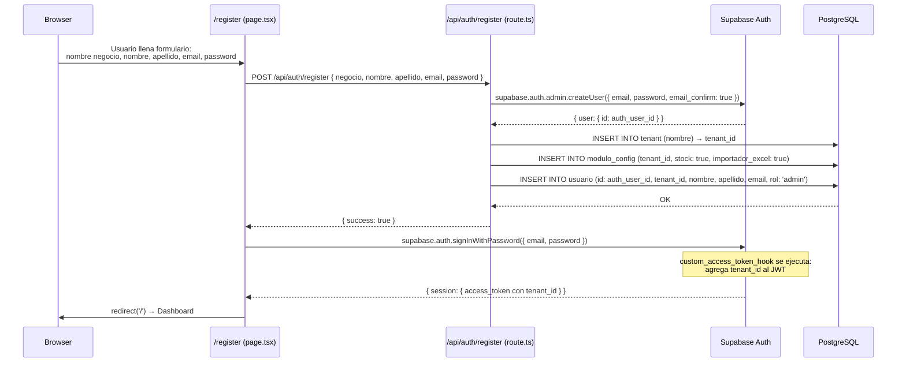
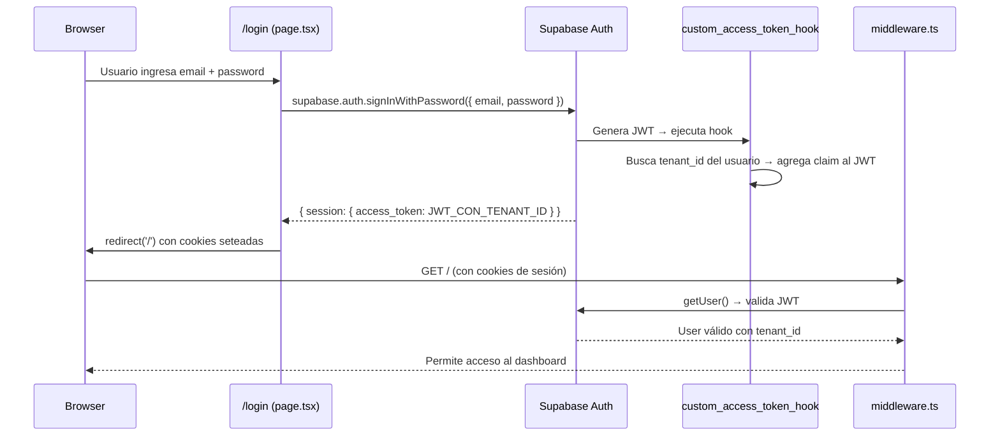
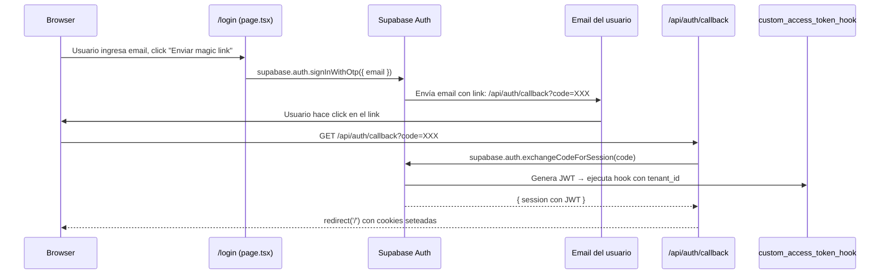

# SmartStock — Autenticación

## Flujo de registro (nuevo tenant + primer usuario admin)



### Detalle paso a paso

1. El usuario completa el formulario de registro con: nombre del negocio, su nombre y apellido, email y contraseña.
2. El frontend envía un POST a `/api/auth/register` con todos los datos.
3. La API route usa el **service role client** (bypasea RLS) para:
   - a) Crear el usuario en Supabase Auth con `auth.admin.createUser`. Se usa `email_confirm: true` para saltar la verificación de email en desarrollo.
   - b) Insertar un nuevo registro en `tenant` con el nombre del negocio.
   - c) Insertar un registro en `modulo_config` con los módulos default del plan Base.
   - d) Insertar un registro en `usuario` con el `id` del auth user, el `tenant_id` del nuevo tenant, y rol `admin`.
4. Si todo sale bien, el frontend hace un `signInWithPassword` para obtener la sesión.
5. En ese login, `custom_access_token_hook` se ejecuta y agrega el `tenant_id` al JWT.
6. El usuario es redirigido al dashboard.

### Manejo de errores en el registro

Si algún paso falla, la API debe revertir los anteriores:

```typescript
export async function POST(request: Request) {
  const supabase = createServiceRoleClient();
  const body = await request.json();

  let authUserId: string | null = null;
  let tenantId: string | null = null;

  try {
    // 1. Crear usuario en Auth
    const { data: authData, error: authError } = 
      await supabase.auth.admin.createUser({
        email: body.email,
        password: body.password,
        email_confirm: true,
      });

    if (authError) throw new Error(`Auth: ${authError.message}`);
    authUserId = authData.user.id;

    // 2. Crear tenant
    const { data: tenant, error: tenantError } = await supabase
      .from('tenant')
      .insert({ nombre: body.negocio })
      .select()
      .single();

    if (tenantError) throw new Error(`Tenant: ${tenantError.message}`);
    tenantId = tenant.id;

    // 3. Crear modulo_config con defaults del plan Base
    const { error: moduloError } = await supabase
      .from('modulo_config')
      .insert({
        tenant_id: tenantId,
        stock: true,
        importador_excel: true,
        facturador_simple: false,
        facturador_arca: false,
        pedidos: false,
        presupuestos: false,
        ia_precios: false,
      });

    if (moduloError) throw new Error(`Modulo: ${moduloError.message}`);

    // 4. Crear usuario
    const { error: userError } = await supabase
      .from('usuario')
      .insert({
        id: authUserId,
        tenant_id: tenantId,
        nombre: body.nombre,
        apellido: body.apellido,
        email: body.email,
        rol: 'admin',
      });

    if (userError) throw new Error(`Usuario: ${userError.message}`);

    return NextResponse.json({ success: true });

  } catch (error) {
    // Cleanup: revertir en orden inverso
    if (tenantId) {
      await supabase.from('modulo_config').delete().eq('tenant_id', tenantId);
      await supabase.from('usuario').delete().eq('tenant_id', tenantId);
      await supabase.from('tenant').delete().eq('id', tenantId);
    }
    if (authUserId) {
      await supabase.auth.admin.deleteUser(authUserId);
    }

    return NextResponse.json(
      { error: (error as Error).message },
      { status: 500 }
    );
  }
}
```

---

## Flujo de login

### Login con email y password



### Login con magic link



### Implementación del callback

```typescript
// src/app/api/auth/callback/route.ts
import { createServerClient } from '@/lib/supabase/server';
import { NextResponse } from 'next/server';

export async function GET(request: Request) {
  const { searchParams, origin } = new URL(request.url);
  const code = searchParams.get('code');
  const next = searchParams.get('next') ?? '/';

  if (code) {
    const supabase = await createServerClient();
    const { error } = await supabase.auth.exchangeCodeForSession(code);

    if (!error) {
      return NextResponse.redirect(`${origin}${next}`);
    }
  }

  return NextResponse.redirect(`${origin}/login?error=auth_callback_failed`);
}
```

---

## Cómo funciona `middleware.ts`

El middleware intercepta **todas** las requests y gestiona la sesión de Supabase.

```typescript
// src/middleware.ts
import { createServerClient } from '@supabase/ssr';
import { NextResponse, type NextRequest } from 'next/server';

const publicRoutes = ['/login', '/register', '/api/auth/callback'];

export async function middleware(request: NextRequest) {
  let supabaseResponse = NextResponse.next({ request });

  const supabase = createServerClient(
    process.env.NEXT_PUBLIC_SUPABASE_URL!,
    process.env.NEXT_PUBLIC_SUPABASE_ANON_KEY!,
    {
      cookies: {
        getAll() {
          return request.cookies.getAll();
        },
        setAll(cookiesToSet) {
          cookiesToSet.forEach(({ name, value, options }) =>
            request.cookies.set(name, value)
          );
          supabaseResponse = NextResponse.next({ request });
          cookiesToSet.forEach(({ name, value, options }) =>
            supabaseResponse.cookies.set(name, value, options)
          );
        },
      },
    }
  );

  // Refrescar sesión si está por expirar
  const { data: { user } } = await supabase.auth.getUser();

  const isPublicRoute = publicRoutes.some(route =>
    request.nextUrl.pathname.startsWith(route)
  );

  // Si no hay usuario y la ruta es protegida → redirigir a login
  if (!user && !isPublicRoute) {
    const url = request.nextUrl.clone();
    url.pathname = '/login';
    return NextResponse.redirect(url);
  }

  // Si hay usuario y está en una ruta pública → redirigir al dashboard
  if (user && isPublicRoute && !request.nextUrl.pathname.startsWith('/api')) {
    const url = request.nextUrl.clone();
    url.pathname = '/';
    return NextResponse.redirect(url);
  }

  return supabaseResponse;
}

export const config = {
  matcher: [
    '/((?!_next/static|_next/image|favicon.ico|.*\\.(?:svg|png|jpg|jpeg|gif|webp)$).*)',
  ],
};
```

### Qué hace el middleware paso a paso

1. **Crea un Supabase client** que puede leer y escribir cookies de la request/response.
2. **Llama a `getUser()`** que:
   - Lee el access token de las cookies.
   - Si el token está por expirar, usa el refresh token para obtener uno nuevo.
   - Setea las cookies actualizadas en la response.
3. **Evalúa la ruta:**
   - Si no hay usuario autenticado y la ruta es protegida → redirect a `/login`.
   - Si hay usuario y la ruta es pública (login/register) → redirect al dashboard.
   - Si es una ruta de API pública (`/api/auth/callback`) → deja pasar.
4. **Retorna la response** con las cookies de sesión actualizadas.

### Rutas públicas vs protegidas

| Ruta | Tipo | Requiere auth |
|---|---|---|
| `/login` | Pública | No. Si ya está autenticado, redirige al dashboard |
| `/register` | Pública | No. Si ya está autenticado, redirige al dashboard |
| `/api/auth/callback` | Pública | No. Es el endpoint que procesa el magic link |
| `/` (dashboard) | Protegida | Si. Si no está autenticado, redirige a login |
| `/productos`, `/importar`, etc. | Protegida | Si |
| `/api/productos`, `/api/movimientos`, etc. | Protegida | Si. Sin sesión, retorna 401 |

---

## Estructura del JWT con claim `tenant_id`

Después de que `custom_access_token_hook` se ejecuta, el JWT tiene esta estructura:

```json
{
  "aud": "authenticated",
  "exp": 1713100800,
  "iat": 1713097200,
  "iss": "https://xxxxx.supabase.co/auth/v1",
  "sub": "a1b2c3d4-e5f6-7890-abcd-ef1234567890",
  "email": "usuario@ejemplo.com",
  "role": "authenticated",
  "tenant_id": "f9e8d7c6-b5a4-3210-fedc-ba0987654321",
  "app_metadata": {
    "provider": "email",
    "providers": ["email"]
  },
  "user_metadata": {
    "nombre": "Juan",
    "apellido": "Pérez"
  },
  "session_id": "..."
}
```

| Claim | Tipo | Origen | Uso |
|---|---|---|---|
| `sub` | UUID | Supabase Auth | ID del usuario en `auth.users`. Es la PK de la tabla `usuario` |
| `email` | string | Supabase Auth | Email del usuario |
| `role` | string | Supabase Auth | Siempre `"authenticated"` para usuarios logueados |
| `tenant_id` | UUID | `custom_access_token_hook` | ID del tenant. Usado por `auth.tenant_id()` en las RLS policies |
| `exp` | number | Supabase Auth | Timestamp de expiración. Default: 1 hora. Renovable con refresh token |

### Cómo leer el `tenant_id` en la aplicación

**En un Server Component o API Route:**
```typescript
const supabase = await createServerClient();
const { data: { user } } = await supabase.auth.getUser();

// El tenant_id está en los claims del JWT
// auth.tenant_id() en PostgreSQL lo lee automáticamente de request.jwt.claims
// En la app, lo podemos obtener decodificando el JWT o consultando la tabla usuario
const { data: usuario } = await supabase
  .from('usuario')
  .select('tenant_id, rol')
  .eq('id', user!.id)
  .single();

const tenantId = usuario!.tenant_id;
const rol = usuario!.rol;
```

**En un Client Component (via hook):**
```typescript
// src/hooks/useTenant.ts
'use client';

import { useEffect, useState } from 'react';
import { createBrowserClient } from '@/lib/supabase/client';

interface TenantInfo {
  tenantId: string;
  rol: 'admin' | 'operador' | 'visor';
  nombreTenant: string;
}

export function useTenant() {
  const [tenant, setTenant] = useState<TenantInfo | null>(null);
  const [loading, setLoading] = useState(true);

  useEffect(() => {
    async function fetchTenant() {
      const supabase = createBrowserClient();
      const { data: { user } } = await supabase.auth.getUser();

      if (!user) {
        setLoading(false);
        return;
      }

      const { data } = await supabase
        .from('usuario')
        .select('tenant_id, rol, tenant:tenant_id(nombre)')
        .eq('id', user.id)
        .single();

      if (data) {
        setTenant({
          tenantId: data.tenant_id,
          rol: data.rol,
          nombreTenant: (data.tenant as any).nombre,
        });
      }

      setLoading(false);
    }

    fetchTenant();
  }, []);

  return { tenant, loading };
}
```

---

## Roles: admin, operador, visor

El rol del usuario se almacena en `usuario.rol` (enum `rol_usuario`). Los permisos se implementan en la capa de aplicación (no en RLS, que solo filtra por tenant).

| Permiso | admin | operador | visor |
|---|---|---|---|
| Ver dashboard y métricas | Si | Si | Si |
| Ver productos, clientes, proveedores | Si | Si | Si |
| Crear/editar/eliminar productos | Si | Si | No |
| Registrar movimientos de stock | Si | Si | No |
| Importar desde Excel | Si | Si | No |
| Emitir comprobantes | Si | Si | No |
| Ver comprobantes e historial | Si | Si | Si |
| Crear/gestionar pedidos | Si | Si | No |
| Configurar negocio (datos, plan) | Si | No | No |
| Gestionar usuarios del tenant | Si | No | No |
| Configurar ARCA (certificados) | Si | No | No |
| Configurar módulos | Si | No | No |
| Anular comprobantes | Si | No | No |

### Implementación del guard de rol

```typescript
// src/lib/utils/auth-guard.ts
import { createServerClient } from '@/lib/supabase/server';
import { redirect } from 'next/navigation';

type Rol = 'admin' | 'operador' | 'visor';

export async function requireRole(rolesPermitidos: Rol[]) {
  const supabase = await createServerClient();
  const { data: { user } } = await supabase.auth.getUser();

  if (!user) redirect('/login');

  const { data: usuario } = await supabase
    .from('usuario')
    .select('rol')
    .eq('id', user.id)
    .single();

  if (!usuario || !rolesPermitidos.includes(usuario.rol)) {
    redirect('/');
  }

  return usuario;
}
```

**Uso en un Server Component:**
```typescript
// src/app/(dashboard)/configuracion/usuarios/page.tsx
import { requireRole } from '@/lib/utils/auth-guard';

export default async function UsuariosPage() {
  await requireRole(['admin']);

  // Solo admin llega acá
  return <div>Gestión de usuarios</div>;
}
```

**Uso en un API Route:**
```typescript
// src/app/api/configuracion/usuarios/route.ts
import { createServerClient } from '@/lib/supabase/server';
import { NextResponse } from 'next/server';

export async function POST(request: Request) {
  const supabase = await createServerClient();
  const { data: { user } } = await supabase.auth.getUser();

  if (!user) {
    return NextResponse.json({ error: 'No autenticado' }, { status: 401 });
  }

  const { data: usuario } = await supabase
    .from('usuario')
    .select('rol, tenant_id')
    .eq('id', user.id)
    .single();

  if (!usuario || usuario.rol !== 'admin') {
    return NextResponse.json({ error: 'Sin permisos' }, { status: 403 });
  }

  // Lógica de creación de usuario...
}
```

---

## Archivos clave

### `lib/supabase/client.ts` — Cliente para el browser

```typescript
// src/lib/supabase/client.ts
import { createBrowserClient as _createBrowserClient } from '@supabase/ssr';

export function createBrowserClient() {
  return _createBrowserClient(
    process.env.NEXT_PUBLIC_SUPABASE_URL!,
    process.env.NEXT_PUBLIC_SUPABASE_ANON_KEY!
  );
}
```

Se usa en **Client Components** (archivos con `'use client'`). Las cookies de sesión se gestionan automáticamente por el SDK.

### `lib/supabase/server.ts` — Cliente para Server Components y API Routes

```typescript
// src/lib/supabase/server.ts
import { createServerClient as _createServerClient } from '@supabase/ssr';
import { cookies } from 'next/headers';

export async function createServerClient() {
  const cookieStore = await cookies();

  return _createServerClient(
    process.env.NEXT_PUBLIC_SUPABASE_URL!,
    process.env.NEXT_PUBLIC_SUPABASE_ANON_KEY!,
    {
      cookies: {
        getAll() {
          return cookieStore.getAll();
        },
        setAll(cookiesToSet) {
          try {
            cookiesToSet.forEach(({ name, value, options }) =>
              cookieStore.set(name, value, options)
            );
          } catch {
            // setAll puede fallar en Server Components (read-only cookies)
            // Es seguro ignorar: el middleware se encarga del refresh
          }
        },
      },
    }
  );
}

export function createServiceRoleClient() {
  const { createClient } = require('@supabase/supabase-js');
  return createClient(
    process.env.NEXT_PUBLIC_SUPABASE_URL!,
    process.env.SUPABASE_SERVICE_ROLE_KEY!
  );
}
```

- `createServerClient()`: usa la sesión del usuario (RLS activo). Para Server Components, API Routes, y Server Actions.
- `createServiceRoleClient()`: bypasea RLS. Solo para operaciones administrativas (registro de nuevo tenant, cron jobs).

### `middleware.ts` — Documentado arriba

Archivo en `src/middleware.ts`. Intercepta todas las requests, refresca la sesión y redirige según autenticación.

---

## Ejemplo: proteger una page.tsx

```typescript
// src/app/(dashboard)/productos/page.tsx
import { createServerClient } from '@/lib/supabase/server';
import { redirect } from 'next/navigation';

export default async function ProductosPage() {
  const supabase = await createServerClient();

  // 1. Verificar autenticación (redundante con middleware, pero defense in depth)
  const { data: { user } } = await supabase.auth.getUser();
  if (!user) redirect('/login');

  // 2. Obtener datos — RLS filtra automáticamente por tenant_id
  const { data: productos, error } = await supabase
    .from('producto')
    .select(`
      *,
      categoria:categoria_id(nombre),
      proveedor:proveedor_id(nombre)
    `)
    .eq('activo', true)
    .order('nombre');

  // 3. Renderizar
  return (
    <div>
      <h1>Productos</h1>
      {/* productos solo contiene los del tenant del usuario */}
      <ProductosTable productos={productos ?? []} />
    </div>
  );
}
```

## Ejemplo: proteger una API Route

```typescript
// src/app/api/productos/route.ts
import { createServerClient } from '@/lib/supabase/server';
import { NextResponse } from 'next/server';

export async function GET() {
  const supabase = await createServerClient();
  const { data: { user } } = await supabase.auth.getUser();

  if (!user) {
    return NextResponse.json({ error: 'No autenticado' }, { status: 401 });
  }

  // RLS filtra automáticamente — no hace falta WHERE tenant_id = X
  const { data, error } = await supabase
    .from('producto')
    .select('*')
    .eq('activo', true)
    .order('nombre');

  if (error) {
    return NextResponse.json({ error: error.message }, { status: 500 });
  }

  return NextResponse.json(data);
}

export async function POST(request: Request) {
  const supabase = await createServerClient();
  const { data: { user } } = await supabase.auth.getUser();

  if (!user) {
    return NextResponse.json({ error: 'No autenticado' }, { status: 401 });
  }

  // Verificar rol (solo admin y operador pueden crear)
  const { data: usuario } = await supabase
    .from('usuario')
    .select('rol, tenant_id')
    .eq('id', user.id)
    .single();

  if (!usuario || usuario.rol === 'visor') {
    return NextResponse.json({ error: 'Sin permisos' }, { status: 403 });
  }

  const body = await request.json();

  // RLS valida que el tenant_id del insert coincida con el del JWT
  const { data, error } = await supabase
    .from('producto')
    .insert({
      tenant_id: usuario.tenant_id,
      codigo: body.codigo,
      nombre: body.nombre,
      descripcion: body.descripcion,
      categoria_id: body.categoria_id,
      proveedor_id: body.proveedor_id,
      unidad: body.unidad ?? 'unidad',
      precio_costo: body.precio_costo ?? 0,
      precio_venta: body.precio_venta ?? 0,
      stock_actual: body.stock_actual ?? 0,
      stock_minimo: body.stock_minimo ?? 0,
    })
    .select()
    .single();

  if (error) {
    return NextResponse.json({ error: error.message }, { status: 400 });
  }

  return NextResponse.json(data, { status: 201 });
}
```
