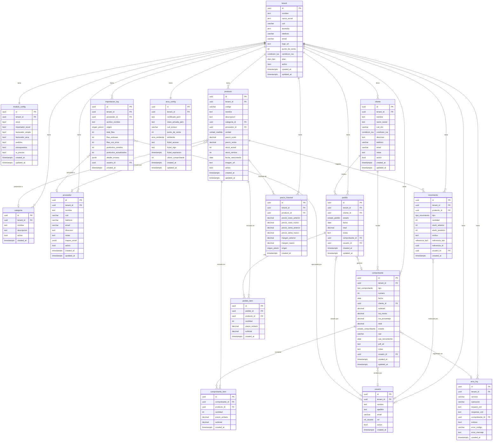

# SmartStock — Base de datos

## Diagrama Entidad-Relación (ERD)



---

## ENUMs

| ENUM | Valores | Uso |
|---|---|---|
| `condicion_iva` | `responsable_inscripto`, `monotributista`, `exento`, `consumidor_final` | Condición fiscal del tenant (en `tenant.condicion_iva`) y del cliente (en `cliente.condicion_iva`). Determina qué tipo de comprobante se puede emitir (A, B o C) |
| `rol_usuario` | `admin`, `operador`, `visor` | Rol del usuario dentro del tenant. Controla permisos en la UI y en las API routes |
| `unidad_medida` | `unidad`, `kg`, `litro`, `metro`, `caja`, `pack`, `gramo`, `ml` | Unidad de medida del producto. Se muestra en la tabla de stock y en los comprobantes |
| `tipo_movimiento` | `entrada`, `salida`, `ajuste` | Tipo de movimiento de stock. `entrada` suma, `salida` resta, `ajuste` establece un valor absoluto |
| `referencia_tipo` | `factura`, `pedido`, `importacion`, `manual`, `ajuste_inventario` | Origen del movimiento. Permite trazar qué operación generó cada cambio de stock |
| `tipo_comprobante` | `factura_a`, `factura_b`, `factura_c`, `nota_credito_a`, `nota_credito_b`, `nota_credito_c`, `remito`, `presupuesto` | Tipo de comprobante fiscal o comercial. Determina la numeración, el layout del PDF y si requiere ARCA |
| `estado_comprobante` | `borrador`, `emitido`, `pendiente_arca`, `error_arca`, `anulado` | Ciclo de vida del comprobante. `pendiente_arca` y `error_arca` solo aplican cuando el módulo ARCA está activo |
| `estado_pedido` | `borrador`, `confirmado`, `entregado`, `cancelado` | Ciclo de vida del pedido. `confirmado` reserva stock, `entregado` lo descuenta, `cancelado` libera la reserva |
| `plan_tipo` | `base`, `completo` | Plan de suscripción del tenant. Determina qué módulos se habilitan en `modulo_config` |
| `arca_ambiente` | `homologacion`, `produccion` | Ambiente ARCA del tenant. Homologación para testing, producción para facturas reales con CAE |
| `origen_precio` | `manual`, `importacion_excel`, `ia_pdf` | Origen de un cambio de precio. Se registra en `precio_historial` para trazabilidad |

---

## Descripción de cada tabla

### `tenant`
**Propósito:** Raíz del multi-tenancy. Cada registro representa un negocio/cliente de SmartStock.

| Campo clave | Descripción |
|---|---|
| `id` | UUID, PK. Referenciado por todas las demás tablas como `tenant_id` |
| `cuit` | CUIT del negocio. Índice parcial (`WHERE cuit IS NOT NULL`). Usado en comprobantes fiscales |
| `punto_de_venta` | Número de punto de venta para la numeración de comprobantes (default 1) |
| `condicion_iva` | Determina qué tipos de factura puede emitir |
| `plan` | `base` o `completo`. Controla qué módulos se activan |
| `activo` | Soft delete. Si es `false`, el tenant está suspendido |

**Índices:** `idx_tenant_cuit` (parcial sobre CUIT).
**Trigger:** `set_tenant_updated_at` — actualiza `updated_at` automáticamente via `moddatetime`.

---

### `modulo_config`
**Propósito:** Un registro por tenant. Controla qué módulos del sistema están habilitados.

| Campo clave | Descripción |
|---|---|
| `tenant_id` | FK a tenant, UNIQUE — exactamente un registro por tenant |
| `stock`, `importador_excel` | Siempre `true`, no se desactivan |
| `facturador_simple` | Habilitado en Plan Base y Completo |
| `facturador_arca` | Solo Plan Completo. Constraint: requiere `facturador_simple = true` |
| `pedidos`, `presupuestos`, `ia_precios` | Solo Plan Completo |

**Constraint:** `chk_arca_requiere_facturador` — no se puede activar ARCA sin el facturador simple.
**Trigger:** `set_modulo_config_updated_at`.

---

### `usuario`
**Propósito:** Usuarios del sistema. La PK es el `id` de `auth.users` (Supabase Auth), lo que vincula la sesión con el perfil del tenant.

| Campo clave | Descripción |
|---|---|
| `id` | UUID, PK. Referencia a `auth.users(id)` — no se genera con uuid_generate_v4 |
| `tenant_id` | FK a tenant. Determina a qué negocio pertenece el usuario |
| `rol` | `admin`, `operador` o `visor`. Controla permisos |
| `activo` | Soft delete. Usuario desactivado no puede operar |

**Índices:** `idx_usuario_tenant`, `idx_usuario_email`.

---

### `categoria`
**Propósito:** Categorías de productos dentro de un tenant. Organización básica del catálogo.

| Campo clave | Descripción |
|---|---|
| `tenant_id` | FK a tenant |
| `nombre` | Nombre único dentro del tenant (índice UNIQUE parcial con `LOWER(nombre)` donde `activa = true`) |

**Índices:** `idx_categoria_tenant`, `idx_categoria_nombre_tenant` (unique parcial).

---

### `proveedor`
**Propósito:** Proveedores del tenant. Además de datos de contacto, almacena el perfil de mapeo Excel para importaciones futuras.

| Campo clave | Descripción |
|---|---|
| `mapeo_excel` | JSONB con el perfil de mapeo guardado: qué columna del Excel corresponde a qué campo del sistema. Permite reimportar sin configurar de nuevo |

**Estructura del `mapeo_excel`:**
```json
{
  "nombre_archivo_ejemplo": "lista_precios_marzo_2026.xlsx",
  "fila_header": 1,
  "mapeo": {
    "codigo": "COD ART",
    "nombre": "DESCRIPCION",
    "precio_costo": "COSTO",
    "precio_venta": "PVP",
    "stock_actual": null,
    "categoria": "RUBRO",
    "unidad": null
  },
  "columnas_ignoradas": ["OBSERVACIONES", "FOTO"],
  "ultima_importacion": "2026-04-10T14:30:00Z"
}
```

**Índices:** `idx_proveedor_tenant`.
**Trigger:** `set_proveedor_updated_at`.

---

### `producto`
**Propósito:** Catálogo de productos. Tabla central del sistema, referenciada por movimientos, comprobantes, pedidos e historial de precios.

| Campo clave | Descripción |
|---|---|
| `codigo` | Código del producto, único dentro del tenant (índice UNIQUE parcial con `LOWER(codigo)` donde `activo = true`). Clave para el upsert en importaciones |
| `stock_actual` | Cantidad actual en stock. Se actualiza atómicamente via `registrar_movimiento` |
| `stock_minimo` | Umbral de alerta. Cuando `stock_actual <= stock_minimo`, aparece en el dashboard |
| `fecha_vencimiento` | Opcional. Si está seteado, el sistema alerta cuando se acerca la fecha |

**Índices:**
- `idx_producto_codigo_tenant` — UNIQUE parcial, clave del upsert
- `idx_producto_tenant` — listado general
- `idx_producto_categoria`, `idx_producto_proveedor` — filtros
- `idx_producto_nombre` — búsqueda full-text en español con `gin(to_tsvector('spanish', nombre))`
- `idx_producto_stock_bajo` — parcial, solo productos activos con stock bajo el mínimo
- `idx_producto_vencimiento` — parcial, solo productos activos con fecha de vencimiento

**Constraints:**
- `chk_precios_positivos` — `precio_costo >= 0 AND precio_venta >= 0`
- `chk_stock_positivo` — `stock_actual >= 0`

**Trigger:** `set_producto_updated_at`.

---

### `movimiento`
**Propósito:** Registro inmutable de cada cambio de stock. Cada movimiento graba el stock anterior y posterior para trazabilidad completa.

| Campo clave | Descripción |
|---|---|
| `tipo` | `entrada` (suma), `salida` (resta) o `ajuste` (establece valor) |
| `stock_anterior`, `stock_posterior` | Snapshot del stock antes y después del movimiento |
| `referencia_tipo` + `referencia_id` | Par polimórfico que vincula el movimiento a su origen (factura, pedido, importación, etc.) |

**Constraint:** `chk_cantidad_positiva` — `cantidad > 0`.
**Índices:** `idx_movimiento_tenant`, `idx_movimiento_producto`, `idx_movimiento_fecha` (desc), `idx_movimiento_referencia` (parcial).

---

### `cliente`
**Propósito:** Clientes del tenant. Se referencia en comprobantes y pedidos.

| Campo clave | Descripción |
|---|---|
| `condicion_iva` | Determina qué tipo de factura recibe (A si es RI, B si es CF/monotributista, C si el emisor es monotributista) |
| `cuit_dni` | CUIT o DNI según la condición fiscal |

**Índices:** `idx_cliente_tenant`, `idx_cliente_cuit` (parcial).
**Trigger:** `set_cliente_updated_at`.

---

### `comprobante`
**Propósito:** Facturas, notas de crédito, remitos y presupuestos. Un comprobante tiene items y puede tener datos de ARCA.

| Campo clave | Descripción |
|---|---|
| `tipo` + `numero` | Par único dentro del tenant (índice UNIQUE). La numeración es secuencial por tipo via `siguiente_numero_comprobante` |
| `estado` | Ciclo de vida: `borrador` → `emitido` → (opcionalmente `pendiente_arca` → `emitido` con CAE, o `error_arca`) |
| `cae`, `cae_vencimiento` | Solo se llenan si el comprobante se aprobó en ARCA |
| `pdf_url` | URL en Supabase Storage del PDF generado |

**Índices:** `idx_comprobante_numero` (unique), `idx_comprobante_tenant`, `idx_comprobante_cliente`, `idx_comprobante_fecha` (desc), `idx_comprobante_estado`.
**Trigger:** `set_comprobante_updated_at`.

---

### `comprobante_item`
**Propósito:** Items de un comprobante. Cada fila es un producto con cantidad y precio.

**Constraint:** `chk_item_positivo` — `cantidad > 0 AND precio_unitario >= 0 AND subtotal >= 0`.
**Índice:** `idx_comprobante_item_comprobante`.

---

### `pedido`
**Propósito:** Pedidos de clientes. Tienen un ciclo de vida con estados y pueden convertirse en factura.

| Campo clave | Descripción |
|---|---|
| `estado` | `borrador` → `confirmado` (reserva stock) → `entregado` (descuenta stock) o `cancelado` (libera reserva) |
| `comprobante_id` | FK al comprobante generado cuando el pedido se convierte a factura |

**Índices:** `idx_pedido_tenant`, `idx_pedido_cliente`, `idx_pedido_estado`, `idx_pedido_fecha` (desc).
**Trigger:** `set_pedido_updated_at`.

---

### `pedido_item`
**Propósito:** Items de un pedido. Misma estructura que `comprobante_item`.

**Constraint:** `chk_pedido_item_positivo`.
**Índice:** `idx_pedido_item_pedido`.

---

### `importacion_log`
**Propósito:** Registro de cada importación de datos (Excel, CSV o IA). Guarda métricas y errores detallados.

| Campo clave | Descripción |
|---|---|
| `origen` | `manual`, `importacion_excel` o `ia_pdf` |
| `detalle_errores` | JSONB con array de errores: `{ fila, campo, valor_original, error }` |

**Estructura del `detalle_errores`:**
```json
[
  {
    "fila": 3,
    "campo": "precio_venta",
    "valor_original": "abc",
    "error": "El precio debe ser un número válido"
  }
]
```

**Índices:** `idx_importacion_tenant`, `idx_importacion_fecha` (desc).

---

### `precio_historial`
**Propósito:** Registro de cada cambio de precio de un producto. Permite ver la evolución y calcular márgenes.

| Campo clave | Descripción |
|---|---|
| `precio_costo_anterior/nuevo` | Precio de costo antes y después del cambio |
| `precio_venta_anterior/nuevo` | Precio de venta antes y después del cambio |
| `margen_anterior/nuevo` | Porcentaje de margen calculado |
| `origen` | Qué generó el cambio: edición manual, importación Excel o extracción IA |

**Índices:** `idx_precio_historial_producto` (desc), `idx_precio_historial_tenant` (desc).

---

### `arca_config`
**Propósito:** Configuración de ARCA por tenant. Almacena certificados (encriptados), tickets de acceso y estado del último comprobante.

| Campo clave | Descripción |
|---|---|
| `certificado_pem`, `clave_privada_pem` | Certificado y clave privada para firmar Token Requests de WSAA. Se almacenan encriptados con `ARCA_ENCRYPTION_KEY` |
| `ambiente` | `homologacion` para testing, `produccion` para facturas reales |
| `ticket_acceso`, `ticket_sign`, `ticket_expiracion` | Token de WSAA vigente. Se renueva automáticamente antes de cada operación si expiró |
| `ultimo_comprobante` | Último número de comprobante emitido en ARCA, para sincronización |

**Trigger:** `set_arca_config_updated_at`.

---

### `arca_log`
**Propósito:** Log de todas las interacciones con ARCA. Para debugging y auditoría.

| Campo clave | Descripción |
|---|---|
| `servicio` | `WSAA` o `WSFE` |
| `operacion` | Nombre de la operación (`LoginCms`, `FECAESolicitar`, etc.) |
| `request_xml`, `response_xml` | XMLs completos enviados y recibidos |
| `exitoso` | Si la operación fue exitosa |
| `error_codigo`, `error_mensaje` | Código y descripción del error de ARCA |

**Índices:** `idx_arca_log_tenant` (desc), `idx_arca_log_comprobante` (parcial).

---

## Funciones SQL

### `registrar_movimiento`

Registra un movimiento de stock y actualiza `producto.stock_actual` en una sola transacción atómica. Usa `FOR UPDATE` para prevenir condiciones de carrera.

```sql
CREATE OR REPLACE FUNCTION registrar_movimiento(
  p_tenant_id       UUID,
  p_producto_id     UUID,
  p_tipo            tipo_movimiento,
  p_cantidad        INTEGER,
  p_motivo          TEXT DEFAULT NULL,
  p_referencia_tipo referencia_tipo DEFAULT NULL,
  p_referencia_id   UUID DEFAULT NULL,
  p_usuario_id      UUID DEFAULT NULL
) RETURNS movimiento AS $$
DECLARE
  v_stock_anterior  INTEGER;
  v_stock_posterior INTEGER;
  v_movimiento      movimiento;
BEGIN
  -- Bloquea la fila del producto para evitar race conditions
  SELECT stock_actual INTO v_stock_anterior
  FROM producto
  WHERE id = p_producto_id AND tenant_id = p_tenant_id
  FOR UPDATE;

  IF NOT FOUND THEN
    RAISE EXCEPTION 'Producto no encontrado: %', p_producto_id;
  END IF;

  CASE p_tipo
    WHEN 'entrada' THEN
      v_stock_posterior := v_stock_anterior + p_cantidad;
    WHEN 'salida' THEN
      v_stock_posterior := v_stock_anterior - p_cantidad;
      IF v_stock_posterior < 0 THEN
        RAISE EXCEPTION 'Stock insuficiente. Actual: %, solicitado: %',
          v_stock_anterior, p_cantidad;
      END IF;
    WHEN 'ajuste' THEN
      -- En ajuste, p_cantidad es el valor absoluto nuevo
      v_stock_posterior := p_cantidad;
  END CASE;

  -- Actualiza el stock del producto
  UPDATE producto
  SET stock_actual = v_stock_posterior, updated_at = NOW()
  WHERE id = p_producto_id AND tenant_id = p_tenant_id;

  -- Inserta el movimiento con snapshot de stock
  INSERT INTO movimiento (
    tenant_id, producto_id, tipo, cantidad,
    stock_anterior, stock_posterior,
    motivo, referencia_tipo, referencia_id, usuario_id
  ) VALUES (
    p_tenant_id, p_producto_id, p_tipo, p_cantidad,
    v_stock_anterior, v_stock_posterior,
    p_motivo, p_referencia_tipo, p_referencia_id, p_usuario_id
  ) RETURNING * INTO v_movimiento;

  RETURN v_movimiento;
END;
$$ LANGUAGE plpgsql SECURITY DEFINER;
```

**Comportamiento por tipo:**
- `entrada`: suma `p_cantidad` al stock actual.
- `salida`: resta `p_cantidad`. Si el resultado es negativo, lanza excepción `Stock insuficiente`.
- `ajuste`: establece `stock_actual = p_cantidad` (valor absoluto, no delta).

**Seguridad:** `SECURITY DEFINER` permite que la función opere con privilegios elevados para bypasear RLS internamente, ya que recibe `p_tenant_id` como parámetro explícito.

---

### `siguiente_numero_comprobante`

Obtiene el próximo número de comprobante para un tenant y tipo dado.

```sql
CREATE OR REPLACE FUNCTION siguiente_numero_comprobante(
  p_tenant_id UUID,
  p_tipo      tipo_comprobante
) RETURNS INTEGER AS $$
DECLARE
  v_siguiente INTEGER;
BEGIN
  SELECT COALESCE(MAX(numero), 0) + 1 INTO v_siguiente
  FROM comprobante
  WHERE tenant_id = p_tenant_id AND tipo = p_tipo;

  RETURN v_siguiente;
END;
$$ LANGUAGE plpgsql SECURITY DEFINER;
```

**Atomicidad:** esta función debe llamarse dentro de la misma transacción que inserta el comprobante. El índice UNIQUE `idx_comprobante_numero(tenant_id, tipo, numero)` previene duplicados si dos usuarios intentan emitir al mismo tiempo — uno de los dos recibirá un error de constraint y debe reintentar.

---

## Extensiones PostgreSQL requeridas

| Extensión | Propósito |
|---|---|
| `uuid-ossp` | Genera UUIDs v4 para las PKs de todas las tablas (`uuid_generate_v4()`) |
| `pgcrypto` | Funciones criptográficas. Usado para encriptar/desencriptar certificados ARCA en la DB |
| `moddatetime` | Trigger helper que actualiza automáticamente campos `updated_at` en cada UPDATE |

```sql
CREATE EXTENSION IF NOT EXISTS "uuid-ossp";
CREATE EXTENSION IF NOT EXISTS "pgcrypto";
CREATE EXTENSION IF NOT EXISTS "moddatetime";
```

Estas extensiones se habilitan en la migración `001_enums.sql` antes de cualquier otra operación.

---

## Orden de ejecución de migraciones

Las migraciones se ejecutan en orden estricto. Cada una depende de las anteriores.

| # | Archivo | Contenido | Depende de |
|---|---|---|---|
| 001 | `001_enums.sql` | Extensiones (`uuid-ossp`, `pgcrypto`, `moddatetime`) + todos los tipos ENUM | Nada |
| 002 | `002_tenant.sql` | Tabla `tenant` con trigger `updated_at` e índice sobre CUIT | 001 (enums `condicion_iva`, `plan_tipo`) |
| 003 | `003_usuario.sql` | Tabla `usuario` con FK a `tenant` y `auth.users` | 002 (tabla `tenant`), 001 (enum `rol_usuario`) |
| 004 | `004_producto.sql` | Tablas `categoria`, `proveedor`, `producto` con triggers, índices y constraints | 002, 001 (`unidad_medida`) |
| 005 | `005_movimiento.sql` | Tabla `movimiento` con índices y constraint de cantidad positiva | 004 (`producto`), 003 (`usuario`), 001 (`tipo_movimiento`, `referencia_tipo`) |
| 006 | `006_facturacion.sql` | Tablas `cliente`, `comprobante`, `comprobante_item` con triggers e índices | 002, 003, 004, 001 (`tipo_comprobante`, `estado_comprobante`, `condicion_iva`) |
| 007 | `007_pedidos.sql` | Tablas `pedido`, `pedido_item` con triggers e índices | 006 (`comprobante`), 004 (`producto`), 003 (`usuario`), 001 (`estado_pedido`) |
| 008 | `008_importacion.sql` | Tabla `importacion_log` | 002, 004 (`proveedor`), 003, 001 (`origen_precio`) |
| 009 | `009_precios.sql` | Tabla `precio_historial` | 004 (`producto`), 001 (`origen_precio`) |
| 010 | `010_arca.sql` | Tablas `arca_config`, `arca_log` | 002, 006 (`comprobante`), 001 (`arca_ambiente`) |
| 011 | `011_rls.sql` | `ENABLE ROW LEVEL SECURITY` + policies SELECT/INSERT/UPDATE/DELETE en las 16 tablas. Función `auth.tenant_id()` y `custom_access_token_hook` | Todas las tablas (002-010) |
| 012 | `012_funciones.sql` | Funciones `registrar_movimiento` y `siguiente_numero_comprobante` | 004, 005, 006 |

### Comando para ejecutar

```bash
npx supabase db push
```

Supabase CLI lee los archivos de `supabase/migrations/` en orden alfabético (por eso la numeración 001-012) y ejecuta los que aún no se hayan aplicado.
