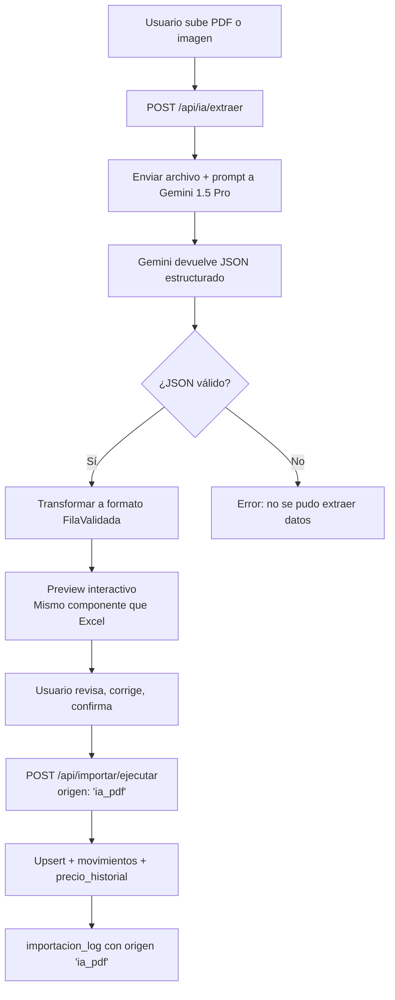
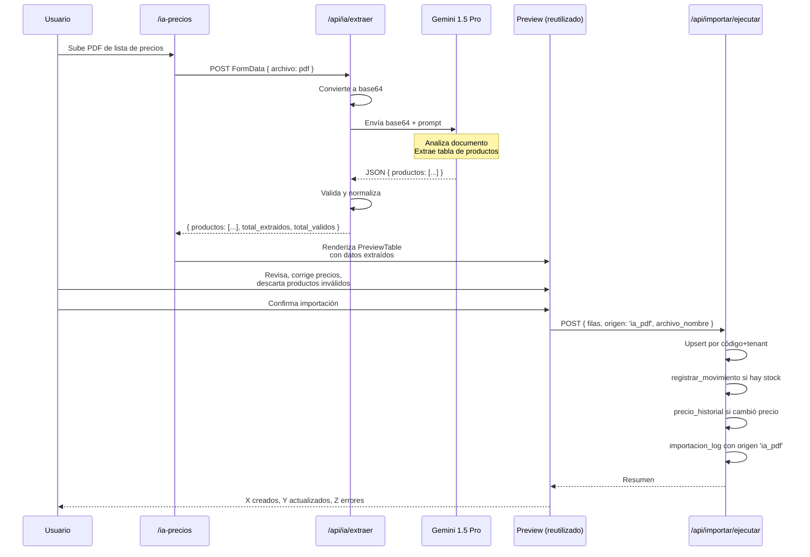

# SmartStock — IA de Precios (Gemini)

## Visión general

El módulo `ia_precios` (Plan Completo) permite extraer datos de productos desde listas de precios en formato PDF o imagen usando Gemini 1.5 Pro. Los datos extraídos entran al mismo pipeline de importación que el Excel (preview → validación → upsert), reutilizando toda la infraestructura existente.



---

## Integración con Gemini 1.5 Pro

### Cliente Gemini

```typescript
// src/lib/ia/gemini.ts

const GEMINI_API_URL = 'https://generativelanguage.googleapis.com/v1beta/models/gemini-1.5-pro:generateContent';

interface GeminiResponse {
  candidates: {
    content: {
      parts: { text: string }[];
    };
  }[];
}

export async function llamarGemini(
  prompt: string,
  archivo: { base64: string; mimeType: string }
): Promise<string> {
  const apiKey = process.env.GEMINI_API_KEY;
  if (!apiKey) throw new Error('GEMINI_API_KEY no configurada');

  const body = {
    contents: [
      {
        parts: [
          {
            inline_data: {
              mime_type: archivo.mimeType,
              data: archivo.base64,
            },
          },
          { text: prompt },
        ],
      },
    ],
    generationConfig: {
      temperature: 0.1,
      maxOutputTokens: 8192,
      responseMimeType: 'application/json',
    },
  };

  const response = await fetch(`${GEMINI_API_URL}?key=${apiKey}`, {
    method: 'POST',
    headers: { 'Content-Type': 'application/json' },
    body: JSON.stringify(body),
  });

  if (!response.ok) {
    const error = await response.text();
    throw new Error(`Gemini API error ${response.status}: ${error}`);
  }

  const data: GeminiResponse = await response.json();

  if (!data.candidates?.[0]?.content?.parts?.[0]?.text) {
    throw new Error('Gemini no devolvió contenido');
  }

  return data.candidates[0].content.parts[0].text;
}
```

### Prompt de extracción

```typescript
// src/lib/ia/prompts.ts

export const PROMPT_EXTRACCION_PRECIOS = `Analiza este documento que contiene una lista de precios de un proveedor.
Extrae TODOS los productos que encuentres en una tabla.

Devuelve ÚNICAMENTE un JSON válido con el siguiente formato, sin texto adicional:
{
  "productos": [
    {
      "codigo": "string o null",
      "nombre": "string",
      "precio": number,
      "unidad": "string o null"
    }
  ]
}

Reglas:
- Si no hay código visible, usa null
- El precio debe ser un número (sin símbolos de moneda)
- Si hay varios precios (costo, lista, oferta), usa el precio de lista
- Ignora encabezados, logos y texto que no sea parte de la tabla de productos
- Si hay categorías o secciones, incluye el nombre del producto completo
- Respetá la ortografía original del documento
- No inventes productos que no estén en el documento
- Si no podés extraer ningún producto, devolvé {"productos": []}`;

export const PROMPT_EXTRACCION_CON_COSTO = `Analiza este documento que contiene una lista de precios de un proveedor.
Extrae TODOS los productos que encuentres.

Devuelve ÚNICAMENTE un JSON válido con el siguiente formato, sin texto adicional:
{
  "productos": [
    {
      "codigo": "string o null",
      "nombre": "string",
      "precio_costo": number o null,
      "precio_venta": number o null,
      "unidad": "string o null"
    }
  ]
}

Reglas:
- Si no hay código visible, usa null
- Los precios deben ser números (sin símbolos de moneda)
- Si el documento tiene un solo precio por producto, asumí que es precio de lista (precio_venta) y dejá precio_costo como null
- Si tiene dos precios (ej: "neto" y "lista"), el menor es costo y el mayor es venta
- Ignora encabezados, logos y texto decorativo
- Si hay categorías o secciones, incluí el nombre del producto completo
- No inventes productos que no estén en el documento`;
```

---

## API Route `/api/ia/extraer`

```typescript
// src/app/api/ia/extraer/route.ts
import { createServerClient } from '@/lib/supabase/server';
import { NextResponse } from 'next/server';
import { moduloGuard } from '@/lib/modulos/guard';
import { llamarGemini } from '@/lib/ia/gemini';
import { PROMPT_EXTRACCION_PRECIOS } from '@/lib/ia/prompts';

interface ProductoExtraido {
  codigo: string | null;
  nombre: string;
  precio: number;
  unidad: string | null;
}

interface GeminiResult {
  productos: ProductoExtraido[];
}

const MIME_TYPES_PERMITIDOS = [
  'application/pdf',
  'image/jpeg',
  'image/png',
  'image/webp',
];

const MAX_FILE_SIZE = 20 * 1024 * 1024; // 20 MB

export async function POST(request: Request) {
  // 1. Verificar módulo
  const guard = await moduloGuard('ia_precios');
  if (!guard.allowed) return guard.response;

  const supabase = await createServerClient();
  const { data: { user } } = await supabase.auth.getUser();
  if (!user) return NextResponse.json({ error: 'No autenticado' }, { status: 401 });

  // 2. Leer archivo del form data
  const formData = await request.formData();
  const file = formData.get('archivo') as File | null;

  if (!file) {
    return NextResponse.json({ error: 'No se envió ningún archivo' }, { status: 400 });
  }

  if (!MIME_TYPES_PERMITIDOS.includes(file.type)) {
    return NextResponse.json({
      error: `Formato no soportado: ${file.type}. Usá PDF, JPG, PNG o WebP.`,
    }, { status: 400 });
  }

  if (file.size > MAX_FILE_SIZE) {
    return NextResponse.json({ error: 'El archivo no puede superar 20 MB' }, { status: 400 });
  }

  // 3. Convertir a base64
  const arrayBuffer = await file.arrayBuffer();
  const base64 = Buffer.from(arrayBuffer).toString('base64');

  // 4. Llamar a Gemini
  let textoRespuesta: string;
  try {
    textoRespuesta = await llamarGemini(PROMPT_EXTRACCION_PRECIOS, {
      base64,
      mimeType: file.type,
    });
  } catch (err) {
    return NextResponse.json({
      error: `Error al procesar con IA: ${(err as Error).message}`,
    }, { status: 502 });
  }

  // 5. Parsear respuesta JSON
  let resultado: GeminiResult;
  try {
    resultado = JSON.parse(textoRespuesta);
  } catch {
    // Intentar extraer JSON del texto si viene con texto extra
    const jsonMatch = textoRespuesta.match(/\{[\s\S]*\}/);
    if (jsonMatch) {
      try {
        resultado = JSON.parse(jsonMatch[0]);
      } catch {
        return NextResponse.json({
          error: 'La IA no devolvió un JSON válido. Intentá con otra imagen o PDF.',
          respuesta_raw: textoRespuesta.substring(0, 500),
        }, { status: 422 });
      }
    } else {
      return NextResponse.json({
        error: 'La IA no devolvió un JSON válido.',
        respuesta_raw: textoRespuesta.substring(0, 500),
      }, { status: 422 });
    }
  }

  if (!resultado.productos || !Array.isArray(resultado.productos)) {
    return NextResponse.json({
      error: 'La respuesta no contiene un array de productos',
    }, { status: 422 });
  }

  // 6. Validar y normalizar productos extraídos
  const productosNormalizados = resultado.productos
    .filter(p => p.nombre && typeof p.nombre === 'string' && p.nombre.trim() !== '')
    .map((p, i) => ({
      codigo: p.codigo || null,
      nombre: p.nombre.trim(),
      precio_venta: typeof p.precio === 'number' && p.precio >= 0 ? p.precio : null,
      precio_costo: null as number | null,
      stock_actual: null as number | null,
      unidad: p.unidad || null,
      categoria: null as string | null,
      _indice_original: i,
    }));

  return NextResponse.json({
    productos: productosNormalizados,
    total_extraidos: resultado.productos.length,
    total_validos: productosNormalizados.length,
    archivo_nombre: file.name,
  });
}
```

---

## Flujo completo paso a paso



---

## Componente de extracción IA

```typescript
// src/components/ia/extraer-precios.tsx
'use client';

import { useState, useCallback } from 'react';
import { Upload, Brain, Loader2 } from 'lucide-react';

interface ProductoExtraido {
  codigo: string | null;
  nombre: string;
  precio_venta: number | null;
  precio_costo: number | null;
  stock_actual: number | null;
  unidad: string | null;
  categoria: string | null;
}

interface Props {
  onExtraccionCompleta: (productos: ProductoExtraido[], archivoNombre: string) => void;
}

export function ExtraerPrecios({ onExtraccionCompleta }: Props) {
  const [loading, setLoading] = useState(false);
  const [error, setError] = useState<string | null>(null);
  const [archivo, setArchivo] = useState<File | null>(null);
  const [stats, setStats] = useState<{ total_extraidos: number; total_validos: number } | null>(null);

  const procesarArchivo = useCallback(async (file: File) => {
    setArchivo(file);
    setLoading(true);
    setError(null);
    setStats(null);

    const formData = new FormData();
    formData.append('archivo', file);

    try {
      const res = await fetch('/api/ia/extraer', {
        method: 'POST',
        body: formData,
      });

      const json = await res.json();

      if (!res.ok) {
        setError(json.error || 'Error al procesar el archivo');
        return;
      }

      setStats({
        total_extraidos: json.total_extraidos,
        total_validos: json.total_validos,
      });

      onExtraccionCompleta(json.productos, file.name);
    } catch (err) {
      setError('Error de conexión. Intentá de nuevo.');
    } finally {
      setLoading(false);
    }
  }, [onExtraccionCompleta]);

  return (
    <div className="space-y-6">
      <div className="flex items-center gap-3">
        <Brain className="h-6 w-6 text-purple-600" />
        <div>
          <h2 className="text-lg font-semibold">Extracción con IA</h2>
          <p className="text-sm text-muted-foreground">
            Subí un PDF o imagen de una lista de precios. La IA extraerá los productos automáticamente.
          </p>
        </div>
      </div>

      <div
        className={`border-2 border-dashed rounded-lg p-8 text-center transition-colors
          ${loading ? 'opacity-50 pointer-events-none border-purple-200 bg-purple-50' : 'border-muted-foreground/25'}
        `}
      >
        {loading ? (
          <div className="flex flex-col items-center gap-3">
            <Loader2 className="h-10 w-10 text-purple-600 animate-spin" />
            <p className="text-sm text-purple-700">
              Analizando <span className="font-medium">{archivo?.name}</span> con Gemini...
            </p>
            <p className="text-xs text-muted-foreground">Esto puede tardar entre 5 y 30 segundos</p>
          </div>
        ) : (
          <>
            <Upload className="h-10 w-10 mx-auto mb-3 text-muted-foreground" />
            <p className="text-sm text-muted-foreground mb-4">
              Formatos: PDF, JPG, PNG, WebP (máx. 20 MB)
            </p>
            <label className="inline-flex items-center gap-2 bg-purple-600 text-white px-4 py-2 rounded cursor-pointer text-sm hover:bg-purple-700">
              <Brain className="h-4 w-4" />
              Seleccionar archivo
              <input
                type="file"
                accept=".pdf,.jpg,.jpeg,.png,.webp"
                className="hidden"
                onChange={(e) => {
                  const file = e.target.files?.[0];
                  if (file) procesarArchivo(file);
                }}
              />
            </label>
          </>
        )}
      </div>

      {stats && (
        <div className="bg-purple-50 border border-purple-200 rounded p-3 text-sm text-purple-800">
          Extraídos {stats.total_extraidos} productos, {stats.total_validos} válidos.
          Revisá el preview antes de confirmar.
        </div>
      )}

      {error && (
        <div className="bg-red-50 border border-red-200 rounded p-3 text-sm text-red-700">
          {error}
        </div>
      )}
    </div>
  );
}
```

---

## Preview de cambios de precio

Cuando la importación IA actualiza precios existentes, se muestra un preview especial que resalta los cambios:

```typescript
// src/components/ia/precio-cambio-preview.tsx
'use client';

import { formatCurrency } from '@/lib/utils/formatters';
import { ArrowRight, TrendingUp, TrendingDown, Minus } from 'lucide-react';

interface CambioPrecio {
  producto_id: string;
  codigo: string;
  nombre: string;
  precio_venta_anterior: number;
  precio_venta_nuevo: number;
  precio_costo_anterior: number | null;
  precio_costo_nuevo: number | null;
  variacion_porcentaje: number;
}

interface Props {
  cambios: CambioPrecio[];
}

export function PrecioCambioPreview({ cambios }: Props) {
  const subieron = cambios.filter(c => c.variacion_porcentaje > 0);
  const bajaron = cambios.filter(c => c.variacion_porcentaje < 0);
  const sinCambio = cambios.filter(c => c.variacion_porcentaje === 0);

  return (
    <div className="space-y-4">
      <div className="flex gap-4 text-sm">
        <span className="flex items-center gap-1 text-red-600">
          <TrendingUp className="h-4 w-4" /> {subieron.length} subieron
        </span>
        <span className="flex items-center gap-1 text-green-600">
          <TrendingDown className="h-4 w-4" /> {bajaron.length} bajaron
        </span>
        <span className="flex items-center gap-1 text-muted-foreground">
          <Minus className="h-4 w-4" /> {sinCambio.length} sin cambio
        </span>
      </div>

      <div className="overflow-x-auto border rounded-lg">
        <table className="w-full text-sm">
          <thead>
            <tr className="bg-muted">
              <th className="px-3 py-2 text-left">Producto</th>
              <th className="px-3 py-2 text-right">Precio anterior</th>
              <th className="px-3 py-2 text-center w-8" />
              <th className="px-3 py-2 text-right">Precio nuevo</th>
              <th className="px-3 py-2 text-right">Variación</th>
            </tr>
          </thead>
          <tbody>
            {cambios
              .sort((a, b) => Math.abs(b.variacion_porcentaje) - Math.abs(a.variacion_porcentaje))
              .map(c => (
                <tr key={c.producto_id} className="border-t">
                  <td className="px-3 py-2">
                    <span className="font-mono text-xs text-muted-foreground mr-2">{c.codigo}</span>
                    {c.nombre}
                  </td>
                  <td className="px-3 py-2 text-right font-mono">
                    {formatCurrency(c.precio_venta_anterior)}
                  </td>
                  <td className="px-3 py-2 text-center">
                    <ArrowRight className="h-4 w-4 text-muted-foreground mx-auto" />
                  </td>
                  <td className="px-3 py-2 text-right font-mono font-medium">
                    {formatCurrency(c.precio_venta_nuevo)}
                  </td>
                  <td className={`px-3 py-2 text-right font-mono font-medium
                    ${c.variacion_porcentaje > 0 ? 'text-red-600' : ''}
                    ${c.variacion_porcentaje < 0 ? 'text-green-600' : ''}
                    ${c.variacion_porcentaje === 0 ? 'text-muted-foreground' : ''}
                  `}>
                    {c.variacion_porcentaje > 0 ? '+' : ''}
                    {c.variacion_porcentaje.toFixed(1)}%
                  </td>
                </tr>
              ))}
          </tbody>
        </table>
      </div>
    </div>
  );
}
```

---

## Historial de precios

### API Route

```typescript
// src/app/api/precios/historial/route.ts
import { createServerClient } from '@/lib/supabase/server';
import { NextResponse, type NextRequest } from 'next/server';

export async function GET(request: NextRequest) {
  const supabase = await createServerClient();
  const { data: { user } } = await supabase.auth.getUser();
  if (!user) return NextResponse.json({ error: 'No autenticado' }, { status: 401 });

  const { searchParams } = new URL(request.url);
  const productoId = searchParams.get('producto_id');
  const origen = searchParams.get('origen');
  const pagina = parseInt(searchParams.get('pagina') ?? '1');
  const porPagina = parseInt(searchParams.get('por_pagina') ?? '50');
  const offset = (pagina - 1) * porPagina;

  let query = supabase
    .from('precio_historial')
    .select(
      '*, producto:producto_id(id, codigo, nombre)',
      { count: 'exact' }
    )
    .order('created_at', { ascending: false })
    .range(offset, offset + porPagina - 1);

  if (productoId) query = query.eq('producto_id', productoId);
  if (origen) query = query.eq('origen', origen);

  const { data, error, count } = await query;

  if (error) return NextResponse.json({ error: error.message }, { status: 500 });

  return NextResponse.json({
    historial: data,
    total: count,
    pagina,
    por_pagina: porPagina,
  });
}
```

### Componente de historial

```typescript
// src/components/ia/historial-precios.tsx
'use client';

import { formatCurrency, formatDateTime } from '@/lib/utils/formatters';

interface EntradaHistorial {
  id: string;
  created_at: string;
  precio_costo_anterior: number | null;
  precio_costo_nuevo: number | null;
  precio_venta_anterior: number | null;
  precio_venta_nuevo: number | null;
  margen_anterior: number | null;
  margen_nuevo: number | null;
  origen: string;
  producto: { id: string; codigo: string; nombre: string };
}

const ORIGEN_LABELS: Record<string, { label: string; color: string }> = {
  manual: { label: 'Manual', color: 'bg-gray-100 text-gray-700' },
  importacion_excel: { label: 'Excel', color: 'bg-blue-100 text-blue-700' },
  ia_pdf: { label: 'IA', color: 'bg-purple-100 text-purple-700' },
};

interface Props {
  historial: EntradaHistorial[];
}

export function HistorialPrecios({ historial }: Props) {
  return (
    <div className="overflow-x-auto">
      <table className="w-full text-sm">
        <thead>
          <tr className="border-b text-left text-muted-foreground">
            <th className="pb-3 font-medium">Fecha</th>
            <th className="pb-3 font-medium">Producto</th>
            <th className="pb-3 font-medium">Origen</th>
            <th className="pb-3 font-medium text-right">Costo ant.</th>
            <th className="pb-3 font-medium text-right">Costo nuevo</th>
            <th className="pb-3 font-medium text-right">Venta ant.</th>
            <th className="pb-3 font-medium text-right">Venta nuevo</th>
            <th className="pb-3 font-medium text-right">Margen</th>
          </tr>
        </thead>
        <tbody>
          {historial.map(h => {
            const origenInfo = ORIGEN_LABELS[h.origen] ?? { label: h.origen, color: 'bg-gray-100' };
            return (
              <tr key={h.id} className="border-b hover:bg-muted/50">
                <td className="py-2 text-muted-foreground text-xs">
                  {formatDateTime(h.created_at)}
                </td>
                <td className="py-2">
                  <span className="font-mono text-xs text-muted-foreground mr-1">
                    {h.producto.codigo}
                  </span>
                  {h.producto.nombre}
                </td>
                <td className="py-2">
                  <span className={`px-2 py-0.5 rounded-full text-xs ${origenInfo.color}`}>
                    {origenInfo.label}
                  </span>
                </td>
                <td className="py-2 text-right font-mono">
                  {h.precio_costo_anterior != null ? formatCurrency(h.precio_costo_anterior) : '—'}
                </td>
                <td className="py-2 text-right font-mono">
                  {h.precio_costo_nuevo != null ? formatCurrency(h.precio_costo_nuevo) : '—'}
                </td>
                <td className="py-2 text-right font-mono">
                  {h.precio_venta_anterior != null ? formatCurrency(h.precio_venta_anterior) : '—'}
                </td>
                <td className="py-2 text-right font-mono font-medium">
                  {h.precio_venta_nuevo != null ? formatCurrency(h.precio_venta_nuevo) : '—'}
                </td>
                <td className="py-2 text-right font-mono">
                  {h.margen_nuevo != null ? `${h.margen_nuevo.toFixed(1)}%` : '—'}
                </td>
              </tr>
            );
          })}
        </tbody>
      </table>
    </div>
  );
}
```

---

## Sugerencia de márgenes

Cuando se importan precios de costo, el sistema puede sugerir un precio de venta basado en el margen habitual del producto o de su categoría.

```typescript
// src/lib/ia/sugerir-margen.ts
import { SupabaseClient } from '@supabase/supabase-js';

export async function sugerirPrecioVenta(
  supabase: SupabaseClient,
  productoId: string,
  nuevoPrecioCosto: number
): Promise<{ precioSugerido: number; margenUsado: number; fuente: string }> {
  // 1. Buscar margen actual del producto
  const { data: producto } = await supabase
    .from('producto')
    .select('precio_costo, precio_venta, categoria_id')
    .eq('id', productoId)
    .single();

  if (producto && producto.precio_costo > 0) {
    const margenActual = ((producto.precio_venta - producto.precio_costo) / producto.precio_costo) * 100;
    if (margenActual > 0) {
      return {
        precioSugerido: Math.round(nuevoPrecioCosto * (1 + margenActual / 100) * 100) / 100,
        margenUsado: margenActual,
        fuente: 'margen_actual_producto',
      };
    }
  }

  // 2. Buscar margen promedio de la categoría
  if (producto?.categoria_id) {
    const { data: productosCat } = await supabase
      .from('producto')
      .select('precio_costo, precio_venta')
      .eq('categoria_id', producto.categoria_id)
      .eq('activo', true)
      .gt('precio_costo', 0)
      .gt('precio_venta', 0);

    if (productosCat && productosCat.length > 0) {
      const margenes = productosCat.map(
        p => ((p.precio_venta - p.precio_costo) / p.precio_costo) * 100
      );
      const margenPromedio = margenes.reduce((s, m) => s + m, 0) / margenes.length;

      if (margenPromedio > 0) {
        return {
          precioSugerido: Math.round(nuevoPrecioCosto * (1 + margenPromedio / 100) * 100) / 100,
          margenUsado: margenPromedio,
          fuente: 'margen_promedio_categoria',
        };
      }
    }
  }

  // 3. Fallback: 30% de margen
  return {
    precioSugerido: Math.round(nuevoPrecioCosto * 1.3 * 100) / 100,
    margenUsado: 30,
    fuente: 'margen_default',
  };
}
```

---

## Límites y costos

| Parámetro | Valor | Notas |
|---|---|---|
| Tamaño máximo de archivo | 20 MB | Límite de Gemini API para inline_data |
| Formatos soportados | PDF, JPG, PNG, WebP | Gemini 1.5 Pro soporta estos como inputs multimodales |
| Temperatura | 0.1 | Baja para maximizar consistencia en la extracción |
| Max output tokens | 8192 | Suficiente para ~200 productos |
| Costo estimado por request | ~$0.002-0.01 USD | Depende del tamaño del documento |
| Límite sugerido por tenant | 50 extracciones/mes (Plan Completo) | Configurable. Se puede rastrear en `importacion_log` con `origen = 'ia_pdf'` |

### Verificación de límite mensual

```typescript
// src/lib/ia/limite.ts
import { SupabaseClient } from '@supabase/supabase-js';

const LIMITE_MENSUAL = 50;

export async function verificarLimiteIA(supabase: SupabaseClient): Promise<{
  permitido: boolean;
  usadas: number;
  limite: number;
}> {
  const inicioMes = new Date();
  inicioMes.setDate(1);
  inicioMes.setHours(0, 0, 0, 0);

  const { count } = await supabase
    .from('importacion_log')
    .select('*', { count: 'exact', head: true })
    .eq('origen', 'ia_pdf')
    .gte('created_at', inicioMes.toISOString());

  const usadas = count ?? 0;

  return {
    permitido: usadas < LIMITE_MENSUAL,
    usadas,
    limite: LIMITE_MENSUAL,
  };
}
```

---

## Tipos TypeScript

```typescript
// src/types/ia.ts

export interface ProductoExtraidoIA {
  codigo: string | null;
  nombre: string;
  precio: number;
  unidad: string | null;
}

export interface ResultadoExtraccion {
  productos: ProductoExtraidoIA[];
  total_extraidos: number;
  total_validos: number;
  archivo_nombre: string;
}

export interface EntradaPrecioHistorial {
  id: string;
  tenant_id: string;
  producto_id: string;
  precio_costo_anterior: number | null;
  precio_costo_nuevo: number | null;
  precio_venta_anterior: number | null;
  precio_venta_nuevo: number | null;
  margen_anterior: number | null;
  margen_nuevo: number | null;
  origen: 'manual' | 'importacion_excel' | 'ia_pdf';
  created_at: string;
}

export type OrigenPrecio = 'manual' | 'importacion_excel' | 'ia_pdf';
```
