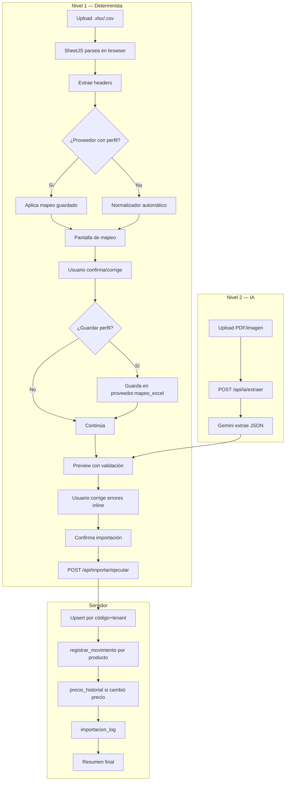
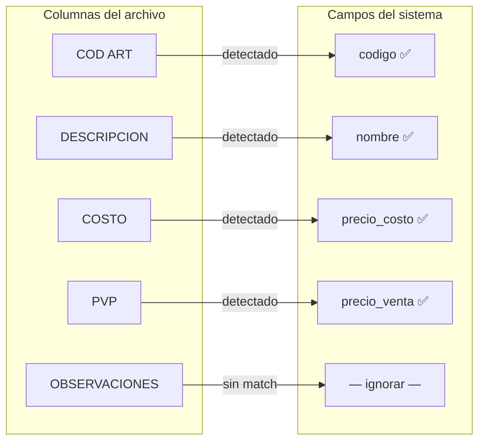

# SmartStock — Importador Excel/CSV

## Visión general

El importador es uno de los dos módulos "siempre activos". Permite a cualquier tenant cargar datos de productos desde archivos Excel (.xlsx) o CSV, con un pipeline de normalización inteligente que detecta automáticamente las columnas, muestra un preview editable, y ejecuta un upsert atómico contra la base de datos.

Tiene dos niveles:

- **Nivel 1 — Determinista (Excel/CSV):** procesamiento 100% en JavaScript sin IA, disponible desde el día uno.
- **Nivel 2 — Con IA (PDF/imagen):** usa Gemini 1.5 Pro para extraer datos de listas de precios en formato PDF o imagen. Disponible solo con el módulo `ia_precios` del Plan Completo. Se documenta en detalle en `ia-precios.md`.



---

## Paso 1 — Upload y parseo con SheetJS

El archivo se parsea **completamente en el browser**, sin subirlo al servidor. Esto es rápido y evita costos de transferencia.

```typescript
// src/lib/normalizador/parsear.ts
import * as XLSX from 'xlsx';

export interface ArchivoParseado {
  headers: string[];
  filas: Record<string, string | number | null>[];
  nombreArchivo: string;
  totalFilas: number;
}

export function parsearArchivo(file: File): Promise<ArchivoParseado> {
  return new Promise((resolve, reject) => {
    const reader = new FileReader();

    reader.onload = (e) => {
      try {
        const data = new Uint8Array(e.target!.result as ArrayBuffer);
        const workbook = XLSX.read(data, { type: 'array' });

        const primerHoja = workbook.Sheets[workbook.SheetNames[0]];
        const jsonData = XLSX.utils.sheet_to_json<Record<string, unknown>>(primerHoja, {
          defval: null,
          raw: false,
        });

        if (jsonData.length === 0) {
          reject(new Error('El archivo está vacío o no tiene datos válidos'));
          return;
        }

        const headers = Object.keys(jsonData[0]);
        const filas = jsonData.map(row => {
          const fila: Record<string, string | number | null> = {};
          for (const key of headers) {
            const val = row[key];
            fila[key] = val === undefined || val === '' ? null : (val as string | number);
          }
          return fila;
        });

        resolve({
          headers,
          filas,
          nombreArchivo: file.name,
          totalFilas: filas.length,
        });
      } catch (err) {
        reject(new Error('No se pudo leer el archivo. Verificá que sea un .xlsx o .csv válido.'));
      }
    };

    reader.onerror = () => reject(new Error('Error al leer el archivo'));
    reader.readAsArrayBuffer(file);
  });
}
```

### Componente de upload

```typescript
// src/components/importar/upload-archivo.tsx
'use client';

import { useState, useCallback } from 'react';
import { Upload, FileSpreadsheet } from 'lucide-react';
import { parsearArchivo, type ArchivoParseado } from '@/lib/normalizador/parsear';

interface Props {
  onArchivoParsed: (data: ArchivoParseado) => void;
}

export function UploadArchivo({ onArchivoParsed }: Props) {
  const [dragging, setDragging] = useState(false);
  const [error, setError] = useState<string | null>(null);
  const [loading, setLoading] = useState(false);

  const procesarArchivo = useCallback(async (file: File) => {
    const extensionesValidas = ['.xlsx', '.xls', '.csv'];
    const ext = file.name.substring(file.name.lastIndexOf('.')).toLowerCase();

    if (!extensionesValidas.includes(ext)) {
      setError('Solo se aceptan archivos .xlsx, .xls o .csv');
      return;
    }

    if (file.size > 10 * 1024 * 1024) {
      setError('El archivo no puede superar 10 MB');
      return;
    }

    setLoading(true);
    setError(null);

    try {
      const data = await parsearArchivo(file);
      onArchivoParsed(data);
    } catch (err) {
      setError((err as Error).message);
    } finally {
      setLoading(false);
    }
  }, [onArchivoParsed]);

  return (
    <div
      onDragOver={(e) => { e.preventDefault(); setDragging(true); }}
      onDragLeave={() => setDragging(false)}
      onDrop={(e) => {
        e.preventDefault();
        setDragging(false);
        const file = e.dataTransfer.files[0];
        if (file) procesarArchivo(file);
      }}
      className={`border-2 border-dashed rounded-lg p-12 text-center transition-colors
        ${dragging ? 'border-primary bg-primary/5' : 'border-muted-foreground/25'}
        ${loading ? 'opacity-50 pointer-events-none' : ''}`}
    >
      <FileSpreadsheet className="h-12 w-12 mx-auto mb-4 text-muted-foreground" />
      <p className="text-lg font-medium mb-2">
        {loading ? 'Procesando archivo...' : 'Arrastrá tu archivo acá'}
      </p>
      <p className="text-sm text-muted-foreground mb-4">
        Formatos aceptados: .xlsx, .xls, .csv (máx. 10 MB)
      </p>
      <label className="inline-flex items-center gap-2 bg-primary text-primary-foreground px-4 py-2 rounded cursor-pointer text-sm">
        <Upload className="h-4 w-4" />
        Seleccionar archivo
        <input
          type="file"
          accept=".xlsx,.xls,.csv"
          className="hidden"
          onChange={(e) => {
            const file = e.target.files?.[0];
            if (file) procesarArchivo(file);
          }}
        />
      </label>
      {error && <p className="text-sm text-red-600 mt-4">{error}</p>}
    </div>
  );
}
```

---

## Paso 2 — Normalizador de headers (diccionario de aliases)

El normalizador compara cada header del archivo contra un diccionario de aliases conocidos. La comparación normaliza ambos lados: minúsculas, sin espacios, sin guiones, sin underscores, sin puntos, sin tildes.

```typescript
// src/lib/normalizador/aliases.ts

export type CampoProducto =
  | 'codigo'
  | 'nombre'
  | 'precio_costo'
  | 'precio_venta'
  | 'stock_actual'
  | 'stock_minimo'
  | 'categoria'
  | 'proveedor'
  | 'fecha_vencimiento'
  | 'unidad';

export const ALIASES: Record<CampoProducto, string[]> = {
  codigo: [
    'codigo', 'cod', 'code', 'sku', 'ref', 'referencia', 'art',
    'articulo', 'id_producto', 'cod_art', 'codart', 'item',
  ],
  nombre: [
    'nombre', 'descripcion', 'producto', 'item', 'articulo',
    'detalle', 'desc', 'name', 'denominacion',
  ],
  precio_costo: [
    'costo', 'precio_costo', 'pcosto', 'costo_unitario',
    'precio_compra', 'cost', 'neto',
  ],
  precio_venta: [
    'precio', 'pvp', 'precio_venta', 'pventa',
    'precio_unitario', 'punit', 'valor', 'price', 'venta',
    'precio_lista', 'lista',
  ],
  stock_actual: [
    'stock', 'cantidad', 'cant', 'qty', 'existencia',
    'disponible', 'saldo', 'inventario',
  ],
  stock_minimo: [
    'stock_minimo', 'minimo', 'min', 'punto_pedido', 'reposicion',
  ],
  categoria: [
    'categoria', 'cat', 'rubro', 'familia', 'tipo',
    'category', 'grupo', 'linea',
  ],
  proveedor: [
    'proveedor', 'prov', 'fabricante', 'marca', 'supplier',
  ],
  fecha_vencimiento: [
    'vencimiento', 'vto', 'venc', 'expira', 'caducidad',
    'fecha_venc', 'expiry', 'fvto',
  ],
  unidad: [
    'unidad', 'um', 'medida', 'unit', 'uom',
  ],
};
```

### Función de normalización de strings

```typescript
// src/lib/normalizador/normalizar.ts

export function normalizarString(s: string): string {
  return s
    .toLowerCase()
    .normalize('NFD')
    .replace(/[\u0300-\u036f]/g, '')  // elimina tildes
    .replace(/[^a-z0-9]/g, '');       // elimina espacios, guiones, underscores, puntos, etc.
}
```

### Función de mapeo automático

```typescript
// src/lib/normalizador/mapear.ts
import { ALIASES, type CampoProducto } from './aliases';
import { normalizarString } from './normalizar';

export interface MapeoColumna {
  headerOriginal: string;
  campoDetectado: CampoProducto | null;
  confianza: 'exacta' | 'parcial' | 'ninguna';
  ignorar: boolean;
}

export function mapearHeaders(headers: string[]): MapeoColumna[] {
  const aliasesNormalizados: Record<CampoProducto, string[]> = {} as any;
  for (const [campo, aliases] of Object.entries(ALIASES)) {
    aliasesNormalizados[campo as CampoProducto] = aliases.map(normalizarString);
  }

  const camposUsados = new Set<CampoProducto>();

  return headers.map(header => {
    const headerNorm = normalizarString(header);

    // Buscar match exacto
    for (const [campo, aliasesNorm] of Object.entries(aliasesNormalizados)) {
      if (camposUsados.has(campo as CampoProducto)) continue;

      if (aliasesNorm.includes(headerNorm)) {
        camposUsados.add(campo as CampoProducto);
        return {
          headerOriginal: header,
          campoDetectado: campo as CampoProducto,
          confianza: 'exacta',
          ignorar: false,
        };
      }
    }

    // Buscar match parcial (contiene)
    for (const [campo, aliasesNorm] of Object.entries(aliasesNormalizados)) {
      if (camposUsados.has(campo as CampoProducto)) continue;

      const matchParcial = aliasesNorm.some(
        alias => headerNorm.includes(alias) || alias.includes(headerNorm)
      );

      if (matchParcial) {
        camposUsados.add(campo as CampoProducto);
        return {
          headerOriginal: header,
          campoDetectado: campo as CampoProducto,
          confianza: 'parcial',
          ignorar: false,
        };
      }
    }

    return {
      headerOriginal: header,
      campoDetectado: null,
      confianza: 'ninguna',
      ignorar: true,
    };
  });
}

export function aplicarPerfilProveedor(
  headers: string[],
  mapeoGuardado: Record<string, string | null>
): MapeoColumna[] {
  return headers.map(header => {
    const campoMapeado = Object.entries(mapeoGuardado).find(
      ([, headerGuardado]) => headerGuardado === header
    );

    if (campoMapeado) {
      return {
        headerOriginal: header,
        campoDetectado: campoMapeado[0] as CampoProducto,
        confianza: 'exacta',
        ignorar: false,
      };
    }

    return {
      headerOriginal: header,
      campoDetectado: null,
      confianza: 'ninguna',
      ignorar: true,
    };
  });
}
```

---

## Paso 3 — Pantalla de mapeo



### Componente de mapeo

```typescript
// src/components/importar/mapeo-columnas.tsx
'use client';

import { useState } from 'react';
import { type MapeoColumna, type CampoProducto } from '@/lib/normalizador/mapear';
import { Check, X, AlertCircle } from 'lucide-react';

const CAMPOS_DISPONIBLES: { value: CampoProducto | 'ignorar'; label: string }[] = [
  { value: 'codigo', label: 'Código' },
  { value: 'nombre', label: 'Nombre / Descripción' },
  { value: 'precio_costo', label: 'Precio de costo' },
  { value: 'precio_venta', label: 'Precio de venta' },
  { value: 'stock_actual', label: 'Stock actual' },
  { value: 'stock_minimo', label: 'Stock mínimo' },
  { value: 'categoria', label: 'Categoría' },
  { value: 'proveedor', label: 'Proveedor' },
  { value: 'fecha_vencimiento', label: 'Fecha de vencimiento' },
  { value: 'unidad', label: 'Unidad de medida' },
  { value: 'ignorar', label: '— Ignorar columna —' },
];

const CONFIANZA_ICON = {
  exacta: <Check className="h-4 w-4 text-green-600" />,
  parcial: <AlertCircle className="h-4 w-4 text-amber-600" />,
  ninguna: <X className="h-4 w-4 text-red-600" />,
};

interface Props {
  mapeo: MapeoColumna[];
  onMapeoChange: (mapeo: MapeoColumna[]) => void;
  onConfirmar: () => void;
  filasMuestra: Record<string, string | number | null>[];
}

export function MapeoColumnas({ mapeo, onMapeoChange, onConfirmar, filasMuestra }: Props) {
  function handleCambio(index: number, campo: CampoProducto | 'ignorar') {
    const nuevoMapeo = [...mapeo];
    if (campo === 'ignorar') {
      nuevoMapeo[index] = { ...nuevoMapeo[index], campoDetectado: null, ignorar: true };
    } else {
      nuevoMapeo[index] = { ...nuevoMapeo[index], campoDetectado: campo, ignorar: false };
    }
    onMapeoChange(nuevoMapeo);
  }

  const tieneNombre = mapeo.some(m => m.campoDetectado === 'nombre');
  const tieneCodigo = mapeo.some(m => m.campoDetectado === 'codigo');

  return (
    <div className="space-y-6">
      <h2 className="text-lg font-semibold">Mapeo de columnas</h2>
      <p className="text-sm text-muted-foreground">
        Verificá que cada columna del archivo esté asociada al campo correcto del sistema.
      </p>

      <div className="space-y-3">
        {mapeo.map((col, i) => (
          <div key={i} className="flex items-center gap-4 p-3 border rounded-lg">
            <div className="flex items-center gap-2 w-1/3">
              {CONFIANZA_ICON[col.confianza]}
              <span className="font-mono text-sm">{col.headerOriginal}</span>
            </div>
            <span className="text-muted-foreground">→</span>
            <select
              value={col.ignorar ? 'ignorar' : col.campoDetectado ?? 'ignorar'}
              onChange={(e) => handleCambio(i, e.target.value as CampoProducto | 'ignorar')}
              className="flex-1 border rounded px-3 py-2 text-sm"
            >
              {CAMPOS_DISPONIBLES.map(c => (
                <option key={c.value} value={c.value}>{c.label}</option>
              ))}
            </select>
            <div className="w-1/4 text-xs text-muted-foreground truncate">
              Ej: {filasMuestra[0]?.[col.headerOriginal] ?? '—'}
            </div>
          </div>
        ))}
      </div>

      {!tieneNombre && (
        <p className="text-sm text-red-600">
          El campo "Nombre" es obligatorio. Asigná una columna al nombre del producto.
        </p>
      )}

      <button
        onClick={onConfirmar}
        disabled={!tieneNombre}
        className="bg-primary text-primary-foreground px-6 py-2 rounded text-sm disabled:opacity-50"
      >
        Continuar al preview
      </button>
    </div>
  );
}
```

---

## Paso 4 — Validación de datos

```typescript
// src/lib/normalizador/validar.ts
import { type CampoProducto } from './aliases';

export interface FilaValidada {
  filaOriginal: number;
  datos: Record<CampoProducto, string | number | null>;
  errores: { campo: CampoProducto; mensaje: string; valorOriginal: unknown }[];
  valida: boolean;
}

export function validarFilas(
  filas: Record<string, string | number | null>[],
  mapeo: { headerOriginal: string; campoDetectado: CampoProducto | null; ignorar: boolean }[]
): FilaValidada[] {
  return filas.map((fila, index) => {
    const datos: Record<string, string | number | null> = {};
    const errores: FilaValidada['errores'] = [];

    for (const col of mapeo) {
      if (col.ignorar || !col.campoDetectado) continue;

      const valorRaw = fila[col.headerOriginal];
      const campo = col.campoDetectado;

      switch (campo) {
        case 'codigo':
          datos[campo] = valorRaw != null ? String(valorRaw).trim() : null;
          break;

        case 'nombre':
          if (!valorRaw || String(valorRaw).trim() === '') {
            errores.push({
              campo, mensaje: 'El nombre del producto no puede estar vacío', valorOriginal: valorRaw,
            });
            datos[campo] = null;
          } else {
            datos[campo] = String(valorRaw).trim();
          }
          break;

        case 'precio_costo':
        case 'precio_venta': {
          const precio = parsearPrecio(valorRaw);
          if (valorRaw != null && precio === null) {
            errores.push({
              campo, mensaje: 'El precio debe ser un número válido', valorOriginal: valorRaw,
            });
            datos[campo] = null;
          } else if (precio !== null && precio < 0) {
            errores.push({
              campo, mensaje: 'El precio no puede ser negativo', valorOriginal: valorRaw,
            });
            datos[campo] = null;
          } else {
            datos[campo] = precio;
          }
          break;
        }

        case 'stock_actual':
        case 'stock_minimo': {
          const num = parsearEntero(valorRaw);
          if (valorRaw != null && num === null) {
            errores.push({
              campo, mensaje: 'Debe ser un número entero', valorOriginal: valorRaw,
            });
            datos[campo] = null;
          } else if (num !== null && num < 0) {
            errores.push({
              campo, mensaje: 'No puede ser negativo', valorOriginal: valorRaw,
            });
            datos[campo] = null;
          } else {
            datos[campo] = num;
          }
          break;
        }

        case 'fecha_vencimiento': {
          if (valorRaw != null && String(valorRaw).trim() !== '') {
            const fecha = parsearFecha(String(valorRaw));
            if (!fecha) {
              errores.push({
                campo, mensaje: 'Formato de fecha no reconocido', valorOriginal: valorRaw,
              });
              datos[campo] = null;
            } else {
              datos[campo] = fecha;
            }
          } else {
            datos[campo] = null;
          }
          break;
        }

        case 'categoria':
        case 'proveedor':
        case 'unidad':
          datos[campo] = valorRaw != null ? String(valorRaw).trim() : null;
          break;
      }
    }

    return {
      filaOriginal: index + 1,
      datos: datos as Record<CampoProducto, string | number | null>,
      errores,
      valida: errores.length === 0,
    };
  });
}

function parsearPrecio(valor: unknown): number | null {
  if (valor == null) return null;
  const str = String(valor)
    .replace(/\$/g, '')
    .replace(/\s/g, '')
    .replace(/\./g, '')   // separador de miles argentino
    .replace(',', '.');   // decimal argentino
  const num = parseFloat(str);
  return isNaN(num) ? null : Math.round(num * 100) / 100;
}

function parsearEntero(valor: unknown): number | null {
  if (valor == null) return null;
  const num = parseInt(String(valor).replace(/\s/g, ''), 10);
  return isNaN(num) ? null : num;
}

function parsearFecha(valor: string): string | null {
  // Intenta DD/MM/YYYY, DD-MM-YYYY, YYYY-MM-DD
  const patrones = [
    /^(\d{1,2})[/\-](\d{1,2})[/\-](\d{4})$/,   // DD/MM/YYYY
    /^(\d{4})[/\-](\d{1,2})[/\-](\d{1,2})$/,    // YYYY-MM-DD
  ];

  const match1 = valor.match(patrones[0]);
  if (match1) {
    const [, d, m, y] = match1;
    return `${y}-${m.padStart(2, '0')}-${d.padStart(2, '0')}`;
  }

  const match2 = valor.match(patrones[1]);
  if (match2) {
    const [, y, m, d] = match2;
    return `${y}-${m.padStart(2, '0')}-${d.padStart(2, '0')}`;
  }

  const parsed = new Date(valor);
  if (!isNaN(parsed.getTime())) {
    return parsed.toISOString().split('T')[0];
  }

  return null;
}
```

---

## Paso 5 — Preview interactivo

```typescript
// src/components/importar/preview-table.tsx
'use client';

import { useState } from 'react';
import { type FilaValidada } from '@/lib/normalizador/validar';
import { type CampoProducto } from '@/lib/normalizador/aliases';
import { AlertCircle, Check, X } from 'lucide-react';

const CAMPO_LABELS: Record<CampoProducto, string> = {
  codigo: 'Código',
  nombre: 'Nombre',
  precio_costo: 'Costo',
  precio_venta: 'Venta',
  stock_actual: 'Stock',
  stock_minimo: 'Mínimo',
  categoria: 'Categoría',
  proveedor: 'Proveedor',
  fecha_vencimiento: 'Vencimiento',
  unidad: 'Unidad',
};

interface Props {
  filas: FilaValidada[];
  camposActivos: CampoProducto[];
  onFilaEdit: (index: number, campo: CampoProducto, valor: string | number | null) => void;
  onFilaDescartar: (index: number) => void;
  onConfirmar: () => void;
  loading: boolean;
}

export function PreviewTable({
  filas, camposActivos, onFilaEdit, onFilaDescartar, onConfirmar, loading,
}: Props) {
  const filasValidas = filas.filter(f => f.valida);
  const filasConError = filas.filter(f => !f.valida);

  return (
    <div className="space-y-4">
      <div className="flex items-center justify-between">
        <h2 className="text-lg font-semibold">Preview de importación</h2>
        <div className="flex gap-4 text-sm">
          <span className="flex items-center gap-1 text-green-600">
            <Check className="h-4 w-4" /> {filasValidas.length} válidas
          </span>
          <span className="flex items-center gap-1 text-red-600">
            <AlertCircle className="h-4 w-4" /> {filasConError.length} con errores
          </span>
        </div>
      </div>

      <div className="overflow-x-auto border rounded-lg">
        <table className="w-full text-sm">
          <thead>
            <tr className="bg-muted">
              <th className="px-3 py-2 text-left w-12">#</th>
              {camposActivos.map(campo => (
                <th key={campo} className="px-3 py-2 text-left">
                  {CAMPO_LABELS[campo]}
                </th>
              ))}
              <th className="px-3 py-2 w-20">Estado</th>
              <th className="px-3 py-2 w-12" />
            </tr>
          </thead>
          <tbody>
            {filas.map((fila, i) => (
              <tr
                key={i}
                className={`border-t ${!fila.valida ? 'bg-red-50' : 'hover:bg-muted/50'}`}
              >
                <td className="px-3 py-2 text-muted-foreground">{fila.filaOriginal}</td>
                {camposActivos.map(campo => {
                  const tieneError = fila.errores.some(e => e.campo === campo);
                  return (
                    <td
                      key={campo}
                      className={`px-3 py-2 ${tieneError ? 'bg-red-100' : ''}`}
                      title={tieneError ? fila.errores.find(e => e.campo === campo)!.mensaje : undefined}
                    >
                      <input
                        type="text"
                        value={fila.datos[campo] ?? ''}
                        onChange={(e) => onFilaEdit(i, campo, e.target.value || null)}
                        className={`w-full bg-transparent border-b border-transparent focus:border-primary outline-none px-1 py-0.5 text-sm
                          ${tieneError ? 'border-red-300 text-red-700' : ''}`}
                      />
                    </td>
                  );
                })}
                <td className="px-3 py-2 text-center">
                  {fila.valida
                    ? <Check className="h-4 w-4 text-green-600 mx-auto" />
                    : <AlertCircle className="h-4 w-4 text-red-600 mx-auto" />
                  }
                </td>
                <td className="px-3 py-2 text-center">
                  <button
                    onClick={() => onFilaDescartar(i)}
                    className="text-muted-foreground hover:text-red-600"
                    title="Descartar fila"
                  >
                    <X className="h-4 w-4" />
                  </button>
                </td>
              </tr>
            ))}
          </tbody>
        </table>
      </div>

      <div className="flex justify-end gap-3">
        <button
          onClick={onConfirmar}
          disabled={loading || filasValidas.length === 0}
          className="bg-primary text-primary-foreground px-6 py-2 rounded text-sm disabled:opacity-50"
        >
          {loading
            ? 'Importando...'
            : `Importar ${filasValidas.length} producto${filasValidas.length !== 1 ? 's' : ''}`
          }
        </button>
      </div>
    </div>
  );
}
```

---

## Paso 6 — Ejecución del upsert en el servidor

### API Route `/api/importar/ejecutar`

```typescript
// src/app/api/importar/ejecutar/route.ts
import { createServerClient } from '@/lib/supabase/server';
import { NextResponse } from 'next/server';

interface FilaImportacion {
  codigo: string | null;
  nombre: string;
  precio_costo?: number | null;
  precio_venta?: number | null;
  stock_actual?: number | null;
  stock_minimo?: number | null;
  categoria?: string | null;
  unidad?: string | null;
  fecha_vencimiento?: string | null;
}

interface RequestBody {
  filas: FilaImportacion[];
  proveedor_id: string | null;
  archivo_nombre: string;
  origen: 'importacion_excel' | 'ia_pdf';
}

export async function POST(request: Request) {
  const supabase = await createServerClient();
  const { data: { user } } = await supabase.auth.getUser();
  if (!user) return NextResponse.json({ error: 'No autenticado' }, { status: 401 });

  const { data: usuario } = await supabase
    .from('usuario')
    .select('rol, tenant_id')
    .eq('id', user.id)
    .single();

  if (!usuario || usuario.rol === 'visor') {
    return NextResponse.json({ error: 'Sin permisos' }, { status: 403 });
  }

  const body: RequestBody = await request.json();
  const { filas, proveedor_id, archivo_nombre, origen } = body;

  if (!filas || filas.length === 0) {
    return NextResponse.json({ error: 'No hay filas para importar' }, { status: 400 });
  }

  const tenantId = usuario.tenant_id;
  let productosCreados = 0;
  let productosActualizados = 0;
  let filasConError = 0;
  const detalleErrores: { fila: number; campo: string; valor_original: string; error: string }[] = [];

  // Obtener categorías existentes para resolución por nombre
  const { data: categorias } = await supabase
    .from('categoria')
    .select('id, nombre')
    .eq('activa', true);

  const categoriasMap = new Map(
    (categorias ?? []).map(c => [c.nombre.toLowerCase(), c.id])
  );

  for (let i = 0; i < filas.length; i++) {
    const fila = filas[i];

    try {
      if (!fila.nombre || fila.nombre.trim() === '') {
        throw new Error('Nombre vacío');
      }

      // Resolver categoría por nombre
      let categoriaId: string | null = null;
      if (fila.categoria) {
        const catNombre = fila.categoria.toLowerCase();
        if (categoriasMap.has(catNombre)) {
          categoriaId = categoriasMap.get(catNombre)!;
        } else {
          const { data: nuevaCat } = await supabase
            .from('categoria')
            .insert({ tenant_id: tenantId, nombre: fila.categoria })
            .select()
            .single();
          if (nuevaCat) {
            categoriaId = nuevaCat.id;
            categoriasMap.set(catNombre, nuevaCat.id);
          }
        }
      }

      // Buscar producto existente por código
      let productoExistente = null;
      if (fila.codigo) {
        const { data } = await supabase
          .from('producto')
          .select('id, precio_costo, precio_venta, stock_actual')
          .eq('codigo', fila.codigo)
          .eq('activo', true)
          .maybeSingle();
        productoExistente = data;
      }

      if (productoExistente) {
        // UPDATE
        const updates: Record<string, unknown> = { nombre: fila.nombre };
        if (fila.precio_costo != null) updates.precio_costo = fila.precio_costo;
        if (fila.precio_venta != null) updates.precio_venta = fila.precio_venta;
        if (fila.stock_minimo != null) updates.stock_minimo = fila.stock_minimo;
        if (fila.unidad) updates.unidad = fila.unidad;
        if (fila.fecha_vencimiento) updates.fecha_vencimiento = fila.fecha_vencimiento;
        if (categoriaId) updates.categoria_id = categoriaId;
        if (proveedor_id) updates.proveedor_id = proveedor_id;

        await supabase
          .from('producto')
          .update(updates)
          .eq('id', productoExistente.id);

        // Registrar cambio de precio en historial
        const costoAnterior = productoExistente.precio_costo;
        const ventaAnterior = productoExistente.precio_venta;
        const costoNuevo = fila.precio_costo ?? costoAnterior;
        const ventaNuevo = fila.precio_venta ?? ventaAnterior;

        if (costoAnterior !== costoNuevo || ventaAnterior !== ventaNuevo) {
          const margenAnt = costoAnterior > 0 ? ((ventaAnterior - costoAnterior) / costoAnterior) * 100 : 0;
          const margenNuevo = costoNuevo > 0 ? ((ventaNuevo - costoNuevo) / costoNuevo) * 100 : 0;

          await supabase.from('precio_historial').insert({
            tenant_id: tenantId,
            producto_id: productoExistente.id,
            precio_costo_anterior: costoAnterior,
            precio_costo_nuevo: costoNuevo,
            precio_venta_anterior: ventaAnterior,
            precio_venta_nuevo: ventaNuevo,
            margen_anterior: margenAnt,
            margen_nuevo: margenNuevo,
            origen,
          });
        }

        // Registrar movimiento si cambió el stock
        if (fila.stock_actual != null && fila.stock_actual !== productoExistente.stock_actual) {
          await supabase.rpc('registrar_movimiento', {
            p_tenant_id: tenantId,
            p_producto_id: productoExistente.id,
            p_tipo: 'ajuste',
            p_cantidad: fila.stock_actual,
            p_motivo: `Ajuste por importación: ${archivo_nombre}`,
            p_referencia_tipo: 'importacion',
            p_usuario_id: user.id,
          });
        }

        productosActualizados++;
      } else {
        // INSERT
        const codigo = fila.codigo || `AUTO-${Date.now()}-${i}`;

        const { data: nuevoProducto, error: insertErr } = await supabase
          .from('producto')
          .insert({
            tenant_id: tenantId,
            codigo,
            nombre: fila.nombre,
            categoria_id: categoriaId,
            proveedor_id: proveedor_id,
            unidad: fila.unidad || 'unidad',
            precio_costo: fila.precio_costo || 0,
            precio_venta: fila.precio_venta || 0,
            stock_actual: 0,
            stock_minimo: fila.stock_minimo || 0,
            fecha_vencimiento: fila.fecha_vencimiento || null,
          })
          .select()
          .single();

        if (insertErr) throw new Error(insertErr.message);

        // Si tiene stock, registrar entrada
        if (fila.stock_actual && fila.stock_actual > 0 && nuevoProducto) {
          await supabase.rpc('registrar_movimiento', {
            p_tenant_id: tenantId,
            p_producto_id: nuevoProducto.id,
            p_tipo: 'entrada',
            p_cantidad: fila.stock_actual,
            p_motivo: `Stock inicial por importación: ${archivo_nombre}`,
            p_referencia_tipo: 'importacion',
            p_usuario_id: user.id,
          });
        }

        productosCreados++;
      }
    } catch (err) {
      filasConError++;
      detalleErrores.push({
        fila: i + 1,
        campo: 'general',
        valor_original: JSON.stringify(fila),
        error: (err as Error).message,
      });
    }
  }

  // Registrar en importacion_log
  await supabase.from('importacion_log').insert({
    tenant_id: tenantId,
    proveedor_id: proveedor_id,
    archivo_nombre,
    origen,
    total_filas: filas.length,
    filas_exitosas: productosCreados + productosActualizados,
    filas_con_error: filasConError,
    productos_creados: productosCreados,
    productos_actualizados: productosActualizados,
    detalle_errores: detalleErrores.length > 0 ? detalleErrores : null,
    usuario_id: user.id,
  });

  return NextResponse.json({
    total_filas: filas.length,
    productos_creados: productosCreados,
    productos_actualizados: productosActualizados,
    filas_con_error: filasConError,
    detalle_errores: detalleErrores,
  });
}
```

---

## Paso 7 — Guardar perfil de proveedor

Cuando el usuario confirma un mapeo y elige guardarlo, se actualiza `proveedor.mapeo_excel`:

```typescript
// src/lib/normalizador/guardar-perfil.ts
import { createBrowserClient } from '@/lib/supabase/client';
import type { MapeoColumna, CampoProducto } from './mapear';

export async function guardarPerfilMapeo(
  proveedorId: string,
  mapeo: MapeoColumna[],
  nombreArchivo: string,
  filaHeader: number
) {
  const supabase = createBrowserClient();

  const mapeoObj: Record<string, string | null> = {};
  const columnasIgnoradas: string[] = [];

  for (const col of mapeo) {
    if (col.ignorar || !col.campoDetectado) {
      columnasIgnoradas.push(col.headerOriginal);
    } else {
      mapeoObj[col.campoDetectado] = col.headerOriginal;
    }
  }

  const perfilExcel = {
    nombre_archivo_ejemplo: nombreArchivo,
    fila_header: filaHeader,
    mapeo: mapeoObj,
    columnas_ignoradas: columnasIgnoradas,
    ultima_importacion: new Date().toISOString(),
  };

  const { error } = await supabase
    .from('proveedor')
    .update({ mapeo_excel: perfilExcel })
    .eq('id', proveedorId);

  return { error };
}
```

---

## Paso 8 — Resumen final

```typescript
// src/components/importar/resumen-importacion.tsx
'use client';

import { Check, AlertCircle, Package, RefreshCw } from 'lucide-react';
import Link from 'next/link';

interface Props {
  resultado: {
    total_filas: number;
    productos_creados: number;
    productos_actualizados: number;
    filas_con_error: number;
    detalle_errores: { fila: number; campo: string; error: string }[];
  };
}

export function ResumenImportacion({ resultado }: Props) {
  return (
    <div className="space-y-6">
      <h2 className="text-lg font-semibold flex items-center gap-2">
        <Check className="h-5 w-5 text-green-600" />
        Importación completada
      </h2>

      <div className="grid grid-cols-2 md:grid-cols-4 gap-4">
        <div className="p-4 border rounded-lg text-center">
          <p className="text-2xl font-bold">{resultado.total_filas}</p>
          <p className="text-sm text-muted-foreground">Total filas</p>
        </div>
        <div className="p-4 border rounded-lg text-center">
          <p className="text-2xl font-bold text-green-600">{resultado.productos_creados}</p>
          <p className="text-sm text-muted-foreground">Creados</p>
        </div>
        <div className="p-4 border rounded-lg text-center">
          <p className="text-2xl font-bold text-blue-600">{resultado.productos_actualizados}</p>
          <p className="text-sm text-muted-foreground">Actualizados</p>
        </div>
        <div className="p-4 border rounded-lg text-center">
          <p className="text-2xl font-bold text-red-600">{resultado.filas_con_error}</p>
          <p className="text-sm text-muted-foreground">Errores</p>
        </div>
      </div>

      {resultado.detalle_errores.length > 0 && (
        <div className="border border-red-200 rounded-lg p-4">
          <h3 className="font-medium text-red-900 mb-2 flex items-center gap-2">
            <AlertCircle className="h-4 w-4" /> Detalle de errores
          </h3>
          <ul className="space-y-1 text-sm">
            {resultado.detalle_errores.map((err, i) => (
              <li key={i} className="text-red-700">
                Fila {err.fila}: {err.error}
              </li>
            ))}
          </ul>
        </div>
      )}

      <div className="flex gap-3">
        <Link href="/productos" className="bg-primary text-primary-foreground px-4 py-2 rounded text-sm">
          <Package className="h-4 w-4 inline mr-2" />
          Ver productos
        </Link>
        <Link href="/importar" className="border px-4 py-2 rounded text-sm">
          <RefreshCw className="h-4 w-4 inline mr-2" />
          Importar otro archivo
        </Link>
      </div>
    </div>
  );
}
```

---

## Detección de duplicados

Dentro de un mismo archivo, si dos filas tienen el mismo código, se toma la última. Contra la base de datos, el upsert busca por `(tenant_id, LOWER(codigo))` gracias al índice UNIQUE parcial.

```typescript
// src/lib/normalizador/deduplicar.ts

import { type FilaValidada } from './validar';

export function deduplicarFilas(filas: FilaValidada[]): {
  unicas: FilaValidada[];
  duplicadasDescartadas: number;
} {
  const mapa = new Map<string, FilaValidada>();
  let descartadas = 0;

  for (const fila of filas) {
    if (!fila.valida) continue;

    const codigo = fila.datos.codigo;
    if (codigo) {
      const key = String(codigo).toLowerCase();
      if (mapa.has(key)) {
        descartadas++;
      }
      mapa.set(key, fila);
    } else {
      mapa.set(`__nocode_${fila.filaOriginal}`, fila);
    }
  }

  return {
    unicas: Array.from(mapa.values()),
    duplicadasDescartadas: descartadas,
  };
}
```

---

## Plantilla descargable

Se incluye una plantilla Excel en `public/plantillas/plantilla_importacion.xlsx` con las columnas predefinidas para que el usuario pueda descargarla, llenarla y reimportarla.

Columnas de la plantilla:

| Código | Nombre | Precio Costo | Precio Venta | Stock | Stock Mínimo | Categoría | Unidad | Vencimiento |
|---|---|---|---|---|---|---|---|---|
| ABC-001 | Producto ejemplo | 100.50 | 150.00 | 50 | 10 | Almacén | unidad | 31/12/2026 |
