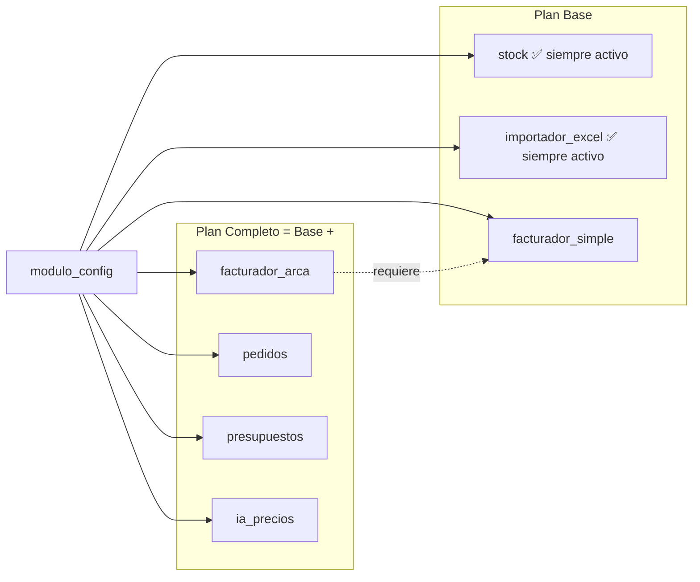
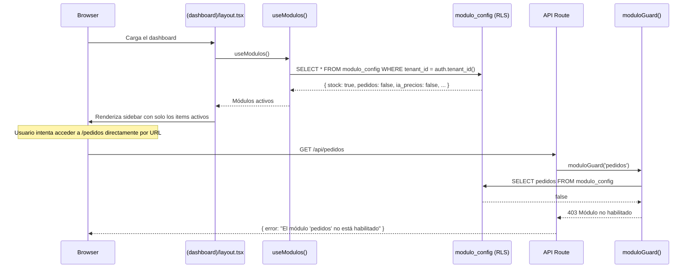
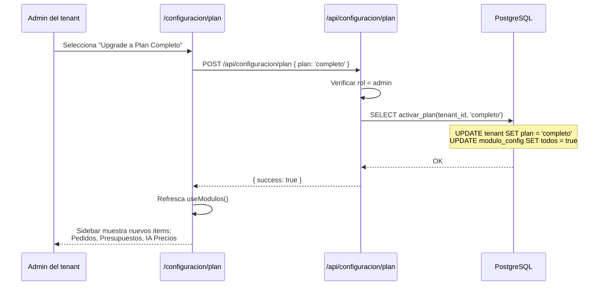

# SmartStock — Sistema de módulos y feature flags

## Visión general

SmartStock controla el acceso a funcionalidad a través de la tabla `modulo_config`: un registro por tenant con campos booleanos que indican qué módulos están habilitados. Esto permite que un mismo deploy sirva a todos los clientes, mostrando/ocultando secciones de la UI y permitiendo/bloqueando llamadas a la API según el plan de suscripción.



---

## Tabla `modulo_config`

```sql
CREATE TABLE modulo_config (
  id                UUID PRIMARY KEY DEFAULT uuid_generate_v4(),
  tenant_id         UUID NOT NULL UNIQUE REFERENCES tenant(id) ON DELETE CASCADE,
  stock             BOOLEAN DEFAULT true,
  importador_excel  BOOLEAN DEFAULT true,
  facturador_simple BOOLEAN DEFAULT false,
  facturador_arca   BOOLEAN DEFAULT false,
  pedidos           BOOLEAN DEFAULT false,
  presupuestos      BOOLEAN DEFAULT false,
  ia_precios        BOOLEAN DEFAULT false,
  created_at        TIMESTAMPTZ DEFAULT NOW(),
  updated_at        TIMESTAMPTZ DEFAULT NOW()
);

ALTER TABLE modulo_config
  ADD CONSTRAINT chk_arca_requiere_facturador
  CHECK (facturador_arca = false OR facturador_simple = true);
```

### Reglas de negocio

| Módulo | ¿Se puede desactivar? | Constraint |
|---|---|---|
| `stock` | No. Siempre `true` | Core del sistema |
| `importador_excel` | No. Siempre `true` | Core del sistema |
| `facturador_simple` | Sí | Habilitado en ambos planes |
| `facturador_arca` | Sí | Requiere `facturador_simple = true` |
| `pedidos` | Sí | Solo Plan Completo |
| `presupuestos` | Sí | Solo Plan Completo |
| `ia_precios` | Sí | Solo Plan Completo |

### Configuración default por plan

```typescript
// src/lib/modulos/defaults.ts

export const MODULOS_PLAN_BASE = {
  stock: true,
  importador_excel: true,
  facturador_simple: false,
  facturador_arca: false,
  pedidos: false,
  presupuestos: false,
  ia_precios: false,
} as const;

export const MODULOS_PLAN_COMPLETO = {
  stock: true,
  importador_excel: true,
  facturador_simple: true,
  facturador_arca: true,
  pedidos: true,
  presupuestos: true,
  ia_precios: true,
} as const;
```

### Función SQL para activar un plan

```sql
CREATE OR REPLACE FUNCTION activar_plan(
  p_tenant_id UUID,
  p_plan      plan_tipo
) RETURNS void AS $$
BEGIN
  UPDATE tenant SET plan = p_plan WHERE id = p_tenant_id;

  IF p_plan = 'completo' THEN
    UPDATE modulo_config SET
      facturador_simple = true,
      facturador_arca = true,
      pedidos = true,
      presupuestos = true,
      ia_precios = true
    WHERE tenant_id = p_tenant_id;
  ELSIF p_plan = 'base' THEN
    UPDATE modulo_config SET
      facturador_arca = false,
      pedidos = false,
      presupuestos = false,
      ia_precios = false
    WHERE tenant_id = p_tenant_id;
  END IF;
END;
$$ LANGUAGE plpgsql SECURITY DEFINER;
```

---

## Flujo de verificación de módulos



---

## Hook `useModulos` — Control en el frontend

```typescript
// src/hooks/useModulos.ts
'use client';

import { useEffect, useState } from 'react';
import { createBrowserClient } from '@/lib/supabase/client';

export interface ModulosConfig {
  stock: boolean;
  importador_excel: boolean;
  facturador_simple: boolean;
  facturador_arca: boolean;
  pedidos: boolean;
  presupuestos: boolean;
  ia_precios: boolean;
}

const DEFAULT_MODULOS: ModulosConfig = {
  stock: true,
  importador_excel: true,
  facturador_simple: false,
  facturador_arca: false,
  pedidos: false,
  presupuestos: false,
  ia_precios: false,
};

export function useModulos() {
  const [modulos, setModulos] = useState<ModulosConfig>(DEFAULT_MODULOS);
  const [loading, setLoading] = useState(true);

  useEffect(() => {
    async function fetchModulos() {
      const supabase = createBrowserClient();

      const { data, error } = await supabase
        .from('modulo_config')
        .select(
          'stock, importador_excel, facturador_simple, facturador_arca, pedidos, presupuestos, ia_precios'
        )
        .single();

      if (data && !error) {
        setModulos(data);
      }

      setLoading(false);
    }

    fetchModulos();
  }, []);

  return { modulos, loading };
}
```

---

## Sidebar dinámica — Mostrar/ocultar items

```typescript
// src/components/layout/sidebar-nav.tsx
'use client';

import Link from 'next/link';
import { usePathname } from 'next/navigation';
import { useModulos } from '@/hooks/useModulos';
import {
  Package, ArrowUpDown, Upload, FileText, Users,
  Truck, ShoppingCart, FileSpreadsheet, Brain, Settings,
} from 'lucide-react';

interface NavItem {
  label: string;
  href: string;
  icon: React.ComponentType<{ className?: string }>;
  modulo?: keyof ModulosConfig;
}

const NAV_ITEMS: NavItem[] = [
  { label: 'Dashboard', href: '/', icon: Package },
  { label: 'Productos', href: '/productos', icon: Package, modulo: 'stock' },
  { label: 'Movimientos', href: '/movimientos', icon: ArrowUpDown, modulo: 'stock' },
  { label: 'Importar', href: '/importar', icon: Upload, modulo: 'importador_excel' },
  { label: 'Proveedores', href: '/proveedores', icon: Truck, modulo: 'stock' },
  { label: 'Clientes', href: '/clientes', icon: Users, modulo: 'facturador_simple' },
  { label: 'Facturación', href: '/facturacion', icon: FileText, modulo: 'facturador_simple' },
  { label: 'Pedidos', href: '/pedidos', icon: ShoppingCart, modulo: 'pedidos' },
  { label: 'Presupuestos', href: '/presupuestos', icon: FileSpreadsheet, modulo: 'presupuestos' },
  { label: 'IA Precios', href: '/ia-precios', icon: Brain, modulo: 'ia_precios' },
  { label: 'Configuración', href: '/configuracion', icon: Settings },
];

export function SidebarNav() {
  const { modulos, loading } = useModulos();
  const pathname = usePathname();

  if (loading) return <nav className="animate-pulse" />;

  const itemsVisibles = NAV_ITEMS.filter(item => {
    if (!item.modulo) return true;
    return modulos[item.modulo];
  });

  return (
    <nav className="flex flex-col gap-1 p-4">
      {itemsVisibles.map(item => {
        const Icon = item.icon;
        const isActive = pathname === item.href || pathname.startsWith(item.href + '/');

        return (
          <Link
            key={item.href}
            href={item.href}
            className={`flex items-center gap-3 rounded-lg px-3 py-2 text-sm transition-colors
              ${isActive
                ? 'bg-primary text-primary-foreground'
                : 'text-muted-foreground hover:bg-muted hover:text-foreground'
              }`}
          >
            <Icon className="h-4 w-4" />
            {item.label}
          </Link>
        );
      })}
    </nav>
  );
}
```

---

## Guard de módulo en API Routes

```typescript
// src/lib/modulos/guard.ts
import { createServerClient } from '@/lib/supabase/server';
import { NextResponse } from 'next/server';

type ModuloKey =
  | 'stock'
  | 'importador_excel'
  | 'facturador_simple'
  | 'facturador_arca'
  | 'pedidos'
  | 'presupuestos'
  | 'ia_precios';

export async function moduloGuard(modulo: ModuloKey) {
  const supabase = await createServerClient();

  const { data: { user } } = await supabase.auth.getUser();
  if (!user) {
    return { allowed: false, response: NextResponse.json({ error: 'No autenticado' }, { status: 401 }) };
  }

  const { data: config } = await supabase
    .from('modulo_config')
    .select(modulo)
    .single();

  if (!config || !config[modulo]) {
    return {
      allowed: false,
      response: NextResponse.json(
        { error: `El módulo '${modulo}' no está habilitado para tu plan.` },
        { status: 403 }
      ),
    };
  }

  return { allowed: true, response: null };
}
```

### Uso en una API Route

```typescript
// src/app/api/pedidos/route.ts
import { moduloGuard } from '@/lib/modulos/guard';
import { createServerClient } from '@/lib/supabase/server';
import { NextResponse } from 'next/server';

export async function GET() {
  const guard = await moduloGuard('pedidos');
  if (!guard.allowed) return guard.response;

  const supabase = await createServerClient();

  const { data, error } = await supabase
    .from('pedido')
    .select('*, cliente:cliente_id(nombre), usuario:usuario_id(nombre)')
    .order('created_at', { ascending: false });

  if (error) return NextResponse.json({ error: error.message }, { status: 500 });

  return NextResponse.json(data);
}
```

---

## Guard de módulo en Server Components (páginas)

```typescript
// src/lib/modulos/page-guard.ts
import { createServerClient } from '@/lib/supabase/server';
import { redirect } from 'next/navigation';

type ModuloKey =
  | 'stock'
  | 'importador_excel'
  | 'facturador_simple'
  | 'facturador_arca'
  | 'pedidos'
  | 'presupuestos'
  | 'ia_precios';

export async function requireModulo(modulo: ModuloKey) {
  const supabase = await createServerClient();

  const { data: { user } } = await supabase.auth.getUser();
  if (!user) redirect('/login');

  const { data: config } = await supabase
    .from('modulo_config')
    .select(modulo)
    .single();

  if (!config || !config[modulo]) {
    redirect('/');
  }
}
```

### Uso en una página

```typescript
// src/app/(dashboard)/pedidos/page.tsx
import { requireModulo } from '@/lib/modulos/page-guard';

export default async function PedidosPage() {
  await requireModulo('pedidos');

  return <div>Listado de pedidos</div>;
}
```

---

## Flujo de cambio de plan



### API Route para cambio de plan

```typescript
// src/app/api/configuracion/plan/route.ts
import { createServerClient } from '@/lib/supabase/server';
import { NextResponse } from 'next/server';

export async function POST(request: Request) {
  const supabase = await createServerClient();
  const { data: { user } } = await supabase.auth.getUser();

  if (!user) {
    return NextResponse.json({ error: 'No autenticado' }, { status: 401 });
  }

  const { data: usuario } = await supabase
    .from('usuario')
    .select('rol, tenant_id')
    .eq('id', user.id)
    .single();

  if (!usuario || usuario.rol !== 'admin') {
    return NextResponse.json({ error: 'Solo admin puede cambiar el plan' }, { status: 403 });
  }

  const body = await request.json();
  const plan = body.plan;

  if (plan !== 'base' && plan !== 'completo') {
    return NextResponse.json({ error: 'Plan inválido' }, { status: 400 });
  }

  const { error } = await supabase.rpc('activar_plan', {
    p_tenant_id: usuario.tenant_id,
    p_plan: plan,
  });

  if (error) {
    return NextResponse.json({ error: error.message }, { status: 500 });
  }

  return NextResponse.json({ success: true, plan });
}
```

---

## Mapa de módulos a rutas y API routes

| Módulo | Páginas UI | API Routes |
|---|---|---|
| `stock` | `/productos`, `/productos/[id]`, `/productos/nuevo`, `/movimientos`, `/proveedores`, `/proveedores/[id]` | `/api/productos`, `/api/movimientos` |
| `importador_excel` | `/importar`, `/importar/mapeo`, `/importar/preview` | `/api/importar/validar`, `/api/importar/ejecutar` |
| `facturador_simple` | `/facturacion`, `/facturacion/nueva`, `/facturacion/[id]`, `/clientes`, `/clientes/[id]` | `/api/facturacion/emitir` |
| `facturador_arca` | `/configuracion/arca` | `/api/facturacion/arca/wsaa`, `/api/facturacion/arca/wsfe` |
| `pedidos` | `/pedidos`, `/pedidos/nuevo`, `/pedidos/[id]` | `/api/pedidos` |
| `presupuestos` | `/presupuestos` | `/api/pedidos` (tipo presupuesto) |
| `ia_precios` | `/ia-precios`, `/ia-precios/historial` | `/api/ia/extraer` |
| — (siempre visible) | `/`, `/configuracion`, `/configuracion/plan`, `/configuracion/usuarios` | `/api/configuracion/plan` |

---

## Tipos TypeScript

```typescript
// src/types/modulos.ts

export type ModuloKey =
  | 'stock'
  | 'importador_excel'
  | 'facturador_simple'
  | 'facturador_arca'
  | 'pedidos'
  | 'presupuestos'
  | 'ia_precios';

export interface ModulosConfig {
  stock: boolean;
  importador_excel: boolean;
  facturador_simple: boolean;
  facturador_arca: boolean;
  pedidos: boolean;
  presupuestos: boolean;
  ia_precios: boolean;
}

export type PlanTipo = 'base' | 'completo';

export const MODULOS_LABELS: Record<ModuloKey, string> = {
  stock: 'Control de stock',
  importador_excel: 'Importador Excel/CSV',
  facturador_simple: 'Facturador simple (PDF)',
  facturador_arca: 'Facturación electrónica (ARCA)',
  pedidos: 'Pedidos',
  presupuestos: 'Presupuestos',
  ia_precios: 'IA de precios',
};

export const MODULOS_PLAN: Record<ModuloKey, PlanTipo | 'siempre'> = {
  stock: 'siempre',
  importador_excel: 'siempre',
  facturador_simple: 'base',
  facturador_arca: 'completo',
  pedidos: 'completo',
  presupuestos: 'completo',
  ia_precios: 'completo',
};
```
