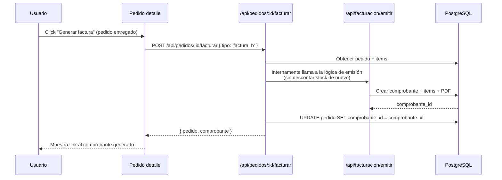
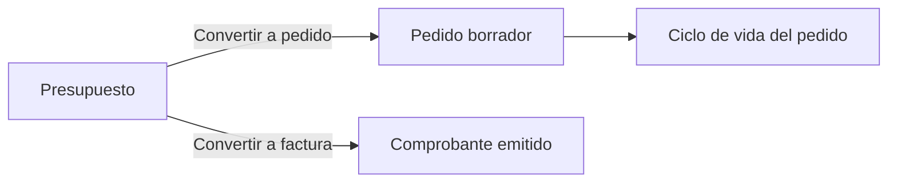

# SmartStock — Módulo de Pedidos y Presupuestos

## Visión general

Disponible solo con el Plan Completo (módulos `pedidos` y `presupuestos`). Un pedido permite armar una orden de compra para un cliente, gestionarla a través de estados y convertirla en factura. Un presupuesto es un comprobante no vinculante que puede convertirse en pedido o directamente en factura.

```mermaid
stateDiagram-v2
    [*] --> Borrador: Crear pedido
    Borrador --> Confirmado: Confirmar
    Borrador --> Cancelado: Cancelar
    Confirmado --> Entregado: Marcar entregado
    Confirmado --> Cancelado: Cancelar
    Entregado --> [*]
    Cancelado --> [*]

    state Borrador {
        [*] --> Editando
        Editando --> Editando: Agregar/quitar items
        note right of Editando: No afecta stock
    }

    state Confirmado {
        note right of Confirmado: Stock "comprometido"<br/>(visible pero no descontado)
    }

    state Entregado {
        note right of Entregado: Stock descontado<br/>Se puede generar factura
    }

    state Cancelado {
        note right of Cancelado: Si estaba confirmado,<br/>libera stock comprometido
    }
```

---

## Estados del pedido y su efecto en el stock

| Estado | Editable | Efecto en stock | Puede facturarse | Transiciones posibles |
|---|---|---|---|---|
| `borrador` | Sí (items, cliente, notas) | Ninguno | No | → `confirmado`, → `cancelado` |
| `confirmado` | No (solo notas) | Reserva visible (no descuenta `stock_actual` pero se muestra como "comprometido") | No | → `entregado`, → `cancelado` |
| `entregado` | No | Descuenta `stock_actual` via `registrar_movimiento` | Sí | Ninguna (estado final) |
| `cancelado` | No | Si venía de `confirmado`, libera la reserva | No | Ninguna (estado final) |

### Stock comprometido

El stock comprometido no modifica `producto.stock_actual`. Se calcula dinámicamente sumando las cantidades de pedidos en estado `confirmado`:

```sql
CREATE OR REPLACE VIEW v_stock_comprometido AS
SELECT
  pi.producto_id,
  p.tenant_id,
  SUM(pi.cantidad) AS comprometido
FROM pedido_item pi
JOIN pedido p ON p.id = pi.pedido_id
WHERE p.estado = 'confirmado'
GROUP BY pi.producto_id, p.tenant_id;
```

En la UI de productos, se muestra:

```
Stock actual: 100
Comprometido: 25
Disponible:   75
```

```typescript
// src/lib/stock/comprometido.ts
import { SupabaseClient } from '@supabase/supabase-js';

export async function obtenerStockComprometido(
  supabase: SupabaseClient,
  productoIds: string[]
): Promise<Map<string, number>> {
  const { data } = await supabase
    .from('pedido_item')
    .select('producto_id, cantidad, pedido:pedido_id!inner(estado)')
    .in('producto_id', productoIds)
    .eq('pedido.estado', 'confirmado');

  const mapa = new Map<string, number>();

  for (const item of data ?? []) {
    const actual = mapa.get(item.producto_id) ?? 0;
    mapa.set(item.producto_id, actual + item.cantidad);
  }

  return mapa;
}
```

---

## API Routes

### `GET /api/pedidos` — Listado con filtros

```typescript
// src/app/api/pedidos/route.ts
import { createServerClient } from '@/lib/supabase/server';
import { NextResponse, type NextRequest } from 'next/server';
import { moduloGuard } from '@/lib/modulos/guard';

export async function GET(request: NextRequest) {
  const guard = await moduloGuard('pedidos');
  if (!guard.allowed) return guard.response;

  const supabase = await createServerClient();
  const { data: { user } } = await supabase.auth.getUser();
  if (!user) return NextResponse.json({ error: 'No autenticado' }, { status: 401 });

  const { searchParams } = new URL(request.url);
  const estado = searchParams.get('estado');
  const clienteId = searchParams.get('cliente_id');
  const pagina = parseInt(searchParams.get('pagina') ?? '1');
  const porPagina = parseInt(searchParams.get('por_pagina') ?? '25');
  const offset = (pagina - 1) * porPagina;

  let query = supabase
    .from('pedido')
    .select(
      `*, cliente:cliente_id(nombre, razon_social),
       usuario:usuario_id(nombre, apellido),
       items:pedido_item(id, cantidad, precio_unitario, subtotal, producto:producto_id(nombre, codigo))`,
      { count: 'exact' }
    )
    .order('created_at', { ascending: false })
    .range(offset, offset + porPagina - 1);

  if (estado) query = query.eq('estado', estado);
  if (clienteId) query = query.eq('cliente_id', clienteId);

  const { data, error, count } = await query;

  if (error) return NextResponse.json({ error: error.message }, { status: 500 });

  return NextResponse.json({
    pedidos: data,
    total: count,
    pagina,
    por_pagina: porPagina,
  });
}
```

### `POST /api/pedidos` — Crear pedido

```typescript
export async function POST(request: Request) {
  const guard = await moduloGuard('pedidos');
  if (!guard.allowed) return guard.response;

  const supabase = await createServerClient();
  const { data: { user } } = await supabase.auth.getUser();
  if (!user) return NextResponse.json({ error: 'No autenticado' }, { status: 401 });

  const { data: usuario } = await supabase
    .from('usuario')
    .select('rol, tenant_id')
    .eq('id', user.id)
    .single();

  if (!usuario || usuario.rol === 'visor') {
    return NextResponse.json({ error: 'Sin permisos' }, { status: 403 });
  }

  const body = await request.json();

  if (!body.items || body.items.length === 0) {
    return NextResponse.json({ error: 'El pedido debe tener al menos un item' }, { status: 400 });
  }

  const total = body.items.reduce(
    (sum: number, i: { cantidad: number; precio_unitario: number }) =>
      sum + i.cantidad * i.precio_unitario,
    0
  );

  const { data: pedido, error: pedidoError } = await supabase
    .from('pedido')
    .insert({
      tenant_id: usuario.tenant_id,
      cliente_id: body.cliente_id || null,
      estado: 'borrador',
      fecha: new Date().toISOString().split('T')[0],
      total: Math.round(total * 100) / 100,
      notas: body.notas || null,
      usuario_id: user.id,
    })
    .select()
    .single();

  if (pedidoError) {
    return NextResponse.json({ error: pedidoError.message }, { status: 500 });
  }

  const itemsInsert = body.items.map((item: any) => ({
    pedido_id: pedido.id,
    producto_id: item.producto_id,
    cantidad: item.cantidad,
    precio_unitario: item.precio_unitario,
    subtotal: Math.round(item.cantidad * item.precio_unitario * 100) / 100,
  }));

  const { error: itemsError } = await supabase
    .from('pedido_item')
    .insert(itemsInsert);

  if (itemsError) {
    await supabase.from('pedido').delete().eq('id', pedido.id);
    return NextResponse.json({ error: itemsError.message }, { status: 500 });
  }

  return NextResponse.json(pedido, { status: 201 });
}
```

### `PATCH /api/pedidos/:id/estado` — Cambiar estado

```typescript
// src/app/api/pedidos/[id]/estado/route.ts
import { createServerClient } from '@/lib/supabase/server';
import { NextResponse } from 'next/server';
import { moduloGuard } from '@/lib/modulos/guard';

const TRANSICIONES_VALIDAS: Record<string, string[]> = {
  borrador: ['confirmado', 'cancelado'],
  confirmado: ['entregado', 'cancelado'],
};

export async function PATCH(
  request: Request,
  { params }: { params: { id: string } }
) {
  const guard = await moduloGuard('pedidos');
  if (!guard.allowed) return guard.response;

  const supabase = await createServerClient();
  const { data: { user } } = await supabase.auth.getUser();
  if (!user) return NextResponse.json({ error: 'No autenticado' }, { status: 401 });

  const { data: usuario } = await supabase
    .from('usuario')
    .select('rol, tenant_id')
    .eq('id', user.id)
    .single();

  if (!usuario || usuario.rol === 'visor') {
    return NextResponse.json({ error: 'Sin permisos' }, { status: 403 });
  }

  const body = await request.json();
  const nuevoEstado = body.estado;

  // Obtener pedido actual con items
  const { data: pedido } = await supabase
    .from('pedido')
    .select('*, items:pedido_item(producto_id, cantidad)')
    .eq('id', params.id)
    .single();

  if (!pedido) {
    return NextResponse.json({ error: 'Pedido no encontrado' }, { status: 404 });
  }

  // Validar transición
  const transicionesPermitidas = TRANSICIONES_VALIDAS[pedido.estado] ?? [];
  if (!transicionesPermitidas.includes(nuevoEstado)) {
    return NextResponse.json({
      error: `No se puede pasar de '${pedido.estado}' a '${nuevoEstado}'`,
    }, { status: 400 });
  }

  // === CONFIRMAR: verificar stock disponible ===
  if (nuevoEstado === 'confirmado') {
    for (const item of pedido.items) {
      const { data: prod } = await supabase
        .from('producto')
        .select('nombre, stock_actual')
        .eq('id', item.producto_id)
        .single();

      if (prod && prod.stock_actual < item.cantidad) {
        return NextResponse.json({
          error: `Stock insuficiente para "${prod.nombre}". Disponible: ${prod.stock_actual}, pedido: ${item.cantidad}`,
        }, { status: 400 });
      }
    }
  }

  // === ENTREGAR: descontar stock ===
  if (nuevoEstado === 'entregado') {
    for (const item of pedido.items) {
      const { error: movError } = await supabase.rpc('registrar_movimiento', {
        p_tenant_id: usuario.tenant_id,
        p_producto_id: item.producto_id,
        p_tipo: 'salida',
        p_cantidad: item.cantidad,
        p_motivo: `Entrega pedido #${pedido.id.substring(0, 8)}`,
        p_referencia_tipo: 'pedido',
        p_referencia_id: pedido.id,
        p_usuario_id: user.id,
      });

      if (movError) {
        return NextResponse.json({
          error: `Error al descontar stock: ${movError.message}`,
        }, { status: 400 });
      }
    }
  }

  // Actualizar estado
  const { data: pedidoActualizado, error } = await supabase
    .from('pedido')
    .update({ estado: nuevoEstado })
    .eq('id', params.id)
    .select()
    .single();

  if (error) return NextResponse.json({ error: error.message }, { status: 500 });

  return NextResponse.json(pedidoActualizado);
}
```

---

## Conversión de pedido a factura



### API Route de conversión

```typescript
// src/app/api/pedidos/[id]/facturar/route.ts
import { createServerClient } from '@/lib/supabase/server';
import { NextResponse } from 'next/server';
import { moduloGuard } from '@/lib/modulos/guard';
import { calcularImportes } from '@/lib/facturacion/calcular-importes';
import { generarPDF } from '@/lib/facturacion/pdf-generator';

export async function POST(
  request: Request,
  { params }: { params: { id: string } }
) {
  const guard = await moduloGuard('pedidos');
  if (!guard.allowed) return guard.response;

  const facGuard = await moduloGuard('facturador_simple');
  if (!facGuard.allowed) return facGuard.response;

  const supabase = await createServerClient();
  const { data: { user } } = await supabase.auth.getUser();
  if (!user) return NextResponse.json({ error: 'No autenticado' }, { status: 401 });

  const { data: usuario } = await supabase
    .from('usuario')
    .select('rol, tenant_id')
    .eq('id', user.id)
    .single();

  if (!usuario || usuario.rol === 'visor') {
    return NextResponse.json({ error: 'Sin permisos' }, { status: 403 });
  }

  const body = await request.json();
  const tipoComprobante = body.tipo ?? 'factura_c';

  // Obtener pedido
  const { data: pedido } = await supabase
    .from('pedido')
    .select(`
      *,
      cliente:cliente_id(*),
      items:pedido_item(*, producto:producto_id(id, nombre, codigo))
    `)
    .eq('id', params.id)
    .single();

  if (!pedido) {
    return NextResponse.json({ error: 'Pedido no encontrado' }, { status: 404 });
  }

  if (pedido.estado !== 'entregado') {
    return NextResponse.json(
      { error: 'Solo se pueden facturar pedidos en estado "entregado"' },
      { status: 400 }
    );
  }

  if (pedido.comprobante_id) {
    return NextResponse.json(
      { error: 'Este pedido ya tiene un comprobante asociado' },
      { status: 409 }
    );
  }

  // Calcular importes
  const itemsCalc = pedido.items.map((i: any) => ({
    producto_id: i.producto_id,
    cantidad: i.cantidad,
    precio_unitario: i.precio_unitario,
  }));
  const importes = calcularImportes(itemsCalc, tipoComprobante);

  // Obtener siguiente número
  const { data: numero } = await supabase.rpc('siguiente_numero_comprobante', {
    p_tenant_id: usuario.tenant_id,
    p_tipo: tipoComprobante,
  });

  // Crear comprobante (sin descontar stock — ya se descontó al entregar)
  const { data: comprobante, error: compError } = await supabase
    .from('comprobante')
    .insert({
      tenant_id: usuario.tenant_id,
      tipo: tipoComprobante,
      numero,
      fecha: new Date().toISOString().split('T')[0],
      cliente_id: pedido.cliente_id,
      subtotal: importes.subtotal,
      iva_monto: importes.iva_monto,
      iva_porcentaje: importes.iva_porcentaje,
      total: importes.total,
      estado: 'emitido',
      notas: `Generado desde pedido #${pedido.id.substring(0, 8)}`,
      usuario_id: user.id,
    })
    .select()
    .single();

  if (compError) return NextResponse.json({ error: compError.message }, { status: 500 });

  // Crear items del comprobante
  const compItems = importes.items.map(item => ({
    comprobante_id: comprobante.id,
    producto_id: item.producto_id,
    cantidad: item.cantidad,
    precio_unitario: item.precio_unitario,
    subtotal: item.subtotal,
  }));

  await supabase.from('comprobante_item').insert(compItems);

  // Generar PDF y subir a Storage
  const { data: tenant } = await supabase
    .from('tenant')
    .select('*')
    .eq('id', usuario.tenant_id)
    .single();

  const itemsPDF = pedido.items.map((i: any) => ({
    cantidad: i.cantidad,
    descripcion: i.producto.nombre,
    precio_unitario: i.precio_unitario,
    subtotal: i.cantidad * i.precio_unitario,
  }));

  const pdf = generarPDF(
    {
      nombre: tenant!.nombre,
      razon_social: tenant!.razon_social,
      cuit: tenant!.cuit,
      domicilio: tenant!.domicilio,
      condicion_iva: tenant!.condicion_iva,
      punto_de_venta: tenant!.punto_de_venta,
      logo_url: tenant!.logo_url,
    },
    {
      nombre: pedido.cliente?.nombre ?? 'Consumidor Final',
      razon_social: pedido.cliente?.razon_social ?? null,
      cuit_dni: pedido.cliente?.cuit_dni ?? null,
      condicion_iva: pedido.cliente?.condicion_iva ?? 'consumidor_final',
      direccion: pedido.cliente?.direccion ?? null,
    },
    {
      tipo: tipoComprobante,
      numero,
      fecha: comprobante.fecha,
      subtotal: importes.subtotal,
      iva_monto: importes.iva_monto,
      iva_porcentaje: importes.iva_porcentaje,
      total: importes.total,
      notas: comprobante.notas,
      cae: null,
      cae_vencimiento: null,
    },
    itemsPDF
  );

  const pdfBuffer = Buffer.from(pdf.output('arraybuffer'));
  const pdfPath = `${usuario.tenant_id}/comprobantes/${tipoComprobante}_${numero}.pdf`;

  await supabase.storage
    .from('comprobantes')
    .upload(pdfPath, pdfBuffer, { contentType: 'application/pdf', upsert: true });

  const { data: publicUrl } = supabase.storage
    .from('comprobantes')
    .getPublicUrl(pdfPath);

  await supabase
    .from('comprobante')
    .update({ pdf_url: publicUrl.publicUrl })
    .eq('id', comprobante.id);

  // Vincular pedido → comprobante
  await supabase
    .from('pedido')
    .update({ comprobante_id: comprobante.id })
    .eq('id', pedido.id);

  return NextResponse.json({
    pedido_id: pedido.id,
    comprobante_id: comprobante.id,
    pdf_url: publicUrl.publicUrl,
  }, { status: 201 });
}
```

---

## Presupuestos

Un presupuesto es un comprobante de tipo `presupuesto`. No afecta stock, no tiene implicancias fiscales, y puede convertirse en pedido o directamente en factura.



### Conversión de presupuesto a pedido

```typescript
// src/app/api/presupuestos/[id]/convertir-a-pedido/route.ts
import { createServerClient } from '@/lib/supabase/server';
import { NextResponse } from 'next/server';
import { moduloGuard } from '@/lib/modulos/guard';

export async function POST(
  request: Request,
  { params }: { params: { id: string } }
) {
  const guard = await moduloGuard('presupuestos');
  if (!guard.allowed) return guard.response;

  const pedidoGuard = await moduloGuard('pedidos');
  if (!pedidoGuard.allowed) return pedidoGuard.response;

  const supabase = await createServerClient();
  const { data: { user } } = await supabase.auth.getUser();
  if (!user) return NextResponse.json({ error: 'No autenticado' }, { status: 401 });

  const { data: usuario } = await supabase
    .from('usuario')
    .select('rol, tenant_id')
    .eq('id', user.id)
    .single();

  if (!usuario || usuario.rol === 'visor') {
    return NextResponse.json({ error: 'Sin permisos' }, { status: 403 });
  }

  // Obtener presupuesto (que es un comprobante tipo 'presupuesto')
  const { data: presupuesto } = await supabase
    .from('comprobante')
    .select('*, items:comprobante_item(producto_id, cantidad, precio_unitario, subtotal)')
    .eq('id', params.id)
    .eq('tipo', 'presupuesto')
    .single();

  if (!presupuesto) {
    return NextResponse.json({ error: 'Presupuesto no encontrado' }, { status: 404 });
  }

  // Crear pedido con los mismos items
  const { data: pedido, error: pedidoError } = await supabase
    .from('pedido')
    .insert({
      tenant_id: usuario.tenant_id,
      cliente_id: presupuesto.cliente_id,
      estado: 'borrador',
      fecha: new Date().toISOString().split('T')[0],
      total: presupuesto.total,
      notas: `Generado desde presupuesto #${presupuesto.numero}`,
      usuario_id: user.id,
    })
    .select()
    .single();

  if (pedidoError) return NextResponse.json({ error: pedidoError.message }, { status: 500 });

  // Copiar items
  const itemsInsert = presupuesto.items.map((i: any) => ({
    pedido_id: pedido.id,
    producto_id: i.producto_id,
    cantidad: i.cantidad,
    precio_unitario: i.precio_unitario,
    subtotal: i.subtotal,
  }));

  await supabase.from('pedido_item').insert(itemsInsert);

  return NextResponse.json({
    presupuesto_id: presupuesto.id,
    pedido_id: pedido.id,
  }, { status: 201 });
}
```

---

## Componentes UI

### Tabla de pedidos con badges de estado

```typescript
// src/components/pedidos/pedidos-table.tsx
'use client';

import Link from 'next/link';
import { formatCurrency, formatDate } from '@/lib/utils/formatters';

interface Pedido {
  id: string;
  estado: string;
  fecha: string;
  total: number;
  cliente: { nombre: string; razon_social: string | null } | null;
  usuario: { nombre: string; apellido: string } | null;
  items: { id: string }[];
}

const ESTADO_STYLES: Record<string, string> = {
  borrador: 'bg-gray-100 text-gray-800',
  confirmado: 'bg-blue-100 text-blue-800',
  entregado: 'bg-green-100 text-green-800',
  cancelado: 'bg-red-100 text-red-800',
};

const ESTADO_LABELS: Record<string, string> = {
  borrador: 'Borrador',
  confirmado: 'Confirmado',
  entregado: 'Entregado',
  cancelado: 'Cancelado',
};

interface Props {
  pedidos: Pedido[];
}

export function PedidosTable({ pedidos }: Props) {
  return (
    <div className="overflow-x-auto">
      <table className="w-full text-sm">
        <thead>
          <tr className="border-b text-left text-muted-foreground">
            <th className="pb-3 font-medium">Pedido</th>
            <th className="pb-3 font-medium">Cliente</th>
            <th className="pb-3 font-medium">Fecha</th>
            <th className="pb-3 font-medium">Items</th>
            <th className="pb-3 font-medium text-right">Total</th>
            <th className="pb-3 font-medium">Estado</th>
          </tr>
        </thead>
        <tbody>
          {pedidos.map(p => (
            <tr key={p.id} className="border-b hover:bg-muted/50 transition-colors">
              <td className="py-3">
                <Link href={`/pedidos/${p.id}`} className="font-mono text-xs hover:underline">
                  #{p.id.substring(0, 8)}
                </Link>
              </td>
              <td className="py-3">
                {p.cliente?.razon_social || p.cliente?.nombre || '—'}
              </td>
              <td className="py-3 text-muted-foreground">{formatDate(p.fecha)}</td>
              <td className="py-3">{p.items.length}</td>
              <td className="py-3 text-right font-mono">{formatCurrency(p.total)}</td>
              <td className="py-3">
                <span className={`px-2 py-0.5 rounded-full text-xs font-medium ${ESTADO_STYLES[p.estado]}`}>
                  {ESTADO_LABELS[p.estado]}
                </span>
              </td>
            </tr>
          ))}
        </tbody>
      </table>
    </div>
  );
}
```

### Detalle de pedido con acciones

```typescript
// src/components/pedidos/pedido-detalle.tsx
'use client';

import { useState } from 'react';
import { formatCurrency, formatDate } from '@/lib/utils/formatters';
import { FileText, Truck, X } from 'lucide-react';

interface PedidoDetalle {
  id: string;
  estado: string;
  fecha: string;
  total: number;
  notas: string | null;
  comprobante_id: string | null;
  cliente: { nombre: string; razon_social: string | null } | null;
  items: {
    id: string;
    cantidad: number;
    precio_unitario: number;
    subtotal: number;
    producto: { id: string; nombre: string; codigo: string };
  }[];
}

interface Props {
  pedido: PedidoDetalle;
  onCambiarEstado: (nuevoEstado: string) => Promise<void>;
  onFacturar: (tipo: string) => Promise<void>;
}

export function PedidoDetalle({ pedido, onCambiarEstado, onFacturar }: Props) {
  const [loading, setLoading] = useState(false);

  async function handleAccion(accion: () => Promise<void>) {
    setLoading(true);
    try { await accion(); } finally { setLoading(false); }
  }

  return (
    <div className="space-y-6">
      <div className="flex justify-between items-start">
        <div>
          <h1 className="text-xl font-bold">Pedido #{pedido.id.substring(0, 8)}</h1>
          <p className="text-muted-foreground">{formatDate(pedido.fecha)}</p>
          {pedido.cliente && (
            <p className="text-sm mt-1">
              Cliente: {pedido.cliente.razon_social || pedido.cliente.nombre}
            </p>
          )}
        </div>
        <div className="flex gap-2">
          {pedido.estado === 'borrador' && (
            <>
              <button
                onClick={() => handleAccion(() => onCambiarEstado('confirmado'))}
                disabled={loading}
                className="flex items-center gap-1 bg-blue-600 text-white px-3 py-1.5 rounded text-sm"
              >
                Confirmar
              </button>
              <button
                onClick={() => handleAccion(() => onCambiarEstado('cancelado'))}
                disabled={loading}
                className="flex items-center gap-1 border border-red-300 text-red-600 px-3 py-1.5 rounded text-sm"
              >
                <X className="h-4 w-4" /> Cancelar
              </button>
            </>
          )}
          {pedido.estado === 'confirmado' && (
            <>
              <button
                onClick={() => handleAccion(() => onCambiarEstado('entregado'))}
                disabled={loading}
                className="flex items-center gap-1 bg-green-600 text-white px-3 py-1.5 rounded text-sm"
              >
                <Truck className="h-4 w-4" /> Marcar entregado
              </button>
              <button
                onClick={() => handleAccion(() => onCambiarEstado('cancelado'))}
                disabled={loading}
                className="flex items-center gap-1 border border-red-300 text-red-600 px-3 py-1.5 rounded text-sm"
              >
                <X className="h-4 w-4" /> Cancelar
              </button>
            </>
          )}
          {pedido.estado === 'entregado' && !pedido.comprobante_id && (
            <button
              onClick={() => handleAccion(() => onFacturar('factura_b'))}
              disabled={loading}
              className="flex items-center gap-1 bg-primary text-primary-foreground px-3 py-1.5 rounded text-sm"
            >
              <FileText className="h-4 w-4" /> Generar factura
            </button>
          )}
        </div>
      </div>

      {/* Items */}
      <table className="w-full text-sm">
        <thead>
          <tr className="border-b text-left">
            <th className="pb-2">Código</th>
            <th className="pb-2">Producto</th>
            <th className="pb-2 text-right">Cantidad</th>
            <th className="pb-2 text-right">P. Unitario</th>
            <th className="pb-2 text-right">Subtotal</th>
          </tr>
        </thead>
        <tbody>
          {pedido.items.map(item => (
            <tr key={item.id} className="border-b">
              <td className="py-2 font-mono text-xs">{item.producto.codigo}</td>
              <td className="py-2">{item.producto.nombre}</td>
              <td className="py-2 text-right">{item.cantidad}</td>
              <td className="py-2 text-right">{formatCurrency(item.precio_unitario)}</td>
              <td className="py-2 text-right">{formatCurrency(item.subtotal)}</td>
            </tr>
          ))}
        </tbody>
      </table>

      <p className="text-right text-lg font-bold">
        Total: {formatCurrency(pedido.total)}
      </p>

      {pedido.notas && (
        <p className="text-sm text-muted-foreground border-t pt-3">
          Notas: {pedido.notas}
        </p>
      )}

      {pedido.comprobante_id && (
        <div className="bg-green-50 border border-green-200 rounded p-3 text-sm text-green-800">
          Facturado — <a href={`/facturacion/${pedido.comprobante_id}`} className="underline">Ver comprobante</a>
        </div>
      )}
    </div>
  );
}
```

---

## Tipos TypeScript

```typescript
// src/types/pedidos.ts

export type EstadoPedido = 'borrador' | 'confirmado' | 'entregado' | 'cancelado';

export interface Pedido {
  id: string;
  tenant_id: string;
  cliente_id: string | null;
  estado: EstadoPedido;
  fecha: string;
  total: number;
  notas: string | null;
  comprobante_id: string | null;
  usuario_id: string | null;
  created_at: string;
  updated_at: string;
}

export interface PedidoItem {
  id: string;
  pedido_id: string;
  producto_id: string;
  cantidad: number;
  precio_unitario: number;
  subtotal: number;
}

export const TRANSICIONES: Record<EstadoPedido, EstadoPedido[]> = {
  borrador: ['confirmado', 'cancelado'],
  confirmado: ['entregado', 'cancelado'],
  entregado: [],
  cancelado: [],
};
```
