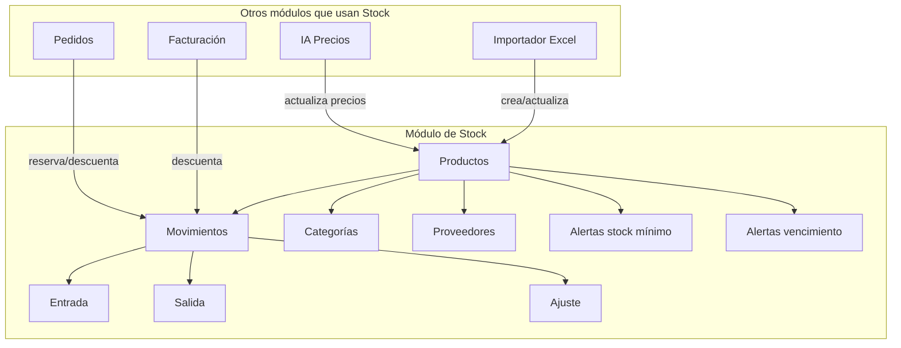
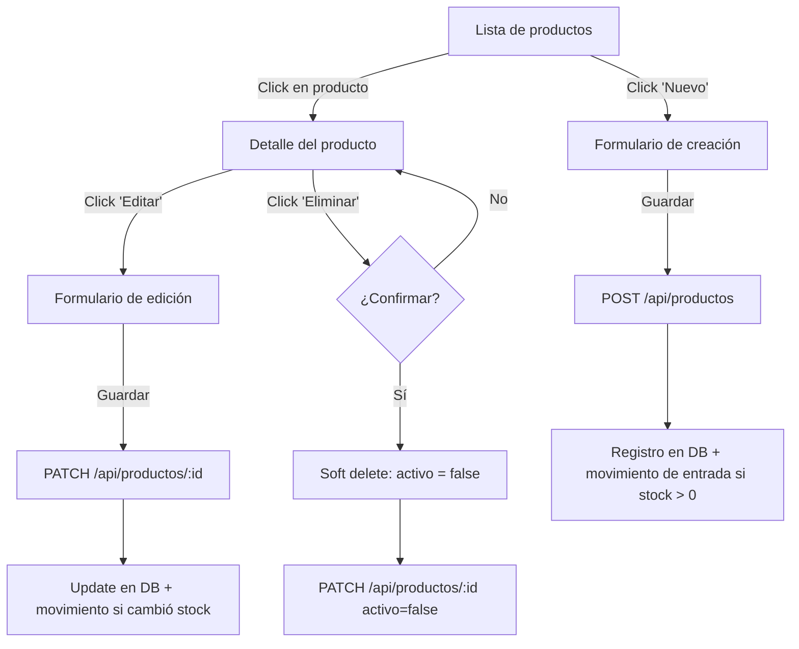
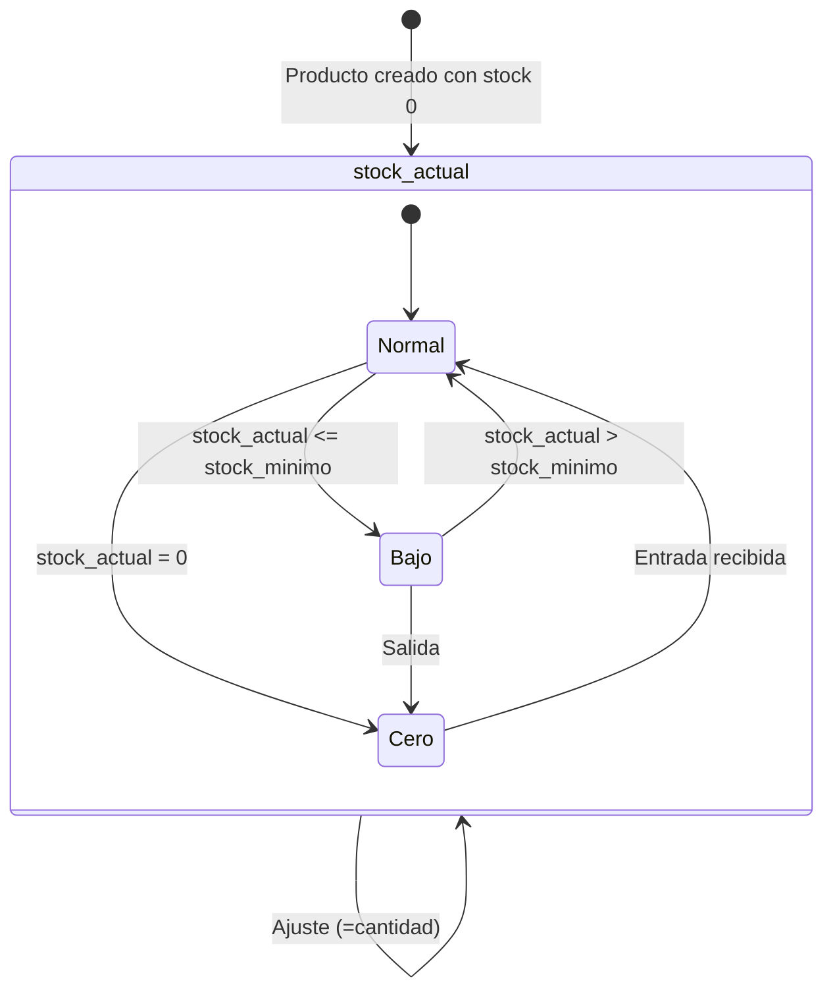

# SmartStock — Módulo de Stock

## Visión general

El módulo de stock es el núcleo del sistema. Siempre está activo para todos los tenants. Comprende:

- **CRUD de productos** con búsqueda full-text, filtros por categoría/proveedor, y paginación.
- **Movimientos de stock** (entrada, salida, ajuste) con registro atómico y trazabilidad.
- **Alertas de stock mínimo** visibles en el dashboard.
- **Alertas de vencimiento** para productos perecederos.
- **CRUD de categorías** y **CRUD de proveedores**.



---

## CRUD de productos

### Flujo completo



### API Routes

#### `GET /api/productos` — Listado con filtros

```typescript
// src/app/api/productos/route.ts
import { createServerClient } from '@/lib/supabase/server';
import { NextResponse, type NextRequest } from 'next/server';

export async function GET(request: NextRequest) {
  const supabase = await createServerClient();
  const { data: { user } } = await supabase.auth.getUser();
  if (!user) return NextResponse.json({ error: 'No autenticado' }, { status: 401 });

  const { searchParams } = new URL(request.url);
  const busqueda = searchParams.get('q');
  const categoriaId = searchParams.get('categoria_id');
  const proveedorId = searchParams.get('proveedor_id');
  const soloStockBajo = searchParams.get('stock_bajo') === 'true';
  const soloVencidos = searchParams.get('vencidos') === 'true';
  const pagina = parseInt(searchParams.get('pagina') ?? '1');
  const porPagina = parseInt(searchParams.get('por_pagina') ?? '25');
  const offset = (pagina - 1) * porPagina;

  let query = supabase
    .from('producto')
    .select(
      '*, categoria:categoria_id(id, nombre), proveedor:proveedor_id(id, nombre)',
      { count: 'exact' }
    )
    .eq('activo', true)
    .order('nombre')
    .range(offset, offset + porPagina - 1);

  if (busqueda) {
    query = query.textSearch('nombre', busqueda, { type: 'websearch', config: 'spanish' });
  }

  if (categoriaId) {
    query = query.eq('categoria_id', categoriaId);
  }

  if (proveedorId) {
    query = query.eq('proveedor_id', proveedorId);
  }

  if (soloStockBajo) {
    query = query.lte('stock_actual', supabase.rpc('stock_minimo_ref'));
    // Alternativa más directa:
    // query = query.filter('stock_actual', 'lte', 'stock_minimo');
    // Supabase no soporta comparar dos columnas directamente en el SDK,
    // usamos un filtro raw:
    query = supabase
      .from('producto')
      .select('*, categoria:categoria_id(id, nombre), proveedor:proveedor_id(id, nombre)', { count: 'exact' })
      .eq('activo', true)
      .gt('stock_minimo', 0)
      .order('nombre')
      .range(offset, offset + porPagina - 1);
    // Se filtra en el cliente o se usa una vista
  }

  if (soloVencidos) {
    const hoy = new Date().toISOString().split('T')[0];
    const en30dias = new Date(Date.now() + 30 * 24 * 60 * 60 * 1000).toISOString().split('T')[0];
    query = query.not('fecha_vencimiento', 'is', null).lte('fecha_vencimiento', en30dias);
  }

  const { data, error, count } = await query;

  if (error) return NextResponse.json({ error: error.message }, { status: 500 });

  return NextResponse.json({
    productos: data,
    total: count,
    pagina,
    por_pagina: porPagina,
    total_paginas: Math.ceil((count ?? 0) / porPagina),
  });
}
```

#### `POST /api/productos` — Crear producto

```typescript
export async function POST(request: Request) {
  const supabase = await createServerClient();
  const { data: { user } } = await supabase.auth.getUser();
  if (!user) return NextResponse.json({ error: 'No autenticado' }, { status: 401 });

  const { data: usuario } = await supabase
    .from('usuario')
    .select('rol, tenant_id')
    .eq('id', user.id)
    .single();

  if (!usuario || usuario.rol === 'visor') {
    return NextResponse.json({ error: 'Sin permisos' }, { status: 403 });
  }

  const body = await request.json();

  const { data: producto, error } = await supabase
    .from('producto')
    .insert({
      tenant_id: usuario.tenant_id,
      codigo: body.codigo,
      nombre: body.nombre,
      descripcion: body.descripcion || null,
      categoria_id: body.categoria_id || null,
      proveedor_id: body.proveedor_id || null,
      unidad: body.unidad || 'unidad',
      precio_costo: body.precio_costo || 0,
      precio_venta: body.precio_venta || 0,
      stock_actual: 0,
      stock_minimo: body.stock_minimo || 0,
      fecha_vencimiento: body.fecha_vencimiento || null,
    })
    .select()
    .single();

  if (error) {
    if (error.code === '23505') {
      return NextResponse.json(
        { error: `Ya existe un producto con el código '${body.codigo}'` },
        { status: 409 }
      );
    }
    return NextResponse.json({ error: error.message }, { status: 400 });
  }

  // Si se indicó stock inicial, registrar movimiento de entrada
  if (body.stock_inicial && body.stock_inicial > 0) {
    await supabase.rpc('registrar_movimiento', {
      p_tenant_id: usuario.tenant_id,
      p_producto_id: producto.id,
      p_tipo: 'entrada',
      p_cantidad: body.stock_inicial,
      p_motivo: 'Stock inicial al crear producto',
      p_referencia_tipo: 'manual',
      p_usuario_id: user.id,
    });
  }

  return NextResponse.json(producto, { status: 201 });
}
```

#### `GET /api/productos/:id` — Detalle

```typescript
// src/app/api/productos/[id]/route.ts
import { createServerClient } from '@/lib/supabase/server';
import { NextResponse } from 'next/server';

export async function GET(
  request: Request,
  { params }: { params: { id: string } }
) {
  const supabase = await createServerClient();
  const { data: { user } } = await supabase.auth.getUser();
  if (!user) return NextResponse.json({ error: 'No autenticado' }, { status: 401 });

  const { data, error } = await supabase
    .from('producto')
    .select(`
      *,
      categoria:categoria_id(id, nombre),
      proveedor:proveedor_id(id, nombre),
      movimientos:movimiento(id, tipo, cantidad, stock_anterior, stock_posterior, motivo, referencia_tipo, created_at)
    `)
    .eq('id', params.id)
    .single();

  if (error || !data) {
    return NextResponse.json({ error: 'Producto no encontrado' }, { status: 404 });
  }

  return NextResponse.json(data);
}
```

#### `PATCH /api/productos/:id` — Editar

```typescript
export async function PATCH(
  request: Request,
  { params }: { params: { id: string } }
) {
  const supabase = await createServerClient();
  const { data: { user } } = await supabase.auth.getUser();
  if (!user) return NextResponse.json({ error: 'No autenticado' }, { status: 401 });

  const { data: usuario } = await supabase
    .from('usuario')
    .select('rol')
    .eq('id', user.id)
    .single();

  if (!usuario || usuario.rol === 'visor') {
    return NextResponse.json({ error: 'Sin permisos' }, { status: 403 });
  }

  const body = await request.json();

  // Campos permitidos para actualizar
  const updates: Record<string, unknown> = {};
  const camposPermitidos = [
    'codigo', 'nombre', 'descripcion', 'categoria_id', 'proveedor_id',
    'unidad', 'precio_costo', 'precio_venta', 'stock_minimo',
    'fecha_vencimiento', 'imagen_url', 'activo',
  ];

  for (const campo of camposPermitidos) {
    if (body[campo] !== undefined) {
      updates[campo] = body[campo];
    }
  }

  // Si cambió precio, registrar en historial
  if (body.precio_costo !== undefined || body.precio_venta !== undefined) {
    const { data: productoActual } = await supabase
      .from('producto')
      .select('precio_costo, precio_venta')
      .eq('id', params.id)
      .single();

    if (productoActual) {
      const costoAnterior = productoActual.precio_costo;
      const ventaAnterior = productoActual.precio_venta;
      const costoNuevo = body.precio_costo ?? costoAnterior;
      const ventaNuevo = body.precio_venta ?? ventaAnterior;

      if (costoAnterior !== costoNuevo || ventaAnterior !== ventaNuevo) {
        const margenAnterior = costoAnterior > 0
          ? ((ventaAnterior - costoAnterior) / costoAnterior) * 100
          : 0;
        const margenNuevo = costoNuevo > 0
          ? ((ventaNuevo - costoNuevo) / costoNuevo) * 100
          : 0;

        const { data: usuarioData } = await supabase
          .from('usuario')
          .select('tenant_id')
          .eq('id', user.id)
          .single();

        await supabase.from('precio_historial').insert({
          tenant_id: usuarioData!.tenant_id,
          producto_id: params.id,
          precio_costo_anterior: costoAnterior,
          precio_costo_nuevo: costoNuevo,
          precio_venta_anterior: ventaAnterior,
          precio_venta_nuevo: ventaNuevo,
          margen_anterior: margenAnterior,
          margen_nuevo: margenNuevo,
          origen: 'manual',
        });
      }
    }
  }

  const { data, error } = await supabase
    .from('producto')
    .update(updates)
    .eq('id', params.id)
    .select()
    .single();

  if (error) {
    if (error.code === '23505') {
      return NextResponse.json({ error: 'Ya existe un producto con ese código' }, { status: 409 });
    }
    return NextResponse.json({ error: error.message }, { status: 400 });
  }

  return NextResponse.json(data);
}
```

---

## Movimientos de stock

### Diagrama de estados de stock



### API Route para registrar movimiento

```typescript
// src/app/api/movimientos/route.ts
import { createServerClient } from '@/lib/supabase/server';
import { NextResponse, type NextRequest } from 'next/server';

export async function GET(request: NextRequest) {
  const supabase = await createServerClient();
  const { data: { user } } = await supabase.auth.getUser();
  if (!user) return NextResponse.json({ error: 'No autenticado' }, { status: 401 });

  const { searchParams } = new URL(request.url);
  const productoId = searchParams.get('producto_id');
  const tipo = searchParams.get('tipo');
  const pagina = parseInt(searchParams.get('pagina') ?? '1');
  const porPagina = parseInt(searchParams.get('por_pagina') ?? '50');
  const offset = (pagina - 1) * porPagina;

  let query = supabase
    .from('movimiento')
    .select(
      '*, producto:producto_id(id, codigo, nombre), usuario:usuario_id(nombre, apellido)',
      { count: 'exact' }
    )
    .order('created_at', { ascending: false })
    .range(offset, offset + porPagina - 1);

  if (productoId) query = query.eq('producto_id', productoId);
  if (tipo) query = query.eq('tipo', tipo);

  const { data, error, count } = await query;

  if (error) return NextResponse.json({ error: error.message }, { status: 500 });

  return NextResponse.json({
    movimientos: data,
    total: count,
    pagina,
    por_pagina: porPagina,
  });
}

export async function POST(request: Request) {
  const supabase = await createServerClient();
  const { data: { user } } = await supabase.auth.getUser();
  if (!user) return NextResponse.json({ error: 'No autenticado' }, { status: 401 });

  const { data: usuario } = await supabase
    .from('usuario')
    .select('rol, tenant_id')
    .eq('id', user.id)
    .single();

  if (!usuario || usuario.rol === 'visor') {
    return NextResponse.json({ error: 'Sin permisos' }, { status: 403 });
  }

  const body = await request.json();

  if (!body.producto_id || !body.tipo || !body.cantidad) {
    return NextResponse.json(
      { error: 'producto_id, tipo y cantidad son requeridos' },
      { status: 400 }
    );
  }

  if (!['entrada', 'salida', 'ajuste'].includes(body.tipo)) {
    return NextResponse.json({ error: 'tipo debe ser entrada, salida o ajuste' }, { status: 400 });
  }

  if (body.cantidad <= 0) {
    return NextResponse.json({ error: 'cantidad debe ser mayor a 0' }, { status: 400 });
  }

  const { data, error } = await supabase.rpc('registrar_movimiento', {
    p_tenant_id: usuario.tenant_id,
    p_producto_id: body.producto_id,
    p_tipo: body.tipo,
    p_cantidad: body.cantidad,
    p_motivo: body.motivo || null,
    p_referencia_tipo: body.referencia_tipo || 'manual',
    p_referencia_id: body.referencia_id || null,
    p_usuario_id: user.id,
  });

  if (error) {
    if (error.message.includes('Stock insuficiente')) {
      return NextResponse.json({ error: error.message }, { status: 400 });
    }
    if (error.message.includes('Producto no encontrado')) {
      return NextResponse.json({ error: error.message }, { status: 404 });
    }
    return NextResponse.json({ error: error.message }, { status: 500 });
  }

  return NextResponse.json(data, { status: 201 });
}
```

---

## Alertas de stock mínimo

### Vista SQL para productos con stock bajo

```sql
CREATE OR REPLACE VIEW v_productos_stock_bajo AS
SELECT
  p.id,
  p.tenant_id,
  p.codigo,
  p.nombre,
  p.stock_actual,
  p.stock_minimo,
  p.stock_minimo - p.stock_actual AS faltante,
  p.proveedor_id,
  prov.nombre AS proveedor_nombre
FROM producto p
LEFT JOIN proveedor prov ON prov.id = p.proveedor_id
WHERE p.activo = true
  AND p.stock_minimo > 0
  AND p.stock_actual <= p.stock_minimo;
```

### API Route para alertas de stock bajo

```typescript
// src/app/api/alertas/stock-bajo/route.ts
import { createServerClient } from '@/lib/supabase/server';
import { NextResponse } from 'next/server';

export async function GET() {
  const supabase = await createServerClient();
  const { data: { user } } = await supabase.auth.getUser();
  if (!user) return NextResponse.json({ error: 'No autenticado' }, { status: 401 });

  const { data, error } = await supabase
    .from('producto')
    .select('id, codigo, nombre, stock_actual, stock_minimo, proveedor:proveedor_id(nombre)')
    .eq('activo', true)
    .gt('stock_minimo', 0)
    .order('nombre');

  if (error) return NextResponse.json({ error: error.message }, { status: 500 });

  const productosConStockBajo = (data ?? []).filter(p => p.stock_actual <= p.stock_minimo);

  return NextResponse.json({
    productos: productosConStockBajo,
    total: productosConStockBajo.length,
  });
}
```

### Componente de alerta en el dashboard

```typescript
// src/components/dashboard/stock-bajo-card.tsx
'use client';

import { useEffect, useState } from 'react';
import { createBrowserClient } from '@/lib/supabase/client';
import { AlertTriangle } from 'lucide-react';
import Link from 'next/link';

interface ProductoStockBajo {
  id: string;
  codigo: string;
  nombre: string;
  stock_actual: number;
  stock_minimo: number;
  proveedor: { nombre: string } | null;
}

export function StockBajoCard() {
  const [productos, setProductos] = useState<ProductoStockBajo[]>([]);
  const [loading, setLoading] = useState(true);

  useEffect(() => {
    async function fetch() {
      const supabase = createBrowserClient();
      const { data } = await supabase
        .from('producto')
        .select('id, codigo, nombre, stock_actual, stock_minimo, proveedor:proveedor_id(nombre)')
        .eq('activo', true)
        .gt('stock_minimo', 0)
        .order('nombre');

      const bajo = (data ?? []).filter(
        (p: ProductoStockBajo) => p.stock_actual <= p.stock_minimo
      );
      setProductos(bajo);
      setLoading(false);
    }
    fetch();
  }, []);

  if (loading) return <div className="animate-pulse h-48 rounded-lg bg-muted" />;
  if (productos.length === 0) return null;

  return (
    <div className="rounded-lg border border-amber-200 bg-amber-50 p-4">
      <div className="flex items-center gap-2 mb-3">
        <AlertTriangle className="h-5 w-5 text-amber-600" />
        <h3 className="font-semibold text-amber-900">
          Stock bajo ({productos.length} producto{productos.length !== 1 ? 's' : ''})
        </h3>
      </div>
      <ul className="space-y-2">
        {productos.slice(0, 5).map(p => (
          <li key={p.id} className="flex justify-between text-sm">
            <Link href={`/productos/${p.id}`} className="text-amber-800 hover:underline">
              {p.nombre}
            </Link>
            <span className="text-amber-600 font-mono">
              {p.stock_actual} / {p.stock_minimo}
            </span>
          </li>
        ))}
      </ul>
      {productos.length > 5 && (
        <Link href="/productos?stock_bajo=true" className="text-sm text-amber-700 hover:underline mt-2 block">
          Ver todos ({productos.length})
        </Link>
      )}
    </div>
  );
}
```

---

## Alertas de vencimiento

### Vista SQL para productos próximos a vencer

```sql
CREATE OR REPLACE VIEW v_productos_por_vencer AS
SELECT
  p.id,
  p.tenant_id,
  p.codigo,
  p.nombre,
  p.fecha_vencimiento,
  p.stock_actual,
  p.fecha_vencimiento - CURRENT_DATE AS dias_restantes,
  CASE
    WHEN p.fecha_vencimiento < CURRENT_DATE THEN 'vencido'
    WHEN p.fecha_vencimiento <= CURRENT_DATE + INTERVAL '7 days' THEN 'critico'
    WHEN p.fecha_vencimiento <= CURRENT_DATE + INTERVAL '30 days' THEN 'proximo'
    ELSE 'ok'
  END AS estado_vencimiento
FROM producto p
WHERE p.activo = true
  AND p.fecha_vencimiento IS NOT NULL
  AND p.fecha_vencimiento <= CURRENT_DATE + INTERVAL '30 days'
ORDER BY p.fecha_vencimiento ASC;
```

### API Route para alertas de vencimiento

```typescript
// src/app/api/alertas/vencimientos/route.ts
import { createServerClient } from '@/lib/supabase/server';
import { NextResponse } from 'next/server';

export async function GET() {
  const supabase = await createServerClient();
  const { data: { user } } = await supabase.auth.getUser();
  if (!user) return NextResponse.json({ error: 'No autenticado' }, { status: 401 });

  const en30dias = new Date(Date.now() + 30 * 24 * 60 * 60 * 1000)
    .toISOString()
    .split('T')[0];

  const { data, error } = await supabase
    .from('producto')
    .select('id, codigo, nombre, fecha_vencimiento, stock_actual')
    .eq('activo', true)
    .not('fecha_vencimiento', 'is', null)
    .lte('fecha_vencimiento', en30dias)
    .order('fecha_vencimiento', { ascending: true });

  if (error) return NextResponse.json({ error: error.message }, { status: 500 });

  const hoy = new Date().toISOString().split('T')[0];

  const productos = (data ?? []).map(p => {
    const dias = Math.ceil(
      (new Date(p.fecha_vencimiento).getTime() - Date.now()) / (1000 * 60 * 60 * 24)
    );
    return {
      ...p,
      dias_restantes: dias,
      estado: dias < 0 ? 'vencido' : dias <= 7 ? 'critico' : 'proximo',
    };
  });

  return NextResponse.json({
    productos,
    vencidos: productos.filter(p => p.estado === 'vencido').length,
    criticos: productos.filter(p => p.estado === 'critico').length,
    proximos: productos.filter(p => p.estado === 'proximo').length,
  });
}
```

### Componente de alerta de vencimientos

```typescript
// src/components/dashboard/vencimientos-card.tsx
'use client';

import { useEffect, useState } from 'react';
import { createBrowserClient } from '@/lib/supabase/client';
import { Clock } from 'lucide-react';
import Link from 'next/link';

interface ProductoVencimiento {
  id: string;
  codigo: string;
  nombre: string;
  fecha_vencimiento: string;
  stock_actual: number;
  dias_restantes: number;
  estado: 'vencido' | 'critico' | 'proximo';
}

const ESTADO_STYLES = {
  vencido: 'text-red-700 bg-red-100',
  critico: 'text-orange-700 bg-orange-100',
  proximo: 'text-yellow-700 bg-yellow-100',
} as const;

const ESTADO_LABEL = {
  vencido: 'Vencido',
  critico: 'Vence esta semana',
  proximo: 'Vence en 30 días',
} as const;

export function VencimientosCard() {
  const [productos, setProductos] = useState<ProductoVencimiento[]>([]);
  const [loading, setLoading] = useState(true);

  useEffect(() => {
    async function fetch() {
      const res = await window.fetch('/api/alertas/vencimientos');
      const json = await res.json();
      setProductos(json.productos ?? []);
      setLoading(false);
    }
    fetch();
  }, []);

  if (loading) return <div className="animate-pulse h-48 rounded-lg bg-muted" />;
  if (productos.length === 0) return null;

  return (
    <div className="rounded-lg border border-red-200 bg-red-50 p-4">
      <div className="flex items-center gap-2 mb-3">
        <Clock className="h-5 w-5 text-red-600" />
        <h3 className="font-semibold text-red-900">
          Vencimientos ({productos.length})
        </h3>
      </div>
      <ul className="space-y-2">
        {productos.slice(0, 5).map(p => (
          <li key={p.id} className="flex justify-between items-center text-sm">
            <Link href={`/productos/${p.id}`} className="text-red-800 hover:underline">
              {p.nombre}
            </Link>
            <span className={`text-xs px-2 py-0.5 rounded-full ${ESTADO_STYLES[p.estado]}`}>
              {p.dias_restantes < 0
                ? `Venció hace ${Math.abs(p.dias_restantes)}d`
                : `${p.dias_restantes}d`}
            </span>
          </li>
        ))}
      </ul>
      {productos.length > 5 && (
        <Link href="/productos?vencidos=true" className="text-sm text-red-700 hover:underline mt-2 block">
          Ver todos ({productos.length})
        </Link>
      )}
    </div>
  );
}
```

---

## Componentes UI principales

### Tabla de productos

```typescript
// src/components/stock/productos-table.tsx
'use client';

import Link from 'next/link';
import { formatCurrency } from '@/lib/utils/formatters';

interface Producto {
  id: string;
  codigo: string;
  nombre: string;
  stock_actual: number;
  stock_minimo: number;
  precio_costo: number;
  precio_venta: number;
  unidad: string;
  categoria: { id: string; nombre: string } | null;
  proveedor: { id: string; nombre: string } | null;
  fecha_vencimiento: string | null;
}

interface Props {
  productos: Producto[];
}

export function ProductosTable({ productos }: Props) {
  return (
    <div className="overflow-x-auto">
      <table className="w-full text-sm">
        <thead>
          <tr className="border-b text-left text-muted-foreground">
            <th className="pb-3 font-medium">Código</th>
            <th className="pb-3 font-medium">Producto</th>
            <th className="pb-3 font-medium">Categoría</th>
            <th className="pb-3 font-medium text-right">Stock</th>
            <th className="pb-3 font-medium text-right">Costo</th>
            <th className="pb-3 font-medium text-right">Venta</th>
            <th className="pb-3 font-medium text-right">Margen</th>
          </tr>
        </thead>
        <tbody>
          {productos.map(p => {
            const margen = p.precio_costo > 0
              ? (((p.precio_venta - p.precio_costo) / p.precio_costo) * 100).toFixed(1)
              : '—';
            const stockBajo = p.stock_minimo > 0 && p.stock_actual <= p.stock_minimo;

            return (
              <tr key={p.id} className="border-b hover:bg-muted/50 transition-colors">
                <td className="py-3 font-mono text-xs">{p.codigo}</td>
                <td className="py-3">
                  <Link href={`/productos/${p.id}`} className="hover:underline font-medium">
                    {p.nombre}
                  </Link>
                </td>
                <td className="py-3 text-muted-foreground">
                  {p.categoria?.nombre ?? '—'}
                </td>
                <td className={`py-3 text-right font-mono ${stockBajo ? 'text-amber-600 font-bold' : ''}`}>
                  {p.stock_actual} {p.unidad !== 'unidad' ? p.unidad : ''}
                </td>
                <td className="py-3 text-right">{formatCurrency(p.precio_costo)}</td>
                <td className="py-3 text-right">{formatCurrency(p.precio_venta)}</td>
                <td className="py-3 text-right text-muted-foreground">{margen}%</td>
              </tr>
            );
          })}
        </tbody>
      </table>
    </div>
  );
}
```

### Formulario de movimiento rápido

```typescript
// src/components/stock/movimiento-rapido.tsx
'use client';

import { useState } from 'react';
import { createBrowserClient } from '@/lib/supabase/client';

interface Props {
  productoId: string;
  productoNombre: string;
  stockActual: number;
  onSuccess: () => void;
}

export function MovimientoRapido({ productoId, productoNombre, stockActual, onSuccess }: Props) {
  const [tipo, setTipo] = useState<'entrada' | 'salida' | 'ajuste'>('entrada');
  const [cantidad, setCantidad] = useState<number>(0);
  const [motivo, setMotivo] = useState('');
  const [loading, setLoading] = useState(false);
  const [error, setError] = useState<string | null>(null);

  async function handleSubmit(e: React.FormEvent) {
    e.preventDefault();
    setLoading(true);
    setError(null);

    const res = await window.fetch('/api/movimientos', {
      method: 'POST',
      headers: { 'Content-Type': 'application/json' },
      body: JSON.stringify({
        producto_id: productoId,
        tipo,
        cantidad,
        motivo: motivo || undefined,
        referencia_tipo: 'manual',
      }),
    });

    const json = await res.json();

    if (!res.ok) {
      setError(json.error);
      setLoading(false);
      return;
    }

    setCantidad(0);
    setMotivo('');
    setLoading(false);
    onSuccess();
  }

  const stockResultante =
    tipo === 'entrada' ? stockActual + cantidad :
    tipo === 'salida' ? stockActual - cantidad :
    cantidad;

  return (
    <form onSubmit={handleSubmit} className="space-y-4 p-4 border rounded-lg">
      <h4 className="font-medium">Movimiento rápido — {productoNombre}</h4>

      <div className="flex gap-2">
        {(['entrada', 'salida', 'ajuste'] as const).map(t => (
          <button
            key={t}
            type="button"
            onClick={() => setTipo(t)}
            className={`px-3 py-1.5 rounded text-sm capitalize ${
              tipo === t
                ? 'bg-primary text-primary-foreground'
                : 'bg-muted text-muted-foreground'
            }`}
          >
            {t}
          </button>
        ))}
      </div>

      <div>
        <label className="block text-sm mb-1">
          {tipo === 'ajuste' ? 'Stock nuevo' : 'Cantidad'}
        </label>
        <input
          type="number"
          min={tipo === 'ajuste' ? 0 : 1}
          value={cantidad}
          onChange={e => setCantidad(parseInt(e.target.value) || 0)}
          className="w-full border rounded px-3 py-2"
          required
        />
      </div>

      <div>
        <label className="block text-sm mb-1">Motivo (opcional)</label>
        <input
          type="text"
          value={motivo}
          onChange={e => setMotivo(e.target.value)}
          className="w-full border rounded px-3 py-2"
          placeholder="Ej: Reposición de proveedor"
        />
      </div>

      <div className="text-sm text-muted-foreground">
        Stock actual: <span className="font-mono">{stockActual}</span> →
        Resultado: <span className={`font-mono ${stockResultante < 0 ? 'text-red-600' : ''}`}>
          {stockResultante}
        </span>
      </div>

      {error && <p className="text-sm text-red-600">{error}</p>}

      <button
        type="submit"
        disabled={loading || cantidad <= 0 || (tipo === 'salida' && stockResultante < 0)}
        className="w-full bg-primary text-primary-foreground rounded py-2 text-sm disabled:opacity-50"
      >
        {loading ? 'Registrando...' : 'Registrar movimiento'}
      </button>
    </form>
  );
}
```

---

## Utilidades

### Formateador de moneda

```typescript
// src/lib/utils/formatters.ts

export function formatCurrency(amount: number): string {
  return new Intl.NumberFormat('es-AR', {
    style: 'currency',
    currency: 'ARS',
    minimumFractionDigits: 2,
    maximumFractionDigits: 2,
  }).format(amount);
}

export function formatDate(date: string | Date): string {
  return new Intl.DateTimeFormat('es-AR', {
    day: '2-digit',
    month: '2-digit',
    year: 'numeric',
  }).format(new Date(date));
}

export function formatDateTime(date: string | Date): string {
  return new Intl.DateTimeFormat('es-AR', {
    day: '2-digit',
    month: '2-digit',
    year: 'numeric',
    hour: '2-digit',
    minute: '2-digit',
  }).format(new Date(date));
}
```

---

## CRUD de categorías

### API Route

```typescript
// src/app/api/categorias/route.ts
import { createServerClient } from '@/lib/supabase/server';
import { NextResponse } from 'next/server';

export async function GET() {
  const supabase = await createServerClient();
  const { data: { user } } = await supabase.auth.getUser();
  if (!user) return NextResponse.json({ error: 'No autenticado' }, { status: 401 });

  const { data, error } = await supabase
    .from('categoria')
    .select('*')
    .eq('activa', true)
    .order('nombre');

  if (error) return NextResponse.json({ error: error.message }, { status: 500 });
  return NextResponse.json(data);
}

export async function POST(request: Request) {
  const supabase = await createServerClient();
  const { data: { user } } = await supabase.auth.getUser();
  if (!user) return NextResponse.json({ error: 'No autenticado' }, { status: 401 });

  const { data: usuario } = await supabase
    .from('usuario')
    .select('rol, tenant_id')
    .eq('id', user.id)
    .single();

  if (!usuario || usuario.rol === 'visor') {
    return NextResponse.json({ error: 'Sin permisos' }, { status: 403 });
  }

  const body = await request.json();

  const { data, error } = await supabase
    .from('categoria')
    .insert({
      tenant_id: usuario.tenant_id,
      nombre: body.nombre,
      descripcion: body.descripcion || null,
    })
    .select()
    .single();

  if (error) {
    if (error.code === '23505') {
      return NextResponse.json({ error: 'Ya existe una categoría con ese nombre' }, { status: 409 });
    }
    return NextResponse.json({ error: error.message }, { status: 400 });
  }

  return NextResponse.json(data, { status: 201 });
}
```

---

## CRUD de proveedores

### API Route

```typescript
// src/app/api/proveedores/route.ts
import { createServerClient } from '@/lib/supabase/server';
import { NextResponse } from 'next/server';

export async function GET() {
  const supabase = await createServerClient();
  const { data: { user } } = await supabase.auth.getUser();
  if (!user) return NextResponse.json({ error: 'No autenticado' }, { status: 401 });

  const { data, error } = await supabase
    .from('proveedor')
    .select('*')
    .eq('activo', true)
    .order('nombre');

  if (error) return NextResponse.json({ error: error.message }, { status: 500 });
  return NextResponse.json(data);
}

export async function POST(request: Request) {
  const supabase = await createServerClient();
  const { data: { user } } = await supabase.auth.getUser();
  if (!user) return NextResponse.json({ error: 'No autenticado' }, { status: 401 });

  const { data: usuario } = await supabase
    .from('usuario')
    .select('rol, tenant_id')
    .eq('id', user.id)
    .single();

  if (!usuario || usuario.rol === 'visor') {
    return NextResponse.json({ error: 'Sin permisos' }, { status: 403 });
  }

  const body = await request.json();

  const { data, error } = await supabase
    .from('proveedor')
    .insert({
      tenant_id: usuario.tenant_id,
      nombre: body.nombre,
      cuit: body.cuit || null,
      telefono: body.telefono || null,
      email: body.email || null,
      direccion: body.direccion || null,
      notas: body.notas || null,
    })
    .select()
    .single();

  if (error) return NextResponse.json({ error: error.message }, { status: 400 });
  return NextResponse.json(data, { status: 201 });
}
```

### Detalle con perfil de mapeo Excel

```typescript
// src/app/api/proveedores/[id]/route.ts
export async function GET(
  request: Request,
  { params }: { params: { id: string } }
) {
  const supabase = await createServerClient();
  const { data: { user } } = await supabase.auth.getUser();
  if (!user) return NextResponse.json({ error: 'No autenticado' }, { status: 401 });

  const { data, error } = await supabase
    .from('proveedor')
    .select('*')
    .eq('id', params.id)
    .single();

  if (error || !data) {
    return NextResponse.json({ error: 'Proveedor no encontrado' }, { status: 404 });
  }

  return NextResponse.json(data);
}

export async function PATCH(
  request: Request,
  { params }: { params: { id: string } }
) {
  const supabase = await createServerClient();
  const { data: { user } } = await supabase.auth.getUser();
  if (!user) return NextResponse.json({ error: 'No autenticado' }, { status: 401 });

  const { data: usuario } = await supabase
    .from('usuario')
    .select('rol')
    .eq('id', user.id)
    .single();

  if (!usuario || usuario.rol === 'visor') {
    return NextResponse.json({ error: 'Sin permisos' }, { status: 403 });
  }

  const body = await request.json();

  const { data, error } = await supabase
    .from('proveedor')
    .update(body)
    .eq('id', params.id)
    .select()
    .single();

  if (error) return NextResponse.json({ error: error.message }, { status: 400 });
  return NextResponse.json(data);
}
```
